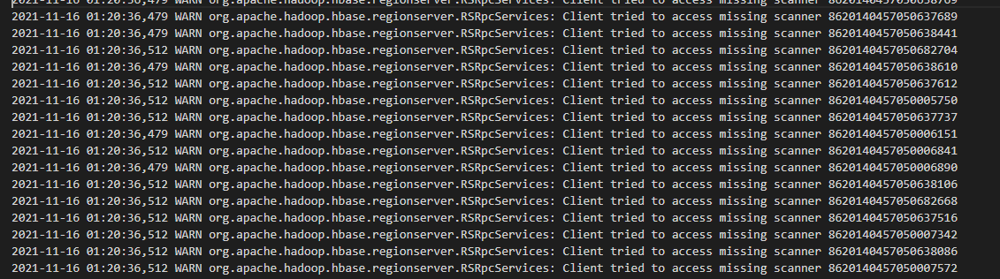
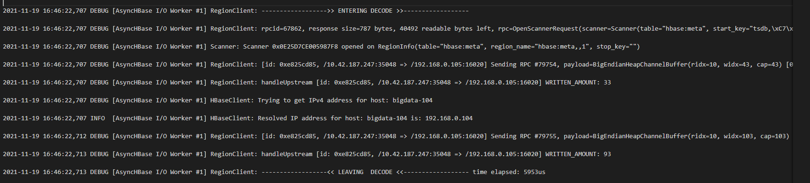
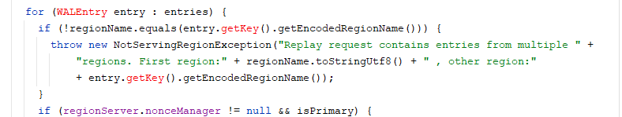
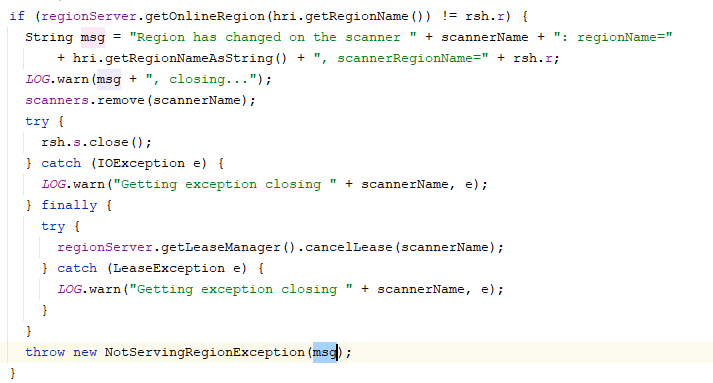
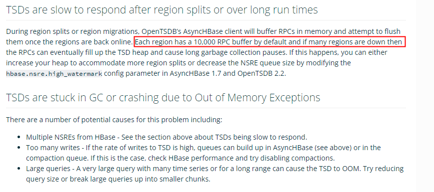
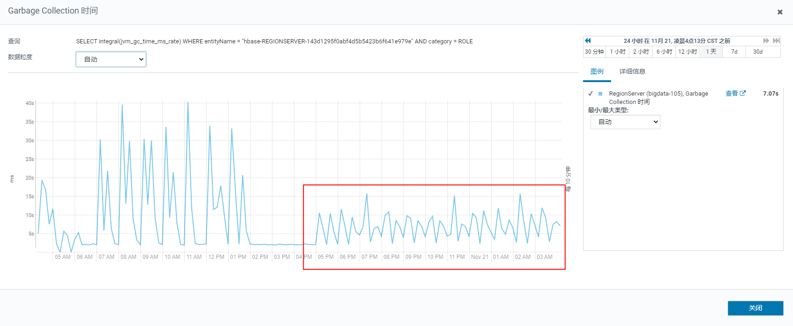
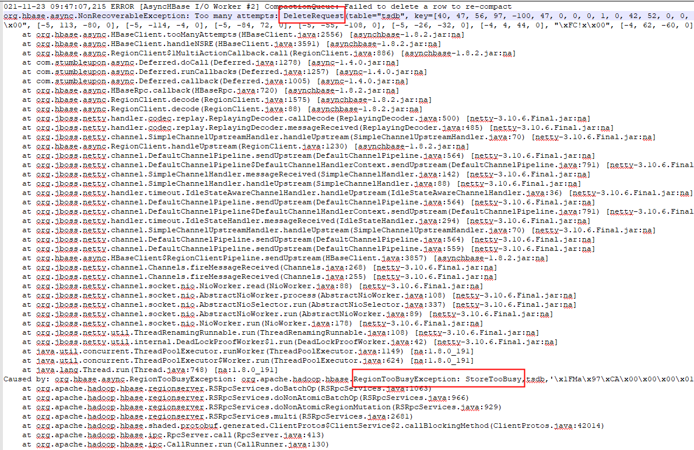
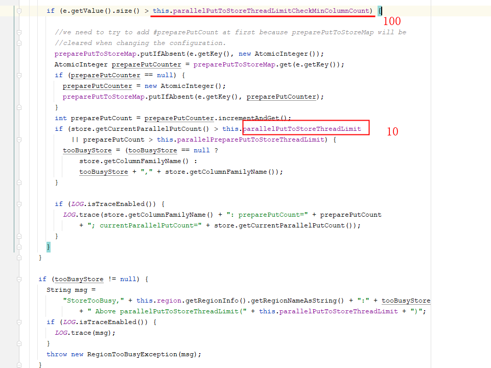
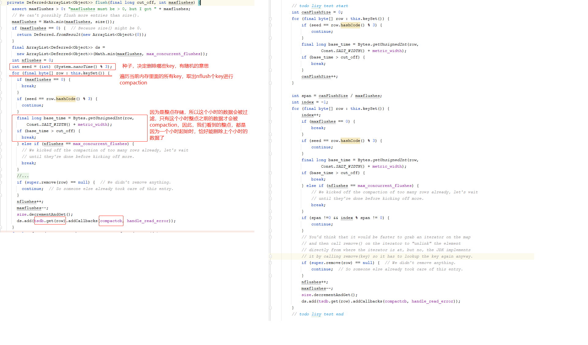

### 长时间GC

<!--more-->

长时间gc，在部分节点，每个小时，都有一个长时间gc的尖峰。

关于G1 GC，对HBase进行进一步改进。

参考文章：https://product.hubspot.com/blog/g1gc-tuning-your-hbase-cluster

对于HBase，我们当前的配置：

memstore size：0.4 = 8.8G

block size：0.4 = 8.8G

static index size：2G~3G

Eden size：15G左右

根据公式：heap >= (M + B + O + E) / 0.7

而我们实际配置已经远超于0.7。

根据线上统计情况，block size = L1 size + L2 size = 13G，used = 3G ~ 4G，其中，L1表示BucketCacheSize，我们配置的4G，在堆外内存，使用量在3G左右，L2表示堆内的元数据信息，我们配置的是0.4，相当于8.8G，而使用量只有几百兆。

所以，我们可将block size调整为0.1。

以22G内存为例，M = 0.4， B = 0.1，O = 0.1，为了满足heap >= (M + B + O + E) / 0.7，需要让Eden大小也为0.1。

而Eden Size的大小，根据XX:MaxGCPauseMillis在动态调整，50ms大约2G~3G，故，将该参数由500调整为50。

再根据HBase的特性，HBase中存储的对象，不是单次young gc就能回收的，大部分都是一些持续存储很久的对象，所以，为了减少young空间，需要将：XX:MaxTenuringThreshold调整为1。

综上，HBase RegionServer调整如下：

block size 由0.4调整为0.1。

gc调整：

```sh
-XX:+UseG1GC -XX:+UnlockExperimentalVMOptions -XX:MaxGCPauseMillis=50 -XX:-OmitStackTraceInFastThrow -XX:ParallelGCThreads=8 -XX:+ParallelRefProcEnabled -XX:+PerfDisableSharedMem -XX:-ResizePLAB -XX:MaxTenuringThreshold=1 -XX:InitiatingHeapOccupancyPercent=50 -XX:G1HeapWastePercent=10 -XX:G1MixedGCCountTarget=16 -XX:G1HeapRegionSize=16m
```


### GC时间长导致RegionServer异常退出

关于最近长时间gc导致RegionServer异常退出，主要原因是async hbase在发送大量的scanner，该scanner请求导致内存持续上升，而gc又无法回收。最终集群出现异常。

HBase出现的日志：



出现这样的scanner请求的debug日志：



跟踪代码，发现，它的触发发生在RPCResponse中。

代码：RegionClient.decode()

关键代码：

```java
if (decoded instanceof NotServingRegionException
    && rpc.getRegion() != null) {
  // We only handle NSREs for RPCs targeted at a specific region, because
  // if we don't know which region caused the NSRE (e.g. during multiPut)
  // we can't do anything about it.
  hbase_client.handleNSRE(rpc, rpc.getRegion().name(),
                          (RecoverableException) decoded);
  return null;
} else if (decoded instanceof RecoverableException && 
    // RSSE could pop on a multi action in which case we want to pass it
    // on to the multi action callback handler.
    !(decoded instanceof RegionServerStoppedException && 
        rpc instanceof MultiAction)) {
  // retry a recoverable RPC that doesn't conform to the NSRE path
  if (hbase_client.cannotRetryRequest(rpc)) {
    return HBaseClient.tooManyAttempts(rpc, (RecoverableException) decoded);
  }
final class RetryTimer implements TimerTask {
  public void run(final Timeout timeout) {
    ......
  }
}
......
}
```

HBase服务端抛出NotServingRegionException时，opentsdb会触发handleNSRE，抛出异常的原因：

1. Region重合
2. RegionSplit

性能压测环境，出现的现象是Region重合。其原因是：从线上拷贝下来的数据，在进行Region合并时，出现了重合。所以，导致每次压力一上来，就有大量的Scanner。



线上出现这个问题的原因是：Region Split。因为opentsdb会缓存region信息，在region split时，region信息发生了变化，所以，会尝试重新去缓存region。也会有大量的scanner。



关于RegionSplit之后，出现大量的rpc，在opentsdb里面有这样的说明：



意思是：**每个Region**在OpenTsdb中会里面会缓存1万个RPC请求。出现这种情况，它的建议是，调低缓存数量。

而我们线上，因为写热点，大部分Region在split时，会出现短暂的scanner请求。从而造成对hbase有一定的冲击。此时：gc时间会持续很长时间。

当我们内存配置合理时，RegionServer不再会宕机，只是会因为gc时间长而停止rpc请求。

因为是scanner请求，我们可以考虑限制scanner handler，来控制scanner请求。

因此：对于线上的配置，可以建议增加以下配置：

hbase.ipc.server.callqueue.read.ratio = 0.4    30个handler，12个用于读

hbase.ipc.server.callqueue.scan.ratio = 0.3   3个用于scan。


除了NotServingRegionException之外，抛出RecoverableException后，会进入重试。重试次数10次。

HBase整点左右出现gc时间过长，一是compaction请求量加大，二是会有失败重试。主要是由opentsdb compaction触发。

默认重试10次，包括之前的堆外内存溢出问题。因为opentsdb compaction是一个纯异步的，主线程只提交compaction，不会去检测是否执行成功，即使失败，在主线程中也检测不到异常，所以在出现异常后，主线程控制rpc请求，很难做到。

rpc失败后，会进行重试，可以考虑将最大重试次数进行控制。由10调整为3。

hbase.client.retries.number=3

gc效果



从效果图我们看到，当重试次数降低后，gc时间明显降低了很多。那么问题来了，是什么原因导致它在不断的重试呢？

### OpenTSDB重试原因分析

降低重试次数后，在opentsdb的日志中看到这样的异常：



在HBase中有这样的逻辑：




DeleteRequest会操作一行中的多列，我们的HBase中，几乎100%超过100列。而单个RegionServer中管理的Region数已经超过80个，所以，并发请求delete也很容易超过10。因此，在这种情况下，会有失败重试的现象。

HBase之所以会有这样的限制，主要是为了保护HBase，防止大量的操作。

由于我们是时间序列数据，一列值很小，而且在每个小时进行compaction时，会有3600列在同时提交，故，可以适当调大该参数：hbase.region.store.parallel.put.limit.min.column.count 由100调到3600。

减少了重试次数，但是，在整点还会有一个小的冲击，之后趋于平稳。

有这样的代码：

```java
void sendRpc(HBaseRpc rpc) {
    if (this.chan != null) {
        if (rpc instanceof BatchableRpc && !(rpc instanceof GetRequest) && (this.server_version >= 29 || rpc instanceof PutRequest)) {
            BatchableRpc edit = (BatchableRpc)rpc;
            if (edit.canBuffer() && this.hbase_client.getFlushInterval() > 0) {
                // delete 和 put 请求走这儿
                this.bufferEdit(edit);
                return;
            }

            this.addSingleEditCallbacks(edit);
        } else if (rpc instanceof MultiAction) {
            MultiAction batch = (MultiAction)rpc;
            if (batch.size() == 1) {
                rpc = this.multiActionToSingleAction(batch);
            } else {
                this.hbase_client.num_multi_rpcs.increment();
            }
        }
    }
}
```


```java
private void bufferEdit(BatchableRpc request) {
    boolean schedule_flush = false;
    MultiAction batch;
    synchronized(this) {
        if (this.batched_rpcs == null) {
            this.batched_rpcs = new MultiAction();
            this.addMultiActionCallbacks(this.batched_rpcs);
            schedule_flush = true;
        }

        batch = this.batched_rpcs;
        batch.add(request);
        if (batch.size() < this.batch_size) {
            // 小于batch_size憋着不发
            batch = null;
        } else {
            this.batched_rpcs = new MultiAction();
            this.addMultiActionCallbacks(this.batched_rpcs);
        }
    }

    if (schedule_flush) {
        this.scheduleNextPeriodicFlush();
    } else if (batch != null) {
        this.sendRpc(batch);
    }

}
```

在整点的时候，会有大量的put请求和delete请求。当它们在某个Region上缓存的rpc请求大于1024时，执行发送。因为时触发的都是上个小时的全部数据，在整点之后的几分钟内，基本都是满状态发送（rowkey排序的），且某些热的Region很容易在同一时间段内发送batch request，从而导致整点时hbase压力比较大。而随着时间的推移，某些rowkey已经被其他opentsdb实例发送掉了，Region请求达到1024个大小的时间值也均衡，所以后期发送会比较平稳。

