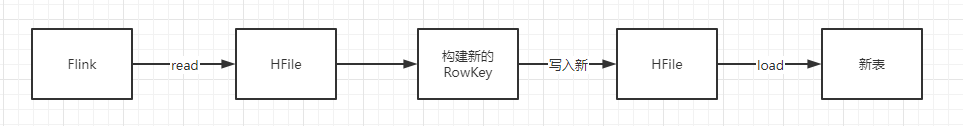
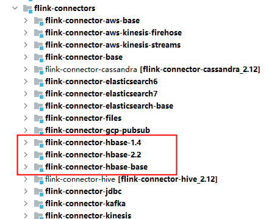
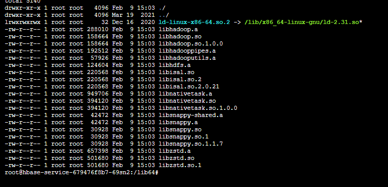

接上篇。

<!--more-->

当我们分析了问题，并改进了新的rowkey结构，那么我们为了做到无缝对接，需要将历史数据进行迁移。

迁移历史数据的思路大体为：

1. 读取原数据
2. 按新结构生成RowKey
3. 写入新表

当我们使用HBase API进行操作时，这个过程相当的慢，而且对HBase正常服务有影响。


## 前提条件

迁移历史数据过程中，以前的rowkey结构扔需要正常使用，且不能因为迁移影响正常业务，让用户无感知。


## 迁移方案选择

HBase提供了bulkload方法。

bulkload的基本原理是：通过MapReduce、Spark或Flink等离线计算框架，批量读取HFile，然后根据自己的业务逻辑，对数据进行进一步操作（更新），之后再生成一个HFile文件。生成HFile以后，通过LoadIncrementalHFiles将其load到新表。




## 采坑集

### 采坑1——hbase-client版本不一致

#### 现象

Flink读取HBase，提供了AbstractTableInputFormat，该InputFormat对外开放的HBase版本是1.4版本。

而我们的HBase版本是2.3.0，我们在load hfile到HBase表中时，只能使用2.0以上的版本进行load。

因此，这儿出现了版本冲突问题。

依赖了hbase-client 1.4版本，就无法load hfile。而，依赖了2.3.0版本，就无法读取hfile。


在Flink的源码中，提供了hbase1.4版本和2.2版本的支持。但是，在maven仓库中心，却是1.4。



#### 解决方案

1. 单独编译该jar包，把编译后的jar放入私服，依赖自己编译的2.2版本
2. 提取核心代码，把核心代码集成到我们服务中使用

我使用的是第二种方式，因为核心代码较少，只需要简单集成即可。代码细节部分在[github](https://github.com/xlblog/hbase-bulkload-service)中。


### 采坑2——hfile未排序

#### 现象

通过flink读取到数据后，经过处理后生成的HFile文件无法load到表中。

原因是，flink是分布式并行任务，它读取后的rowkey是未经过排序的，需要将它排序后在写成一个hfile。

#### 解决方案

对rowkey进行排序。核心代码如下：

```java
dataStream.sortPartition(0, Order.ASCENDING).map(new MapFunction<Tuple2<String, HBaseResult>, HBaseResult>() {
            @Override
            public HBaseResult map(Tuple2<String, HBaseResult> value) throws Exception {
                return value.f1;
            }
        });
```


### 采坑3——单hfile对应多region，load很慢

#### 现象

由于历史数据比较大，事先已经根据业务需求建立了预分区。而每次进行bulkload时，只有部分数据。flink生成的hfile是按照并行度来生成的。一个task生成一个hfile，当hfile load在预分区表中时，因为需要将数据分发到不同的region，因此，load很慢。

#### 解决方案

在进行bulkload时，官方给出的建议是，一个hfile尽可能对应一个region。因此，为了解决这个问题，我重写了HadoopOutputFormat。根据我们的预分区，将生成多个hfile。不再是一个task一个hfile。

核心代码如下：

```java
@Override
public void writeRecord(Tuple2<org.apache.hadoop.hbase.io.ImmutableBytesWritable, org.apache.hadoop.hbase.Cell> record) throws IOException {
    byte[] rowkey = record.f0.get();
    byte[] prefix = Arrays.copyOf(rowkey, 2);

    // 我追加的部分
    if (!Arrays.equals(salt, prefix)) {
        close();
        open(originTaskNum, numTasks);
        salt = prefix;
    }
	// 追加结束
    
    try {
        this.recordWriter.write(record.f0, record.f1);
    } catch (InterruptedException e) {
        throw new IOException("Could not write Record.", e);
    }
}
```


### 采坑4——缺少native文件

#### 现象

当真实load数据时，（load命令发起是有我写的微服务发起），由于我们的hbase中使用的是snappy压缩，而微服务是部署在k8s中的，因此，由于缺少native文件，无法进行load。

#### 解决方案

将native文件拿下来，加入我们的依赖工程，在打包时，将native文件放在容器的：/lib64目录。



Java服务启动时，会自动load lib64目录，将它加载到jvm中。


### 采坑5——权限不同导致无法load

#### 现象

还是load数据，由于我们使用的微服务进行提交，它提交的账号是root账号。而我们hbase中，hdfs目录权限是hbase。因此，在load时，因为无权限，load失败。

#### 解决方案

将root加入hbase用户组，同时给/hbase目录一个用户组读写权限。

具体加入方式：[给hdfs增加用户组](https://www.codercto.com/a/23848.html)


1、在Linux执行如下命令增加supergroup

groupadd supergroup

2、如将用户yarn增加到supergroup中，再执行：

usermod -a -G supergroup yarn

3、同步系统的权限信息到HDFS：

su - hdfs -s /bin/bash -c "hdfs dfsadmin -refreshUserToGroupsMappings"

4、验证

\1) 将/user/hdfs目录的权限由700，修改为770

su - hdfs -s /bin/bash -c "hadoop fs -chmod 770 /user/hdfs"

\2) 通过加到supergroup组中的yarn用户去列这个目录：

su - yarn -s /bin/bash -c "hadoop fs -ls /user/hdfs"

可成功列出目录即表示操作成功。


## 总结

以上采坑现象是开发过程中遇到的坑。在真实线上进行时的坑，下篇再续。希望我踩过的坑，大家能避免。