由于某些业务场景，Redis中的单个Key下的Value是一个很大的值，这些bigkey对我们的查询会有多大影响呢？

## 背景

我们的业务场景下，有两种存储结构，其中一种是以hash来存储，存储结构如下：

key：id

value：Map<String, String>

平均每个id下面有近18000个点，最高的有20万个点。

另一种是以string来存储。


现在线上的bigkey分布情况如下：

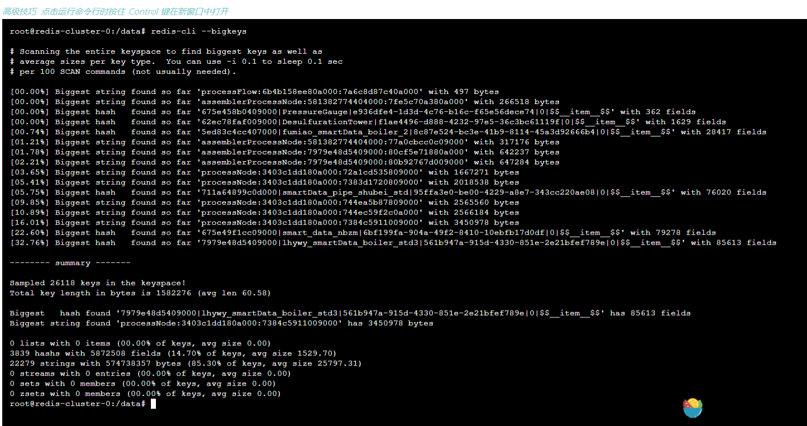


## 使用benchmark验证大string场景

### benchmark介绍

语法：redis-benchmark [option] [option value]

option参数说明：

| 序号 | 选项                   | 描述                                       | 默认值    |
| :--- | :--------------------- | :----------------------------------------- | :-------- |
| 1    | **-h**                 | 指定服务器主机名                           | 127.0.0.1 |
| 2    | **-p**                 | 指定服务器端口                             | 6379      |
| 3    | **-s**                 | 指定服务器 socket                          |           |
| 4    | **-c**                 | 指定并发连接数                             | 50        |
| 5    | **-n**                 | 指定请求数                                 | 10000     |
| 6    | **-d**                 | 以字节的形式指定 SET/GET 值的数据大小      | 2         |
| 7    | **-k**                 | 1=keep alive 0=reconnect                   | 1         |
| 8    | **-r**                 | SET/GET/INCR 使用随机 key, SADD 使用随机值 |           |
| 9    | **-P**                 | 通过管道传输 <numreq> 请求                 | 1         |
| 10   | **-q**                 | 强制退出 redis。仅显示 query/sec 值        |           |
| 11   | **--csv**              | 以 CSV 格式输出                            |           |
| 12   | **-l（L 的小写字母）** | 生成循环，永久执行测试                     |           |
| 13   | **-t**                 | 仅运行以逗号分隔的测试命令列表。           |           |
| 14   | **-I（i 的大写字母）** | Idle 模式。仅打开 N 个 idle 连接并等待。   |           |

### 写bigkey对redis的压力

实际业务场景下，string类型的数据，是没有用到管道的。大小大概在4M左右。因此，模拟写的脚本：

```shell
redis-benchmark -h 172.16.0.34 -p 31429 -t set -c 10 -n 10000000 -d 4194304 -q
```

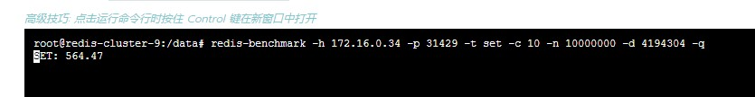

可以看出，当写的值很大时，写请求速率很低。

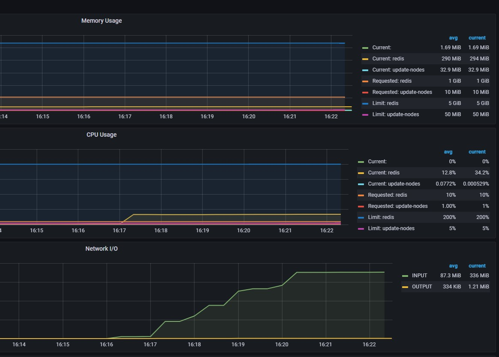

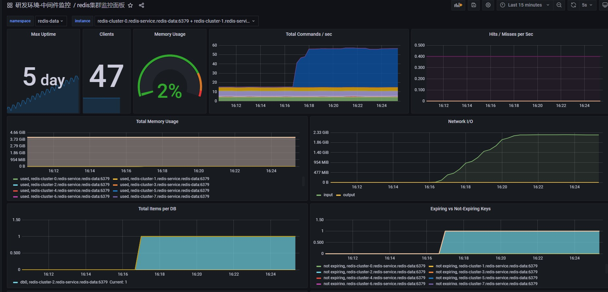

从监控中可以看出，当value值很大时，网络IO会很高，但是请求频率会很低，redis的cpu使用率也很低。


当降低写入数据大小，由4M降低为4K时，redis写入情况如下图：

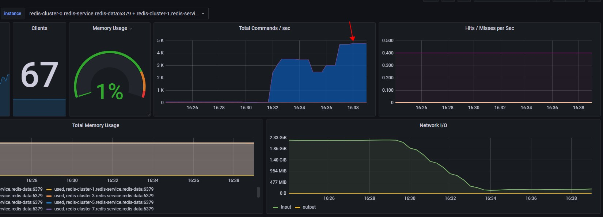

写入速率提高了，cpu使用率依然比较低。每秒处理的command命令虽然有提高，但是相对来说还是很低。


当使用pipeline时，发送4K数据时：

```sh
root@redis-cluster-9:/data# redis-benchmark -h 172.16.0.34 -p 31429 -t set -c 30 -n 100000000 -d 4096 -P 5000 -q
SET: 508406.19
```

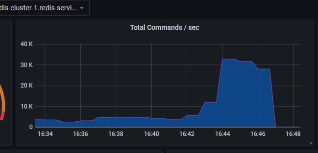

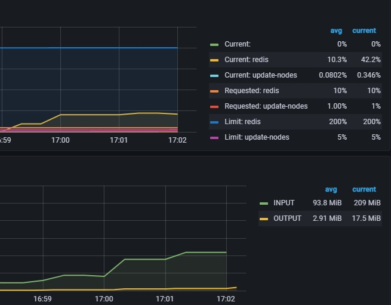

结论：不使用管道，写string类型的数据，大部分时间都花在传输上，redis基本无太大压力（cpu使用率低）。

使用管道时，cpu有提升，但不会占到100%，即，写string类型的数据时，影响基本在网络传输上。

### 读bigkey对redis的压力

当读一个4M的数据时

```sh
root@redis-cluster-9:/data# redis-benchmark -h 172.16.0.34 -p 31429 -t get -c 10 -n 100000000 -d 4194304 -l -q
GET: 57665.86
```


当读取一个4K的数据时

```sh
root@redis-cluster-9:/data# redis-benchmark -h 172.16.0.34 -p 31429 -t get -c 10 -n 100000000 -d 4096 -l -q
GET: 62565.63
```


不使用管道，似乎在网络中，读取4M和读取4K，差异并不是很大。

使用管道时：

```sh
root@redis-cluster-9:/data# redis-benchmark -h 172.16.0.34 -p 31429 -t get -c 10 -n 100000000 -d 4096 -P 5000 -l -q
GET: 6845530.00
```

```sh
root@redis-cluster-9:/data# redis-benchmark -h 172.16.0.34 -p 31429 -t get -c 10 -n 100000000 -d 4194304 -P 5000 -l -q
GET: 7032953.50
```

使用管道，读取4K和4M差距好像也并不大。


## 通过Java实现benchmark功能验证大Hash场景

### 写bigkey对redis的压力

**场景一：**

10个并发线程，每个线程生成1000个key，每个key下面2万个点，每个点存储180笔。即：map的key有20000 * 180 = 3600000个。

```http
POST http://localhost:8005/benchmark/write
Content-Type: application/json

{
  "threadCount": 10,
  "keyCount": 1000,
  "itemCount": 20000
}
```

往redis写入情况及redis压力表现如下：

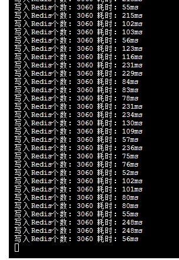

每次往redis中写入3060个点，每个点平均耗时在100ms。说明，写请求延迟不高。

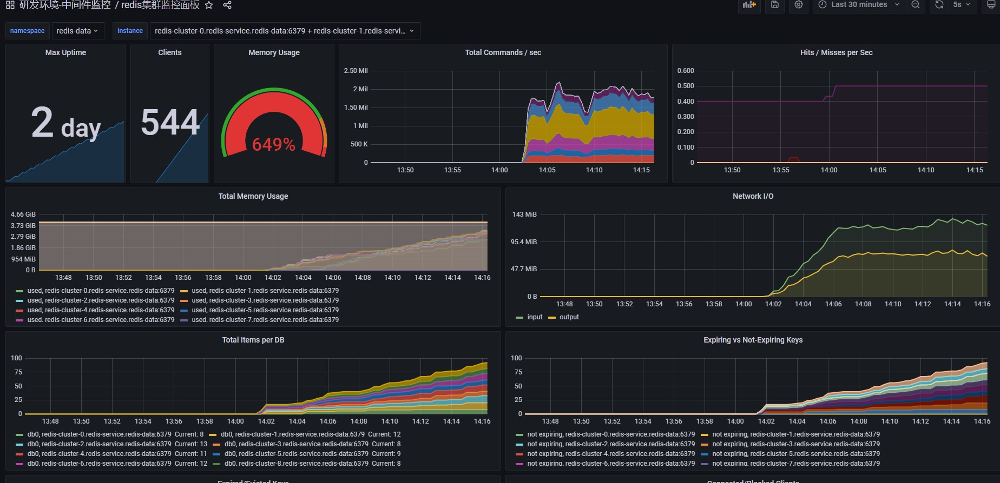

redis一共有10个节点，其中5个主节点，5个从节点。所有节点每秒总共处理约200万命令。

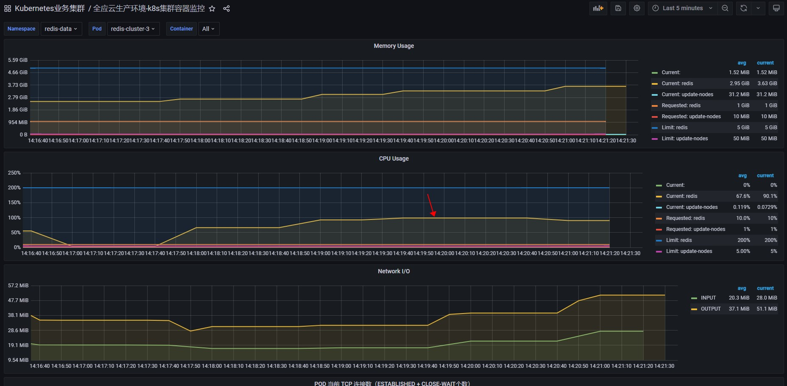

cpu使用率达到了100%，说明redis开始真正的在忙。但它的处理效率还是比较可观的。


**场景二**

在场景1的基础上，增大写入线程，由10调整为50。

```http
curl --location --request POST 'http://localhost:8005/benchmark/write' \
--header 'Content-Type: application/json' \
--data-raw '{
    "threadCount": 50,
    "keyCount": 1000,
    "itemCount": 20000
}'
```

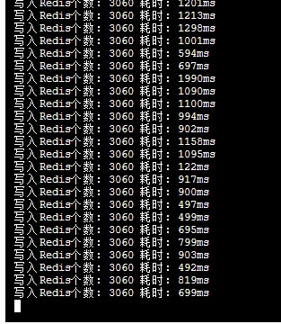


写入redis的平均耗时在1s左右。

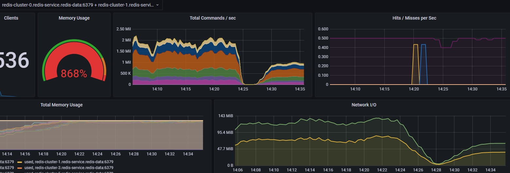

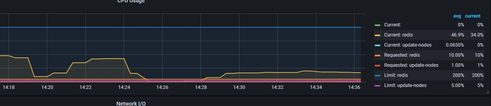

每秒处理的命令数下降，cpu使用率也下降。说明加大客户端线程，大部分时间是客户端线程在切换，浪费了时间。


**场景3：调低并发线程数**

将并发线程由10调整为7，表现形式和10近似相同。cpu使用率达到100%，每秒处理的command数量达到200万。

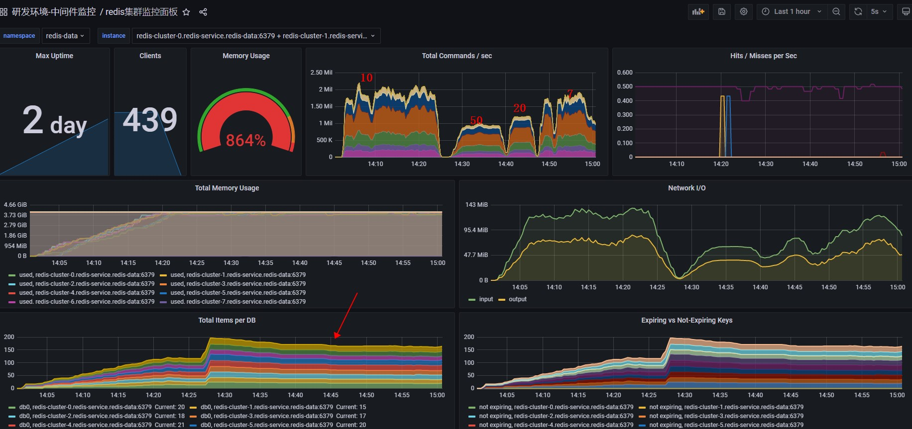


**总结**

当cpu使用率达到100%时，redis处理的命令数其实是挺高的。

在hash存储结构下的bigkey，对写入无影响。通过上图可以看到，第一次任务，redis是从一个没有的key创建出来的，后面的几次提交，是从redis的key上做更新的。即使某个key很大，更新操作也基本不受影响。延迟也低。


### 读bigkey对redis的压力

在写入数据的基础上进行读验证（真实的读，能从server端返回读取结果）

**场景一**

```http
curl --location --request POST 'http://localhost:8005/benchmark/read' \
--header 'Content-Type: application/json' \
--data-raw '{
    "readCount":50,
    "threadCount": 10,
    "keyCount": 1000,
    "itemCount": 3000
}'
```

10个线程并发读，一共读取1000个key，每个key下读3000个点（总共2万个），每个点会一次读出最近180笔。重复读取50次。

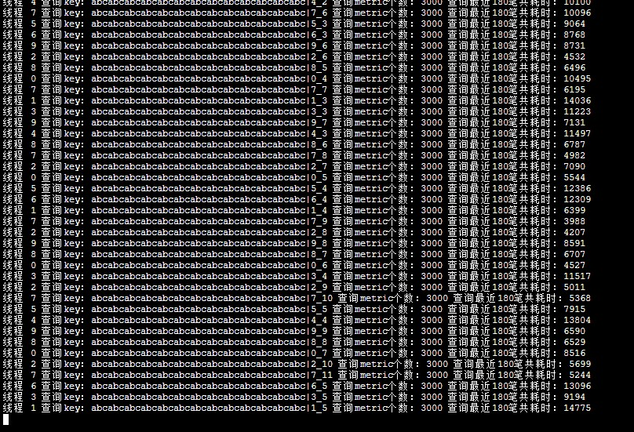

从监控可以看出，一次读3000个点，平均耗时10s左右。


**场景二：降低单次读取的点个数**

```http
curl --location --request POST 'http://localhost:8005/benchmark/read' \
--header 'Content-Type: application/json' \
--data-raw '{
    "readCount":50,
    "threadCount": 10,
    "keyCount": 1000,
    "itemCount": 300
}'
```

当单次查询的item个数由3000降低为300时，查询性能如下：

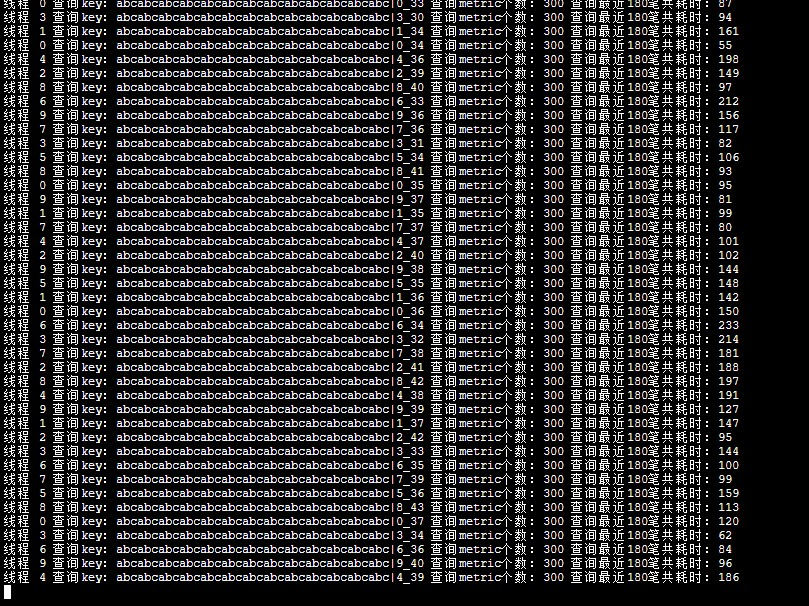

平均响应时间：100ms。当由300降低为30时，平均延迟为20ms。

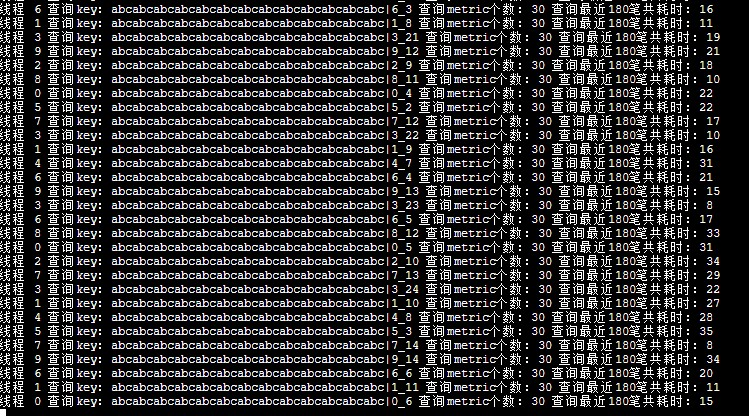


**结论**

在redis中，hash结构下的bigkey，对于写操作，无影响。对于查询来说，查询的结果越大，响应时间越长。针对我们的业务场景下的查询，基本不受影响。

