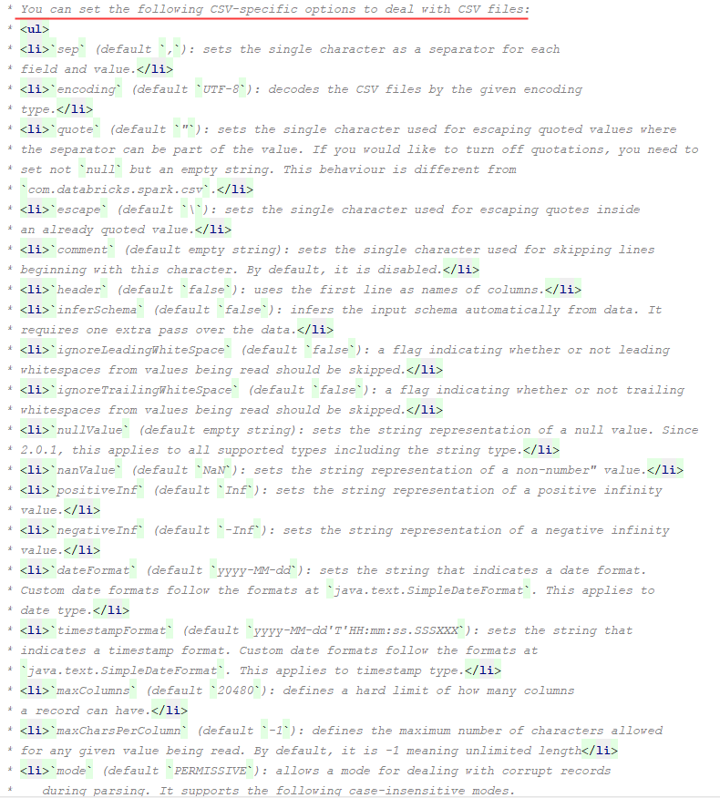

spark可以从多个数据源读取数据，下面介绍一下常用的数据源的读取方式。

### 使用load加载不同格式的数据源

load是最简单，最通用的一种加载方式。spark默认是加载parquet格式的。如果需要其他格式，需要通过format指定格式，spark内部也提供了一些常用的格式，如果你的文件不满足这些格式，你可以自定义format方式。

#### 加载parquet格式

```scala
val userInfoFrame = sparkSession.read.load("/user.parquet")
```


#### 加载其他spark支持的格式

spark已经定义了一些常用的格式，如json、csv、orc等。使用如下操作来指定具体的格式：

- 加载json

  ```scala
  val dataFrame = sparkSession.read.format("json").load("/user.json")
  ```

- 加载csv

  ```scala
  val dataFrame = sparkSession.read
  	.format("csv")
  	.option("sep", ";")
  	.option("inferSchema", "true")
  	.option("header", "true")
  	.load("/user.scv")
  ```

加载其他也是类似。需要注意的是，加载csv时，设置了一些option参数，它们分别代表什么意思呢。我们可以到DataFrameReader下面来看，官方给每个值都提供了说明：



我们挑一些csv格式中，比较重要的选项来说明一下：

| 操作        | 备注                                                         |
| ----------- | ------------------------------------------------------------ |
| sep         | 设置分割符，默认是","                                        |
| encoding    | csv文件的编码格式，默认"utf-8"，如果你的文件是gbk，可以通过这个选项设置 |
| comment     | 用来设置跳过该字符开头的行，默认是空的，即所有的行都读取。常用语跳过csv文件中的第一行 |
| header      | 表示是否让第一行作为列名，默认是false。如果你的csv就是从某个表读取的，则设置为true |
| inferSchema | 是否开启自动推断schema，比如推断类型。默认是false。          |
| nullValue   | 如果值为null，设置一个默认值，一般情况下不会设置。默认即是空字符串。 |
| dateFormat  | 设置时间格式化方式，默认是：yyyy-MM-dd。如果你需要带上时分秒，可以重新设置 |

其实不仅仅是csv有这些选项可以设置，json、orc、txt都有选项设置，具体的选项，可以到该类下参考，比较详细，这儿不做多余的介绍了。


#### 自定义格式化类型

虽然spark官网已经给我们提供了一些常用格式的加载方式，但实际场景下，我们用的格式可能远不止这几种，只要是具有规则的文件，都可以自定义转换工具来加载。具体实现方式，后续单独使用一个专题来介绍。


### 使用纯SQL操作数据源

上面介绍的是根据sparkSession的read来读取不同格式的数据源，其实我们也可以使用纯SQL的形式来读取。例如读取某个parquet文件：

```val
sparkSession.sql("SELECT * FROM parquet.`/users.parquet`")
```

是不是相当简单呢。同理，读取json和csv方式如下：

```scala
sparkSession.sql("SELECT * FROM json.`/users.json`")

parkSession.sql("SELECT * FROM csv.`/users.csv`")
```


### 将DataFrame输出

spark默认是和hive做了对接的，因此，如果要将DataFrame里面的数据持久化至hive表，直接使用saveAsTable即可。
如果你的hive是基于文件的，例如text、parquet、csv等，可以通过选项path来进行输出。例如：df.write.option("path", "/some/path").saveAsTable("tableName")。
两者的区别是什么呢，其实就是一个内部表和外部表的区别。第二种将文件写入到某个目录下，即使你的hive表已经删除了，数据还是在的，不过在写入表示，需要手动的刷新一下hive表，因为hive的元数据并没有被写进去。`MSCK REPAIR TABLE`来刷新。

如果需要对输出进行分桶和分区，可以使用bucketBy和partitionBy

