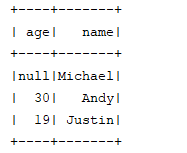
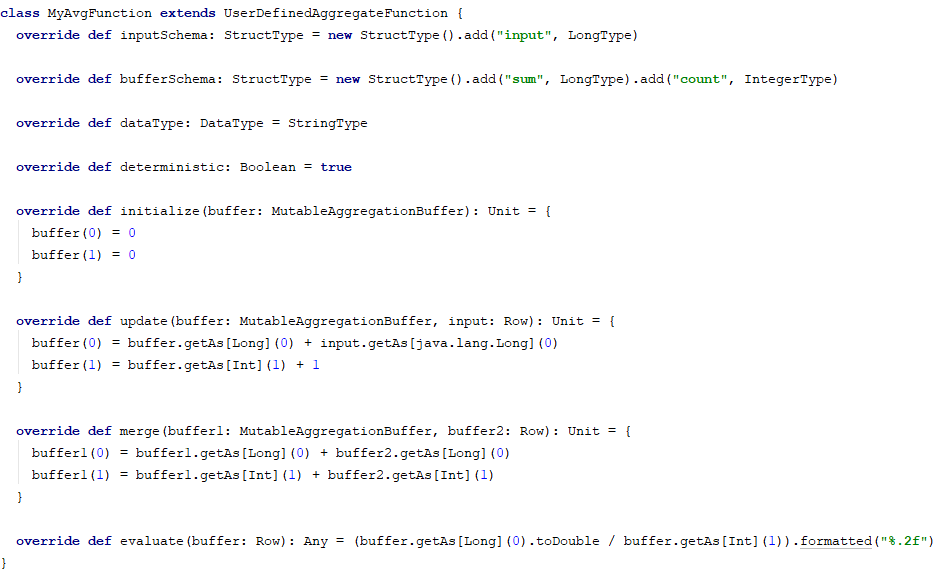
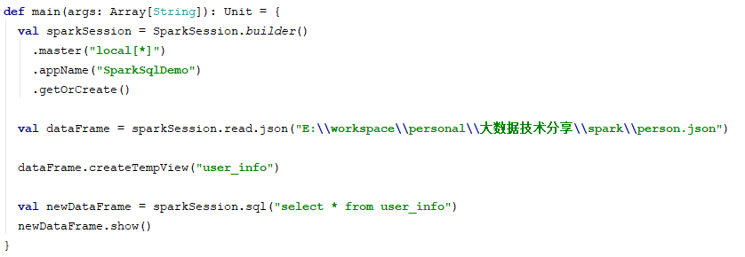

SparkSQL是Spark的一个模块，它主要用来处理结构化数据。它是相对于SparkCore更高层的一个API，底层实现也是spark core的方式来实现。

SparkSQL支持纯SQL的开发，也提供了一种链式编程的API，它的关键点是DataFrame。

下面重点介绍一下DataFrame。

## 环境准备

### 引入spark-sql依赖

在编写spark-sql程序时，需要将spark-sql的依赖加入到项目中。

```xml
  <dependency>
  	<groupId>org.apache.spark</groupId>
      <artifactId>spark-sql_2.11</artifactId>
  	<version>2.2.0</version>
  </dependency>
```

### 创建SQL上下文

在写spark程序时，我们需要一个spark上下文：SparkContext。在写spark-sql时，我们也需要一个SQL上下文：SqlContext。这个SQL上下文是有SparkSession创建出来。SparkSession中定义了spark的运行环境。

```scala
  def main (args: Array [String]): Unit = {
      val sparkSession = SparkSession.builder()
      	.appName("SparkSqIDemo")
      	.getOrCreate()  
      val sqlContext = sparkSession.sqIContext
  }
```

SparkConf的配置在spark-core中已经介绍了，它们是一样的，都用来指定spark的运行环境。

ps：在spark2.0时，sqlContext的大部分功能已经完全移到了SparkSession下。意味着我们不再使用sql上下文了，直接从sparkSession中进行sql开发。

在写spark-core程序时，我们的SparkContext是new出来的，现在也可以从sparkSession中获取。后续推荐使用这种方式来获取sparkContext，因为它完美的避免了同一个程序创建多个SparkContext的这种情况，而且它可以创建不冲突的sqlContext和sparkContext。

 

### 创建DataFrame

写spark-sql程序，我们必须要先有一个DataFrame。DataFrame可以理解为一个表，它将这个表的结构封装成了一个对象。创建DataFrame有如下几种方式：

从已有的RDD转换而来
  从HiveTable得到
  从data source得到

spark支持的data source有很多种类型，比如：json、csv、parquet、orc、jdbc、other data base。后面我们会详细介绍如何从这些数据源来获得DataFrame。

下面是一个从json中创建DataFrame的案例：

```scala
  def main(args: Array[String]): Unit = {
      val sparkSession = SparkSession.builder()
      	.master("local[*]")
      	.appName("SparkSqlDemo")
      	.getOrCreate()
      
      val dataFrame = sparkSession.read.json("E:\\workspace\\person.json")
      dataFrame.show()
  }
```

这个json文件是park案例下的一个json文件，大家可以在example/resource下找到。



 

## DataFrame操作详解

有了DataFrame，就可以在DataFrame上来操作数据了。


### 基本的操作方法

下面介绍一下基本的一些操作方法

- select
- filter
- groupBy
- orderBy
- count

以person.json这个文件为例：

 

#### select

select提供了多种形式。可以指定查询的字段名，也可以使用一个表达式。

```scala
  dataFrame.select("name","age")
  dataFrame.selectExpr("age+1 as age2").show()
```

如果不写select，默认是查询全部字段，一般只有在查询部分字段时才写select。

 

#### filter

filter用来过滤不想要的数据。filter里面可以传一个表达式，也可以传一个function。function一般用于更复杂的过滤。

```scala
  dataFrame.filter("age is not null").show()
  
  dataFrame.filter(row=>{
  
    val age = row.getAs[java.lang.Long]("age")
  
     age != null && age > 20
  
  }).show()
```


####  groupBy

根据某个字段进行分组，可以添加多个字段。类似于sql中的group by name,age

```scala
dataFrame.groupBy("name","age")
```


#### orderBy

根据字段进行排序，可以是多个字段，也可以是一个表达式。默认升序，如果需要降序，可以使用表达式的形式来实现。

```scala
dataFrame.orderBy("age","name").show()
dataFrame.orderBy(newColumn("age").desc).show()
```


#### count

count一般配合groupBy使用，统计每个分组下的数量。

````scala
dataFrame.groupBy("name").count()
````


上面是一些基本的DataFrame方法，可以看出来，和sql基本是一样的。除了这些基本方法之外，还有很多方法，大家可以慢慢了解使用。

 

### 自定义函数

上面提到，spark在select时可以写表达式，例如我们要统计age列的总和，我们可以写

```scala
dataFrame.selectExpr("sum(age)")
```

其中的sum是一个sql函数。如果在某些情况下，sum不能满足条件，我们可以自定义自己的函数来使用。

自定义函数分为3类：

- udf   转换函数：一行输入一行输出
- udaf  聚合函数：多行输入一行输出
- udtf  表函数：一行输入多行输出

比较常用的是udf和udaf，udtf几乎不用。例如要解析一些json文件，可以用udf来解析。再比如要求某个指标的上下四分位，可以用udaf来聚合。

 

#### 自定义udf函数

````scala
sparkSession.udf.register("my_udf", (v: java.lang.Long)) => {
    if(v != null) {
        v * 2
    } else {
        0
    }
}
dataFrame.selectExpr("my_udf(age)").show()
````

使用register来注册一个自定义函数，第一个参数为udf函数名，第二个参数为自定义的udf函数。

 

#### 自定义udaf函数

自定义udaf，需要继承UserDefinedAggregateFunction。我们自定义一个我们的求平均值的函数。



使用该自定义函数，像注册udf函数一样，将它注册进去即可使用。

 

### 纯SQL写法

spark不仅仅提供了链式sql编程外，还提供了入门门槛更低的纯sql写法。如下：



我们从一个文件中读出一个dataFrame后，我们可以将它注册为一个表视图。可以通过sql来操作该表视图。是不是更简单更方便。

tempView是session级别的。如果要将tempView分享给所有的session，则可以创建一个全局的视图。

```scala
dataFrame.createGlobalTempView("user_info")
```

全局视图在所有的session中都有效，直到spark任务停止。

例如：

```scala
dataFrame.createGlobalTempView("user_info")

val newDataFrame1 = sparkSession.sql("select * from user_info")

val newDataFrame2 = sparkSession.newSession().sql("select * from user_info")
```

需要注意的是，newSession只是用来隔离一些注册表、临时视图、注册函数。在它们的底层依旧是同一个SparkContext。我们之前也说过，Spark程序只能有一个SparkContext。

 

### 从已有RDD转换DataFrame

上面有一种通过文本文件、数据库中读出来DataFrame。除了这些方式之外，还有一种方式就是从一个已知的RDD来创建DataFrame。

从一个已知的RDD转换为DataFrame又存在两种方式

通过反射的形式自己推断schema
  用户手动创建schema

使用反射形式转换，代码会更加简洁，但某些场景并不适合，例如解析一个文本文件，该文本文件需要输出到多个不同的表，我们可以手动来创建schema。

 

#### 使用反射

```scala
import sparkSession.implicits._
val lines = sparkSession.sparkContext.textFile("E:\\workspace\\person.txt")
val userInfoDataFrame = lines.map(line = > {
    val info = line.split(" ")
    UserInfo(info(0).toInt, info(1))
}).toDF
userInfoDataFrame.show()

case class UserInfo(age:Int, name:String)
```

我们可以看到，我们定义了一个UserInfo对象，它具有两个属性，通过case class则能通过反射的形式将它转换为对应的DataFrame。需要注意的是，这儿只能是case class，普通class无法转换。

 

#### 手动创建schema

手动创建schema分了三步

- 定义Row
- 定义StructType
- 将row rdd转换为DataFrame


```scala
val schema = new StructType(Array(StructField("age", IntegerType), StructField("name", StringType)))
val userInfoDataFrame = sparkSession.createDataFrame(rowRdd, schema)
userInfoDataFrame.show()
```

上面便是通过已有的RDD来转换为DataFrame。这种场景一般用于一些非结构化的文件中，通过spark-core对其进行解析后，将它转换为结构化的数据，使其存入数据库中。 
