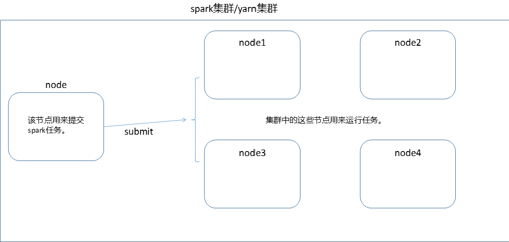

spark程序一般是提交在集群中来执行。大概执行流程如下：

- IDEA编写spark程序
- 打包spark程序
- 上传spark程序至spark集群
- 通过spark-submit命令来提交spark程序
- 根据spark-submit命令设置的参数来分配节点（例如：集群有4个节点，运行任务需要两个节点，则只分配两个。）
- 每个节点启动一个jvm来运行spark程序（如果设置了executor-core，则每个jvm中启动多个线程）
- 程序运行结束




注意：

1. 每个应用程序，都有独立的executors，在该应用程序执行未结束前，executors是保持不变的，每个executor会启用多个线程来执行，每个线程执行的任务被称为task。多个应用程序之间是互不干扰的。
2. spark的运行与集群管理器无关，即只要多个机器能进行通讯，即可运行spark任务。
3. 在任务运行过程中，Driver程序会负责监听执行程序的运行状态及运行结果，因此，Driver必须和运行节点网络互通
4. 由于Driver程序启动了task，因此Driver端和Executor端最好在同一局域网下，因为数据传输会很快。
5. 提交spark任务的节点，并非必须在集群中，可以是本地笔记本电脑


目前spark支持的运行环境有如下几种：

- standalone spark自带的一个简单集群
- Apache Mesos
- Hadoop Yarn
- Kubernetes 

 

了解了整体的流程后，我们来系统的学习一下各个细节


### Spark应用提交

#### 专业术语

| 术语             | 含义                                                         |
| ---------------- | ------------------------------------------------------------ |
| application      | 基于用户编写的spark程序，包括了spark官网提供的Driver程序和Executor程序。 |
| driver  program  | 由main函数做入口，创建的SparkContext程序                     |
| cluster  manager | 集群上获取资源的外部服务，如YARN、spark自带的standalone manager |
| deploy mode      | 用来区分driver程序运行的位置。cluster模式，driver程序在集群内部被执行，client模式，driver程序在集群外部执行。也就是为啥client模式下，连接断开后任务便停止，因为driver程序被停止了。 |
| driver           | 用来运行driver程序的jvm，被称为driver                        |
| executor         | 用来运行task程序的jvm，被称为executor                        |
| task             | 任务运行的最小单元                                           |
| stage            | 任务的运行阶段，通常以shuffer来划分。例如：shuffer前是stage1，shuffer后是stage2。一个stage会被分成n个task来同时运行，即一个stage由多个task组成。stage可以理解为代码中的一个片段代码，task则是将这个片段拷贝了n份，同时运行 |


#### 在集群中提交spark任务

在提交spark前，需要先将应用程序进行打包，打包方式有很多种，如果存在依赖的第三方jar，需要一并打包进来。

将spark应用程序上传至spark集群后，通过使用spark-submit来提交，spark-submit的提交参数和spark-shell一样。前面已经介绍了。下面是一个spark-submit的提交示例：

```sh
spark-submit \
  --name TestSparkApp \
  --master yarn \
  --deploy-mode cluster \
  --queue root \
  --driver-memory 2G \
  --num-executors 50 \
  --executor-memory 10g \
  --executor-cores 2 \
  --class com.wdzaslzy.TestSparkApp \
  --jars /jars/xx.jar,/jars/yyy.jar \
 ./bigdata-test.jar params
```


#### 在本地提交Spark任务

如果不上传在集群上，且你本地计算机和集群网络互通，也可以在本地计算机上进行提交。提交方式是将master设置为集群的地址即可。例如：

```sh
spark-submit \
  --name TestSparkApp \
  --master spark://207.184.161.138:7077 \
  --deploy-mode cluster \
  --queue root \
  --driver-memory 2G \
  --num-executors 50 \
  --executor-memory 10g \
  --executor-cores 2 \
  --class com.wdzaslzy.TestSparkApp \
  --jars /jars/xx.jar,/jars/yyy.jar \
 ./bigdata-test.jar params
```

如果要提交在YARN上，需要在本地配置好Hadoop_Conf和Yarn_Conf。


#### spark提交到多集群的方式

master的设置有如下几种方式

| master url                      |                                                              |
| ------------------------------- | ------------------------------------------------------------ |
| local                           |                                                              |
| local[k]                        | 在本地模式以多线程形式运行                                   |
| local[K,F]                      | 在本地以多线程运行，允许最多失败F次                          |
| local[*]                        | 运行的线程数由本地计算机配置决定                             |
| local[*,F]                      | 同上                                                         |
| spark://HOST:PORT               | 提交到远程spark集群上                                        |
| spark://HOST1:PORT1,HOST2:PORT2 | 发送到spark集群中指定的几个节点                              |
| mesos://HOST:PORT               | 发送到mesos集群                                              |
| yarn                            | 提交到yarn集群上。yarn集群的位置通过变量：HADOOP_CONF_DIR 和YARN_CONF_DIR  来确定 |
| k8s://HOST:PORT                 | 提交到  Kubernetes 集群                                      |

spark提交任务时，所有的配置都由conf/spark-defaults.conf来配置，如果在spark-submit时指定了一些参数，则优先使用指定参数，如未指定，则从该配置文件中获取。后面会详细介绍该配置文件的配置。


#### spark任务依赖jar

在提交spark任务时，如果发现有部分依赖的jar没有打包进来，可以通过参数 --jars来提交。--jars不支持目录，只支持确定的某个jar，多个jar之间以","隔开。

jars的传入方式可以是多种
 - file  绝对路径。file:/xxx，executor会从driver拉取jar进行下载
 - hdfs、http、ftp。hdfs://xxx
 - local  local:/xxx，没有网络io，每个节点必须存在jar

