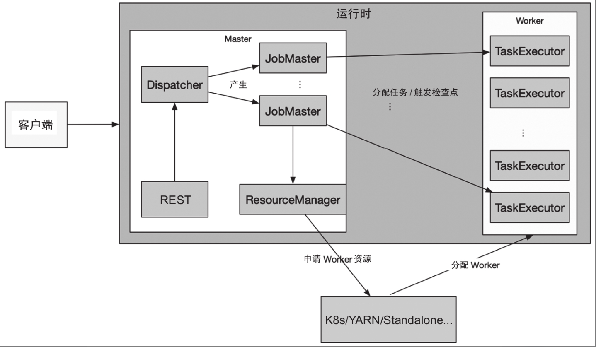
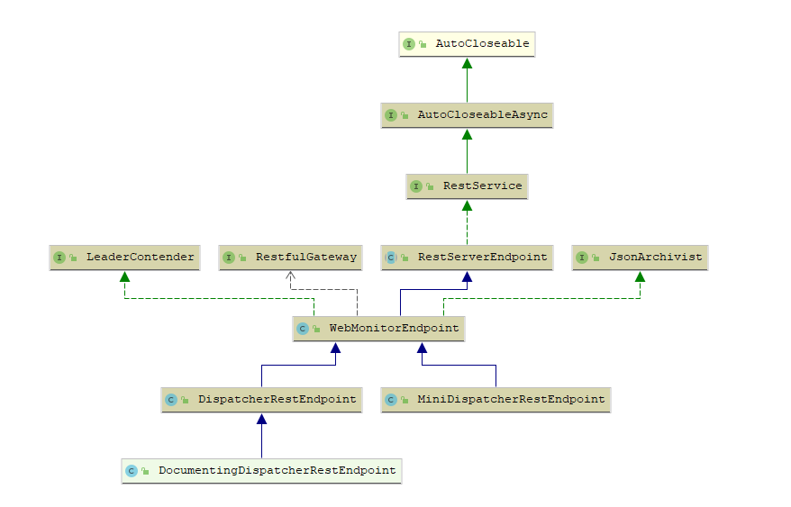

Flink运行过程是Flink引擎的核心部分，支撑着Flink流作业和批作业的运行，同时保障作业的高可用和可扩展性等。**Flink运行时采用Master-Worker的架构，其中Flink的Master节点为JobManager，Worker节点为TaskManager**。

那么，Flink运行时都有哪些组件，分别承担什么样的职责呢？

## Flink运行时组件

Flink运行时组件（角色）有REST、Dispatcher、JobMaster、Resource-Manager和TaskExecutor，而客户端负责与运行时组件交互、提交作业、查询集群和作业的状态等操作。

- JobManager

  - REST

    接收客户端的HTTP请求，提供各种REST服务。如：作业、集群的指标，作业的运行时状态信息，操作作业等。

  - Dispatcher

    接收REST转发的操作JobMaster请求，启动和管理JobMaster。

  - JobMaster

    主要负责作业的运行调度和检查点的协调。例如：生命周期管理、任务的调度、出错恢复、状态查询、分布式状态快照等。

  - ResourceManager

    在不同部署模式下（k8s，yarn等）对资源进行管理（申请资源、回收资源、资源状态管理）。

- TaskManager

  - TaskExecutor

    对资源（cpu、内存）以逻辑的slot进行划分，作业的task会调度到slot上运行。

### REST组件

rest组件的核心代码是WebMonitorEndpoint类，相关类图如下：

从该类图看到，WebMonitorEndpoint继承自RestServerEndpoint，实现了JsonArchivist和LeaderContender接口。其中，RestServerEndpoint是基于Netty实现的抽象类。JsonArchivist接口定义了基于ExecutionGraph生成JSON的接口。LeaderContender接口定义了Leader选举方面的处理。

WebMonitorEndpoint还有两个子类：MiniDispatcherRestEndpoint和DispatcherRestEndpoint。MiniDispatcherRestEndpoint是基于pre-job模式的实现。DispatcherRestEndpoint是基于session模式的实现。

当运行一个flink job时，

#### RestServerEndpoint

