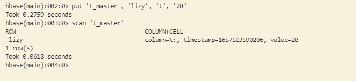
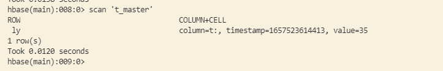
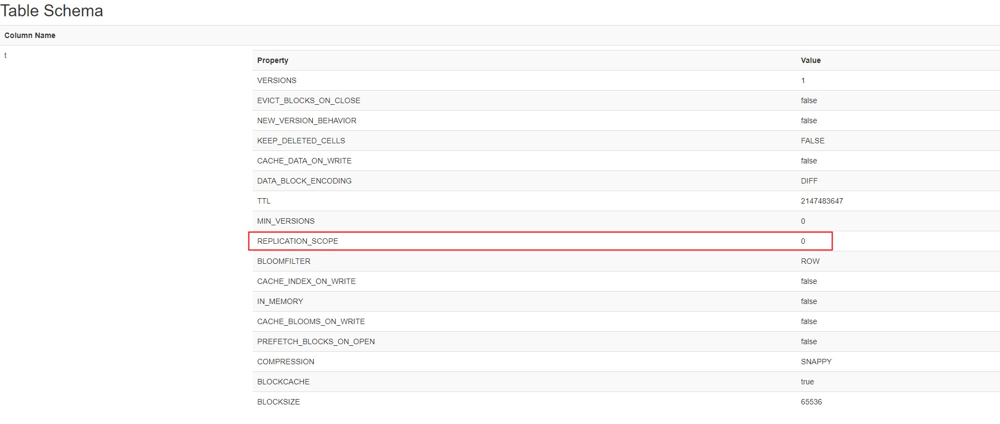
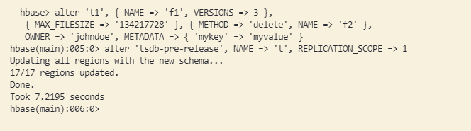
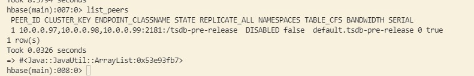
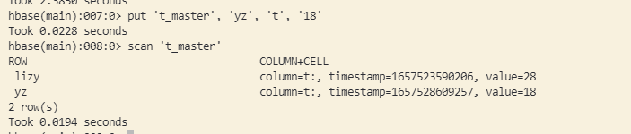
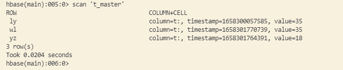
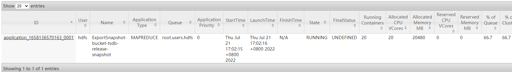
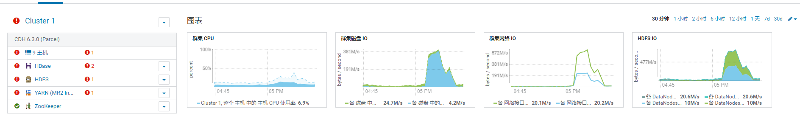
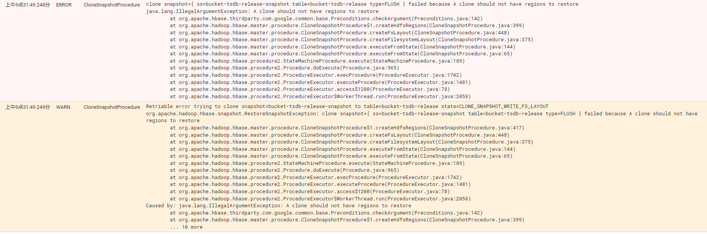

本篇是基于ClusterReplication的理论基础，进行实践。理论基础请参考前文：[HBase容灾之ClusterReplication机制](https://wdzaslzy.github.io/2022/06/15/hbase/HBase%E5%AE%B9%E7%81%BE%E4%B9%8BClusterReplication%E6%9C%BA%E5%88%B6/)


## 单向异步串行复制

### 环境准备

准备两个集群，其中一个为主，一个为备。

- 主备集群版本必须要一致
- 主备集群能够互相通信，且时钟要同步


**在主集群上开启replicat功能**

```xml
<property>
    <name>hbase.replication</name>
    <value>true</value>
    <description>打开replication功能</description>
</property>
```


目前我已准备了两套HBase集群，版本：2.1.0

| 节点        | 主备 |
| ----------- | ---- |
| 172.16.0.10 | 主   |
| 10.0.0.95   | 备   |


**第一步：在主/备集群创建一张测试表**

在主集群创建一张测试表：t_master，建表语句：

```shell
hbase> create 't_master', {NAME => 't', DATA_BLOCK_ENCODING => 'DIFF', COMPRESSION => 'SNAPPY'}
```

用该建表语句，在备集群建立一张一模一样的表。


**第二步：分别在主备集群上put一条数据**

主机群：

```shell
hbase> put 't_master', 'lizy', 't', '28'
```



备集群：

```shell
hbase> put 't_master', 'ly', 't', '35'
```




### 开启异步复制

1. 将主集群中待复制的表列簇的REPLICATION_SCOPE设置为1。默认为0。



修改命令：`help 'alter'`查看使用帮助。

```shell
hbase> alter 't_master', NAME => 't', REPLICATION_SCOPE => 1
```



2. 为主备集群添加复制关系

   cluster_key为备集群的zk地址

```shell
hbase> add_peer '1', CLUSTER_KEY=> "10.0.0.97,10.0.0.98,10.0.0.99:2181:/hbase", STATE=> "DISABLED", TABLE_CFS => { "t_master" => []}, SERIAL=> true
```


3. 添加复制关系后，可以用list_peers查看




4. 确认没问题后，根据业务需求看是否将历史数据导入备集群

如果需要导入历史数据，则通过HBase内置的ExportSnapshot工具进行导入。导入方式在后面介绍


5. 向主集群写入一条数据

   ```shell
   hbase> put 't_master', 'yz', 't', '18'
   ```

   分别查看主备集群的数据。此时：主集群有两条数据，备集群有一条数据（环境准备时写入的）。

   


6. 待数据导入完成后（或不需要导入数据时），打开peer

   ```shell
   hbase> enable_peer '1'
   ```

   打开后，scan备集群，可发现，多了一条记录。

   

7. 在主集群上再写入一条数据

   ```shell
   hbase> put 't_master', 'wl', 't', '35'
   ```

   scan备集群，发现新写的数据也存在。

   
   
   

## 双向异步串行复制

单向复制，只能用于主备集群，当主集群宕机后，备集群只能提供查询，不能写入实时数据。

为了让主集群和备集群具有同等价值，可以启用双向复制。

### 双集群开启replication功能

1. 修改上面的“备”集群配置，开启replication功能。

2. 删除上面创建的表和peer

   ```shell
   hbase> disable 't_master'
   hbase> drop 't_master'
   hbase> remove_peer '1'
   ```

3. 分别创建一个一样的表

   ```shell
   hbase> create 't_test', {NAME => 't', DATA_BLOCK_ENCODING => 'DIFF', COMPRESSION => 'SNAPPY', REPLICATION_SCOPE => '1'}
   ```

4. 分别在集群上添加peer，peer_id要一致

   ```shell
   集群1：
   hbase> add_peer '1', CLUSTER_KEY=> "172.16.1.62,172.16.1.64,172.16.1.63:2181:/hbase", TABLE_CFS => { "t_test" => []}, SERIAL=> true
   
   集群2：
   hbase> add_peer '1', CLUSTER_KEY=> "172.16.1.43,172.16.1.44,172.16.1.45:2181:/hbase", TABLE_CFS => { "t_test" => []}, SERIAL=> true
   ```

5. 在集群1上写数据

   ```shell
   hbase> put 't_test', 'lizy', 't', '28'
   ```

   写完后，在集群2上查看是否有集群1上写的内容。

6. 在集群2上写新数据

   ```shell
   hbase> put 't_test', 'ly', 't', '35'
   ```

   写完后，在集群1上查看是否有集群2上写的内容。

### 使用注意

当同时在集群1上写入rowkey为“a”的数据后，再集群2上也写入rowkey为“a”的数据（值不同），会发生什么？

```shell
hbase> put 't_test', 'a', 't', '1'
hbase> put 't_test', 'a', 't', '2'
```

如果在同一时刻都在往双集群上写数据，rowkey相同，但值不同，会出现，集群1的结果复制到集群2，把集群2的结果覆盖，集群2的结果复制到集群1，把集群1的结果覆盖。

所以，为了保证集群的数据严格一致，需要确保写入只在一个集群上进行。


## 同步复制

同步复制功能，目前只在社区版本有，hbase当前最新版本2.4.13并无该feature。如果需要验证该功能，需要自行编译hbase master分支。


## 项目实践

以上的测试，都是简单使用。在企业内部，如何来从一个已有的集群上，完成ClusterReplication呢？

### 背景

目前我们的业务是以OpenTSDB+HBase的时序数据库，OpenTSDB有以下几个核心表：

- tsdb
- tsdb-uid
- tsdb-tree
- tsdb-meta
- tsdb-rollup-15m
- tsdb-rollup-1h

因为线下环境共用一个大数据集群，所以在hbase中有除此之外的其它表，所以，在创建peer时，不能用全部replication。需要为每个表创建单独的peer。

### 操作过程

**第一步：修改每张表，开启replication_scop**

```shell
hbase> alter 'TABLE', NAME => 't', REPLICATION_SCOPE => 1
```

**第二步：为每个表创建DISABLE状态的peer**

```shell
hbase> add_peer 'peer_id', CLUSTER_KEY=> "172.16.1.62,172.16.1.64,172.16.1.63:2181:/hbase", STATE=> "DISABLED", TABLE_CFS => { "TABLE" => []}, SERIAL=> true
```

**第三步：将主集群的数据导入到备集群**

使用Snapshot的方式来复制表。不使用distcp。因为distcp的过程中，有可能会有数据丢失的情况。而且，使用distcp需要停止表，否则在执行过程中会失败（因为copy某个文件时，如果发生合并，那个文件不存在后，整个distcp就失败退出了），而且snapshot效率更高。

例：将tsdb表拷贝到备集群

1. 在主集群上创建snapshot

   ```shell
   snapshot 'tsdb', 'tsdb_snapshot'
   ```

2. 查看snapshot

   ```shell
   hbase> list_snapshots
   ```

3. 迁移snapshot至备集群

   ```shell
   hbase org.apache.hadoop.hbase.snapshot.ExportSnapshot \
       -snapshot tsdb_snapshot \
       -copy-from hdfs://172.16.1.44:8020/hbase \
       -copy-to hdfs://172.16.1.62:8020/hbase \
       -mappers 20 \
       -bandwidth 10
   ```

   ExportSnapshot使用的是MR程序在跑，mappers指并行度，bandwidth指网络带宽，单位MB/s。线上操作时，可以限制网络带来来保护正常的集群业务。

   

   如果不保护集群网络带宽，可能会出现主机异常。

   

4. 从快照恢复一个tsdb表

   ```shell
   hbase> list_snapshots
   hbase> restore_snapshot 'tsdb_snapshot'
   ```

   恢复表前，注意权限。/hbase/.hbase-snapshot，/hbase/archive/data/default目录下，是否有hbase权限。

   恢复表后，查看恢复的表记录，是否能正常访问。

   如果出现权限问题，且执行了restore_snapshot，需要停止hbase，设置对应权限，删除/hbase/.tmp下的内容后重启。否则会出现以下error：

   

5. 打开主集群上的peer

   ```shell
   enable_peer '1'
   ```

6. 使用hbase自带工具VerifyReplication校验主备集群上的数据是否一致

   命令使用说明：

   ```sh
   hbase org.apache.hadoop.hbase.mapreduce.replication.VerifyReplication --help
   ```

   对tsdb表进行一致性校验：

   ```shell
   hbase org.apache.hadoop.hbase.mapreduce.replication.VerifyReplication -mappers 20 -bandwidth 10 1 tsdb
   ```

   

## 异常场景

一个系统，99%的时间能正常服务，但是1%的时间不可服务，那么这个系统一定是一个不稳定的系统。

所以为了保障该功能可用，需要验证几个异常场景。

**主备数据同步延迟时间多久**

在正常情况下，是0延迟。异常情况下（peer有堵塞），会有一定的延迟。核心代码：

ReplicationSourceWALReader类下的addEntryToBatch方法。

复制时，会一直读取hlog，当达到最大条数、大小限制，或读到hlog末尾，则进行发送。

ReplicationSourceWALReader下的run方法，用来无限循环读取hlog。


**假设主因为写流量过大崩溃，备集群是否也会崩溃**

写过大不会导致HBase崩溃。只会因为写入过大导致HBase停止写入。


**主集群崩溃后，没来得及复制的数据会怎样**

在异步复制模式下，主集群崩溃后，没来得及复制的数据，待主集群恢复后可继续复制。如果主集群数据被清空，则没来得及复制的数据，会在宕机时丢失。


**主集群和备集群出现网络中断，复制会怎样**

网络中断下，复制会失败重试。直到网络恢复，期间产生的WAL日志，会一直保留在hdfs上。WAL日志，每个小时发生一次滚动（即每个小时生成一个新的hlog）。当WAL数量达到一定程度后（默认32个），写会被阻塞。


**备集群异常停止，复制会怎样，恢复后怎样**

备集群异常，主集群上复制会频繁重试，直到主集群上堵塞的hlog文件太多后，导致写阻塞，或等备集群恢复后，主集群开始批量复制。

恢复后正常工作，可以设置每个批次大小，防止写流量不会过高。

