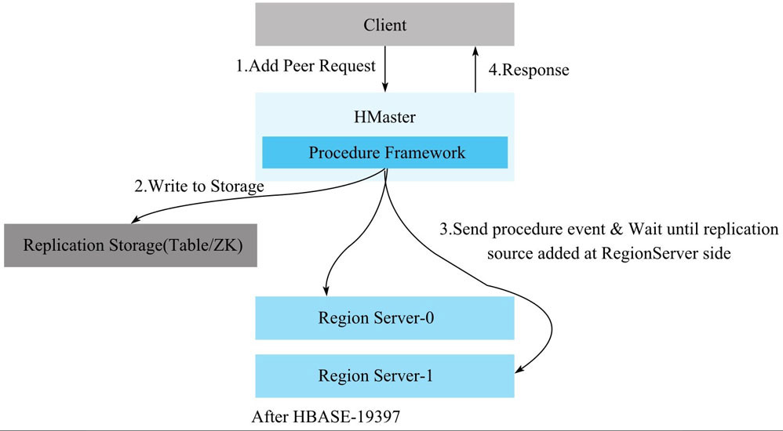
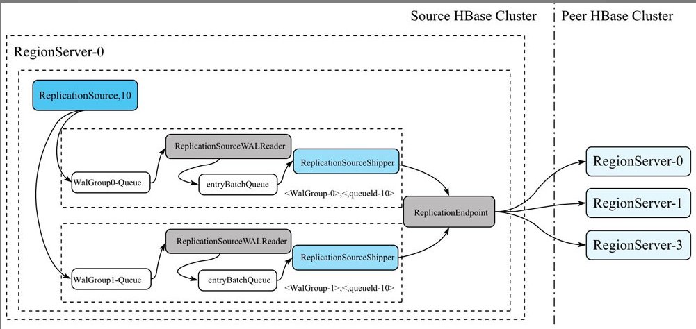
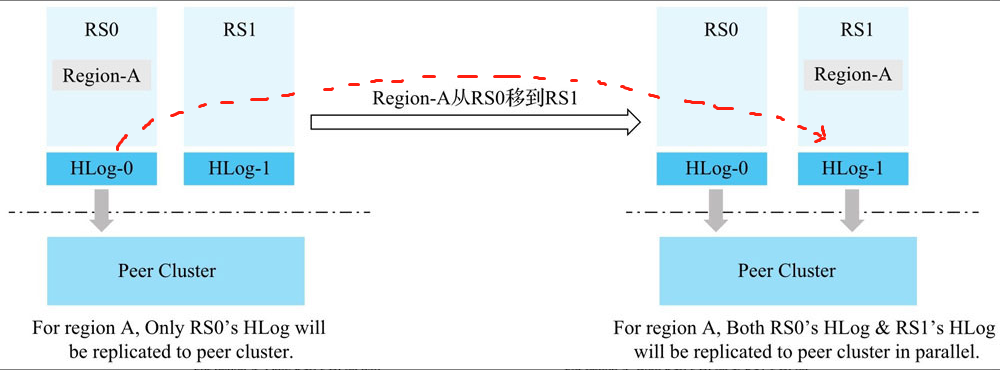
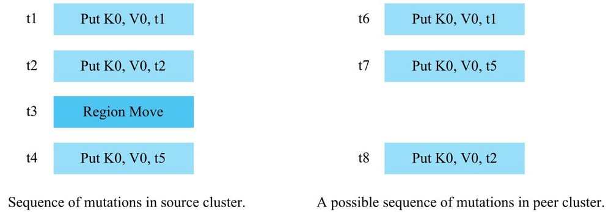
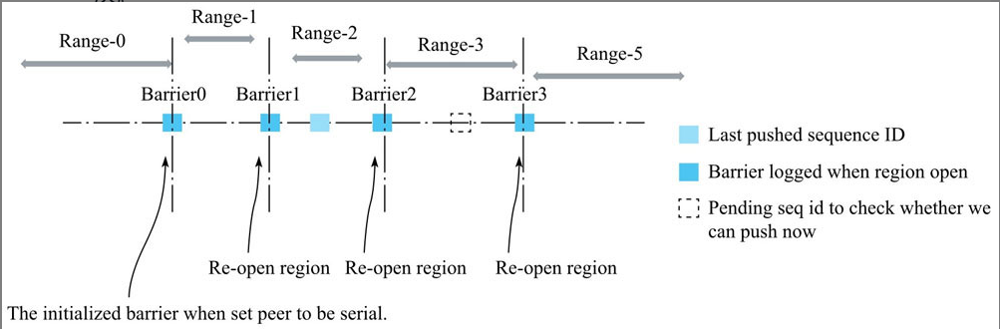
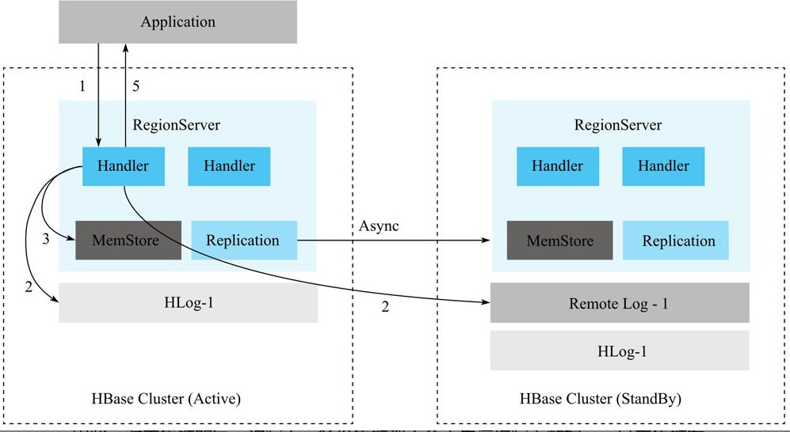

HBase提供了一种集群复制机制。它通过传播WAL文件来保证多集群之间状态互相同步。
一般情况下，这种ClusterReplication机制用于：

1. 数据备份和灾难恢复
2. 离线数据分析

ClusterReplication是在列簇的粒度上启用。也就是说，如果一个表中存在多个列簇，可以只同步其中一个列簇。
在启动Replication之前，需要在目标集群上创建好对应的表和列簇。

默认情况下，集群间复制是异步的。当数据进入A集群后，被写入WAL文件。A集群后台会运行一个线程，将WAL发送到B集群。因为是异步复制，因此，它不能保证数据完全一致。有可能会存在数据数据丢失或顺序不一致情况。为了解决这个问题，HBase在2.1版本提供了同步复制功能。

HBase中Replication和WAL Compression一起使用，会存在兼容性问题。因此，如果需要使用Replication的话，需要关闭WAL Compression。key：`hbase.regionserver.wal.enablecompression`


## Replication介绍

集群之间的复制使用的是：source-push方式。即：主集群主动推送给备集群。

### 开启Replication流程

1 将创建Peer的请求发送到Master。

> peer代表集群间的一种复制关系

2 当Master收到创建Peer的请求时，会在zk上为该Peer创建相关的znode，保证元数据信息不会丢失

3 Master创建完Peer的元数据node后，向每一个RegionServer发送创建Peer的请求，保证每个RegionServer都创建Peer。

4 当每个RegionServer创建完成之后，Master返回创建结果给客户端。




### Replication原理

创建完Peer之后，真正负责数据同步的是RegionServer的ReplicationSource线程。数据推送流程如下：




1 创建Peer时，每个RegionServer会创建一个ReplicationSource线程（线程名：replicationSource_10，10表示PeerId）。ReplicationSource会把当前正在写入的HLog都保存在复制队列中（逻辑保存），然后在RegionServer上注册一个Listener，用来监听HLog Roll操作。如果RegionServer做了HLog Roll操作，那么ReplicationSource收到这个操作后，会把这个HLog分到对应的walGroup-Queue里面，同时把HLog文件名持久化到zk上，这样重启后，还是可以继续复制未完成的HLog。

2 每个WalGroup-Queue后端都有一个ReplicationSourceWALReader的线程，这个线程不断的从Queue去除一个Hlog，然后把HLog中的Entry逐个读出来后，放到一个名为entryBatchQueue的队列中。

3 entryBatchQueue队列后端有一个名为ReplicationSourceShipper的线程，不断从Queue中取出LogEntry，交给Peer的ReplicationEndpoint，ReplicationEndpoint把这些Entry打包成一个replicateWALEntry操作，通过RPC发送到Peer集群的某个RegionServer上，对应的Peer集群的RegionServer把replicateWALEntry解析成若干个Batch操作，并调用batch接口执行。待RPC调用成功之后，ReplicationSourceShipper会更新最近一次成功复制的Hlog Position到ZooKeeper，以便RegionServer重启后，下次能从最新的position开始复制。


### 配置Cluster Replication

#### 操作流程

1 搭建备份集群，在备份集群上创建与主集群相同的表

2 主集群和备集群可以相互访问

3 登录主集群，进入hbase shell，执行add_peer命令

4 执行完add_peer后，再执行enable_table_replication

5 检查是否开启集群间数据同步，通过日志进行检查。关键日志：Log.info("Replicating " + clusterId + " -> " + peerClusterId);


#### 核心命令介绍

**1. add_peer <ID> <CLUSTER_KEY> [STATE] [NAMESPACES] [TABLE_CFS] [SERIAL]**

add_peer：为两个集群之间添加复制关系

ID：一个唯一的字符串，用来标记这种复制关系。因为集群间的复制粒度在列簇上，因此，两个集群之间可以添加多个复制关系。ID就是代表每个复制关系。

CLUSTER_KEY：目标集群的信息。由这种结构组成：`hbase.zookeeper.quorum:hbase.zookeeper.property.clientPort:zookeeper.znode.parent`

STATE：复制链路的状态。可选值：ENABLED/DISABLED，默认是ENABLED。

NAMESPACES：将复制哪个命名空间下的表。

TABLE_CFS：标记复制哪些表和表列簇到备集群。

SERIAL：串行标记，用来标识复制到备集群是否用串行方式复制。默认false。

例如：

```shell
hbase> add_peer '1', CLUSTER_KEY=> "zk1,zk2,zk3:2181:/hbase-backup", STATE=> "DISABLED", NAMESPACES => ["ns1", "ns2"], TABLE_CFS => { "ns3:table1" => [], "ns3:table2" => ["cf1"] }, SERIAL=> true
```


当用户想自定义复制策略，可以使用ENDPOINT_CLASSNAME。它有两个可选参数：DATA和CONFIG。

例如：

```shell
hbase> add_peer '11', ENDPOINT_CLASSNAME => 'org.apache.hadoop.hbase.MyReplicationEndpoint',
    DATA => { "key1" => 1 }, CONFIG => { "config1" => "value1", "config2" => "value2" },
    TABLE_CFS => { "table1" => [], "ns2:table2" => ["cf1"], "ns3:table3" => ["cf1", "cf2"] }
```


**2. list_peers**

列出当前集群中所有的replication关系


**3. enable_peer <ID>**

开启某个replication


**4. disable_peer <ID>**

禁用replication关系，主集群将不再往备集群发送数据，但仍会保留所有的WAL，一旦开启后，则会把保留的WAL发到备集群。


**5. remove_peer <ID>**

删除复制关系，主集群不再给备发送复制。


**6. enable_table_replication <TABLE_NAME>**

**7. disable_table_replication <TABLE_NAME>**

启用和禁用某个表的复制


### 串行复制

串行复制的目的是按数据到达的顺序从源集群复制到目标集群。

#### 为什么需要串行复制

正常情况下，异步复制的方式，是通过WAL的创建时间来顺序读取，然后将数据复制到备集群。但是，当主集群发生region-move，如果存在未推送完成的hlog，hbase会将该hlog文件移动到其它RS上，新的RS会新起一个Replication线程进行复制。由于hlog是追加的，因此，此时会有两个RS并行向备集群复制数据，很容易造成数据不一致。



这种并行操作，会导致：**主集群与备集群的数据不一致**



用户的写入顺序为：t1，t2，t5。用户在写到t5时，还没有进行集群复制（因为是异步的，所以有延迟）。

当用户在写完t2后，发生了region-move，此时，t1，t2的数据是在RS1上，t5的数据在RS2上。

那么，此时两个RS会同时往备集群进行复制数据。最终备集群接收到的可能是：

RS1--> t1

RS2--> t5

RS1--> t2

就会导致主集群和备集群数据不一致。


#### 串行复制的工作原理

并行复制的问题原因是：Region从一个RegionServer移动到另一个RegionServer的过程中，Region的数据会分散在两个RegionServer的HLog上，而两个RegionServer完全独立的推送各自的HLog，从而导致同一个Region的数据并行的写入Peer集群。

知道了问题根因，比较简单的解决思路是：把Region的数据按照Region Move发生的时间点t0分成两段。小于t0时间的数据都在RS0的HLog上，大于t0时间的数据都在RS1的HLog上。让RS0先推小于t0的数据，等RS0把小于t0的数据全部推送到备集群之后，RS1再开始推送大于t0的数据。


hbase的同步策略如下图：



几个概念：

* Barrier：和上述思路中的t0概念类似。具体是指，每一个Region重新Assign到新的RegionServer时，新RegionServer打开Region前能读到最大SequenceId（此Region在HLog中最近一次写入数据分配的Id），因此，每Open一次Region，就会产生一个新的Barrier。
* LastPushedSequenceId：表示该Region最近一次成功推送到备集群的HLog的SequenceId。每成功推送一次，都会更新此值。
* PendingSequenceId：表示该Region当前读到的HLog的SequenceId。


### 同步复制

一般情况下，默认HBase的复制方式是异步复制。即HBase客户端写入数据到主集群之后就返回了，然后主集群再异步的把数据依次推送到备份集群。这样存在的一个问题是，若主集群因为bug或其他原因意外退出无法提供服务时，备份集群的数据是比主集群少的。这时，HBase的可用性将受到极大影响。

#### 设计思路

同步复制的核心思想是，RegionServer在收到写入请求时，不仅会在主集群上写一份HLog日志，还会同时在备份集群上写一份RemoteWAL日志，只有等主集群上的HLog和备集群上的RemoteWAL都写入成功且MemStore写入成功后，才返回给客户端。

除此之外，主集群和备集群之间还会开启异步复制链路，若主集群上的某个HLog通过异步复制完全推送到备份集群，那么这个HLog在备集群上对应的RemoteWAL则被清理，否则不可清理。



因此，主集群的每一次写入，备份集群斗殴不会丢失这次写入的数据，一旦主集群发生故障，只需要回放RemoteWAL日志到备集群，备集群马上就可以为线上提供服务。


#### 开启同步复制的操作流程

**第一步：添加两个同步Replication**

在主集群上添加peer：

```shell
hbase> add_peer '1', CLUSTER_KEY => 'zk1,zk2,zk3:2181:/test-backup', REMOTE_WAL_DIR=>'hdfs://namespace/hbase/test-backup/remoteWALs',TABLE_CFS=>{"test"=>[]}
```

在备集群上添加peer：

```shell
hbase> add_peer '1', CLUSTER_KEY=>'zk1,zk2,zk3:2181:/test',REMOTE_WAL_DIR=>'hdfs://namespace/hbase/hbase/remoteWALs',NAMESPACES=>{"test"=>[]}
```

同步复制需要在主机群和备集群具有相同的peerId，peer只支持table之间的同步。


**第二步：将备集群状态设置为STANDBY状态**

在备集群上操作：

```shell
hbase> transit_peer_sync_replication_state '1', 'STANDBY'
```


**第三步：将主集群设置为ACTIVE状态**

在主集群上操作：

```shell
hbase> transit_peer_sync_replication_state '1', 'ACTIVE'
```

经过这三步操作，同步复制已经设置成功。客户端只能从主集群去读写数据，如果客户端往备集群去读写，则会被拒绝。


#### 备集群崩溃时如何处理

如果备集群崩溃，它将无法为主集群写入remoteWAL，所以我们需要将主集群的状态转换到DOWNGRADE_ACTIVE状态。这意味着，主集群不会再写任何remoteWAL，但是会正常的复制队列仍然可以正常工作，他将新写入的WAL排队，直到备集群恢复。

```shell
hbase> transit_peer_sync_replication_state '1', 'DOWNGRADE_ACTIVE'
```

当备集群恢复后，将主集群状态设置为ACTIVE。

```shell
hbase> hbase> transit_peer_sync_replication_state '1', 'ACTIVE'
```


#### 主集群宕机后如何处理

如果主集群宕机，需要将备集群的状态设置为DOWNGRADE_ACTIVE，同时将流量切到备集群，让备集群变为主集群。

当原来的主集群恢复后，将它设置为STANDBY状态即可。


