# HBase gc优化第一版

<!--more-->

对读写缓存进行了分离，使用了堆外内存，读缓存不再往内存中写。整体gc有了一定的提升，但还是会有整点尖峰情况。

查看HBase的读写请求，基本趋于稳定，所以整点的尖峰，猜测和调整HBase参数基本无关。

下面是读写分离之后，datanode-7上gc的情况。

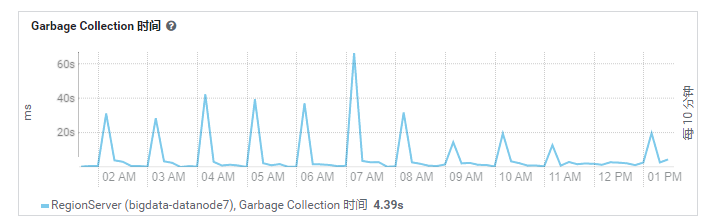

线上OpenTsdb get/delete 请求情况

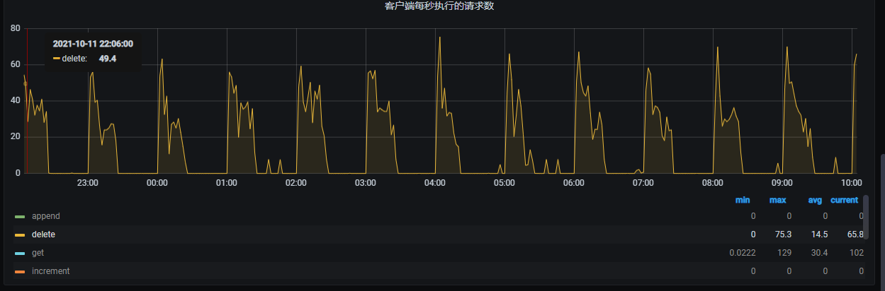

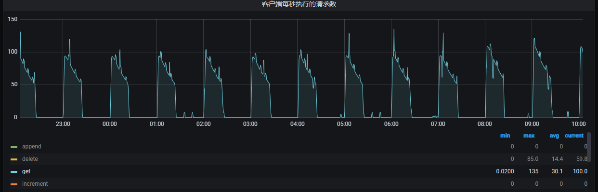

可以看到，它们都是整点的时候有一个小尖峰。

OpenTsdb整点在做compaction，会发出大量的get和delete请求。在整点时对HBase会有一定的冲击。

OpenTsdb官方提供了另一种写方式：append方式。

该方式的意图是：请求进来之后，不再创建新的列，而是追加在一个列上。这样也就不会再去做compaction操作。

# Release环境调整后的现象

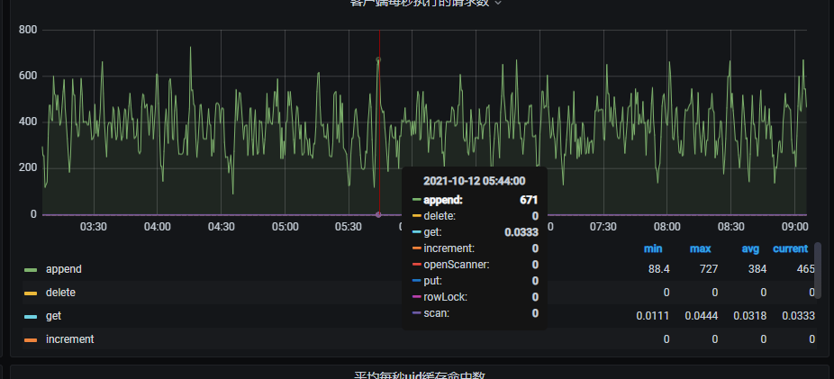

线下HBase GC调整前后对比

调整前：10号~11号

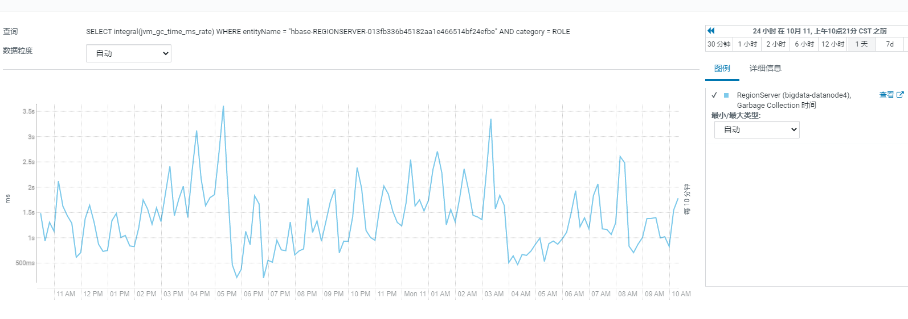

调整后：11号下午6点到12号

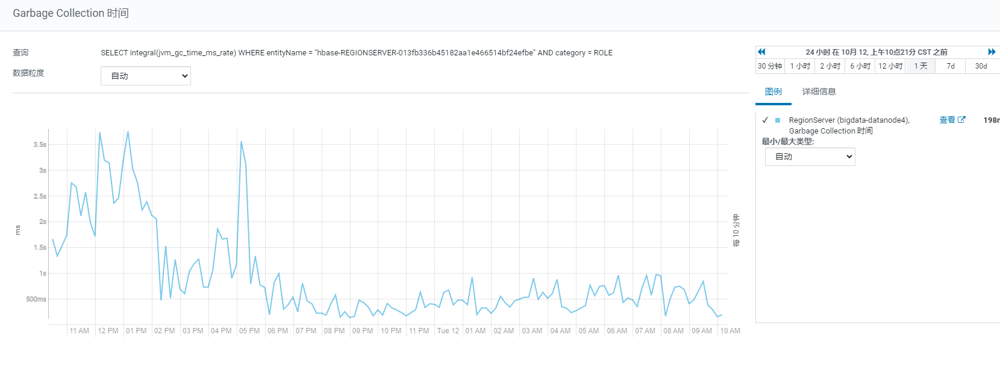

gc明显平稳了很多，但是也有一些小的波动，原因是：HBase被多个环境引用，比如pre-release环境。pre-release环境也会发出一些compaction。

新老数据查询不受影响。

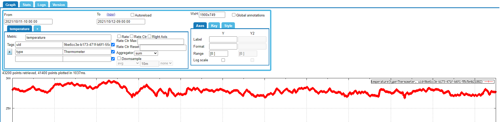

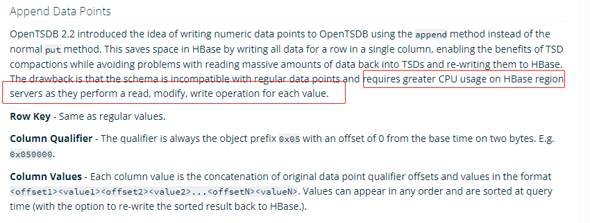

参考文章：https://www.cnblogs.com/bigdatasafe/p/10524023.html

# 关闭Compaction和append

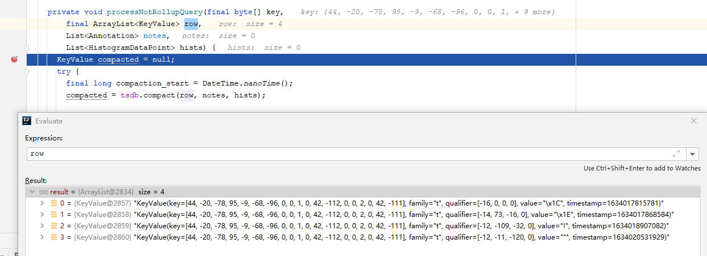

存储在HBase中，底层的StoreFile是多行，查询时，会增加IO，并且，多行存储，rowkey会重复，增加磁盘空间。

开启append模式后，查询情况：

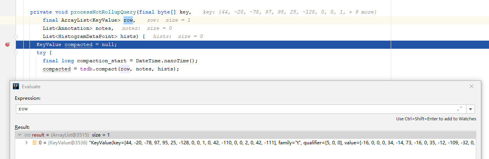

# 减缓压缩速度

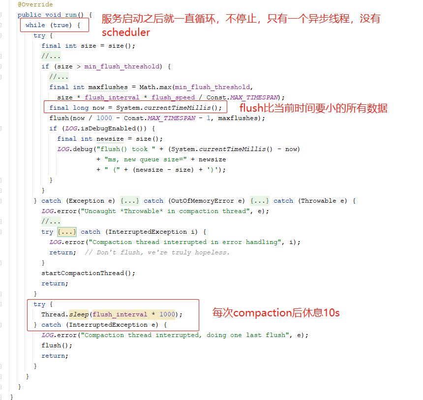

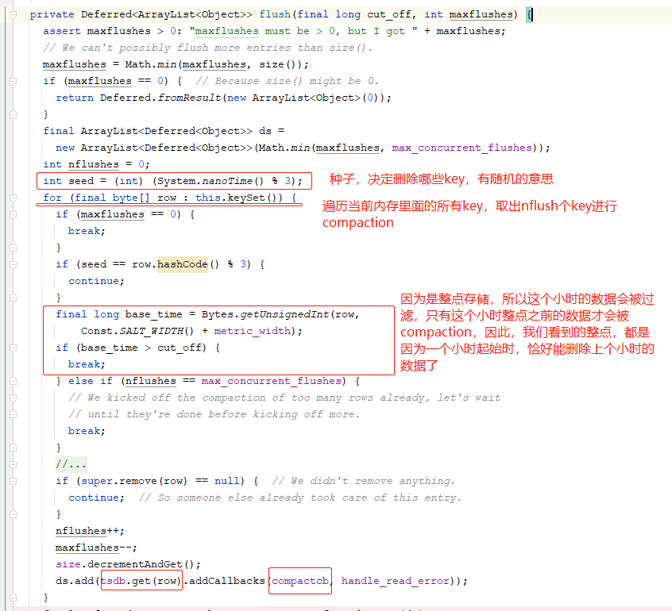

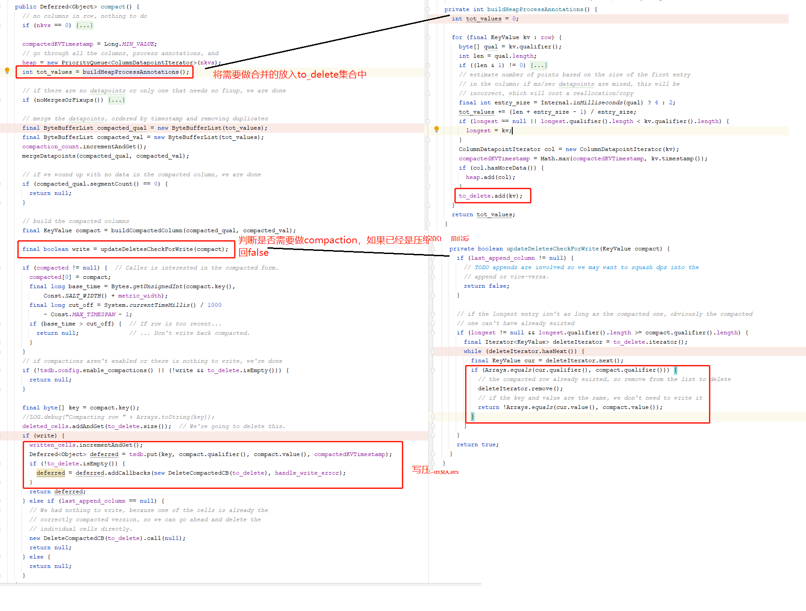