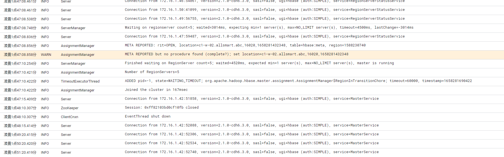
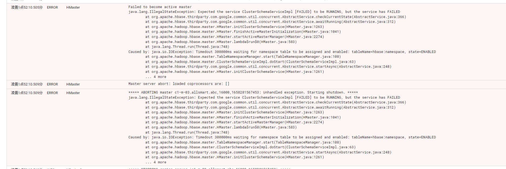
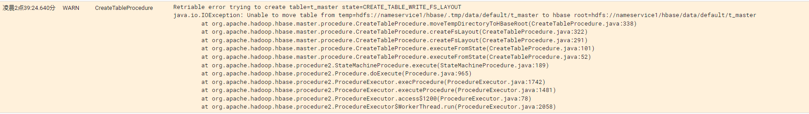

### 启动故障

新搭建的HBase，没有任何表，web-ui上不显示hbase系统表。过一会儿退出master。

关键日志：






问题描述：

hbase的namespace表有问题，连接超时。


解决方案：

1. 将hdfs上的namepace路径删掉：/hbase/data/hbase/namespace
2. 打开zk-cli，将/hbase目录删除（不要怕zk上的目录的重要性，hbase启动时，master会重新去创建）
3. 重启hbase


### 创建表时无权限

在hdfs上，目录：/hbase/data/default是我手动创建的。使用的是hdfs账号创建。

进入hbase shell中创建表，提示权限不够。

解决方案：将default权限给所有用户。

我的操作过程是：删掉/hbase/data/default目录，让其自动创建。

删掉后，因为default目录不存在，再次创建表时，无法创建。/hbase/.tmp目录下记录了创建记录。



提示无法将刚刚创建的.tmp目录移动过去。

使用hbase账号创建一个default目录后，该warn日志消除，刚创建的表恢复正常。

```sh
sudo -u hbase hdfs dfs -mkdir /hbase/data/default
```

新集群操作，一定要注意权限问题。


### 备份数据恢复

因为环境迁移，我备份了旧集群hbase的数据，需要将备份数据还原到新集群。

1. 将备份的表目录移动到hbase目录下。

   例如：sudo -u hbase hdfs dfs -mv /tmp/bucket* /hbase/data/default/

2. 使用meta修复工具，将移动过来的表信息修复在meta表中。

   meta修复工具可以在github中下载：[hbase-meta-repair](https://github.com/DarkPhoenixs/hbase-meta-repair)

3. 重启master

4. hbase shell执行disable/enable，重新加载表。

**注意：一定要注意权限问题。写到hdfs的文件可能是hdfs权限，移动到hbase目录下，一定要给足权限。否则出现永久RIT。**

