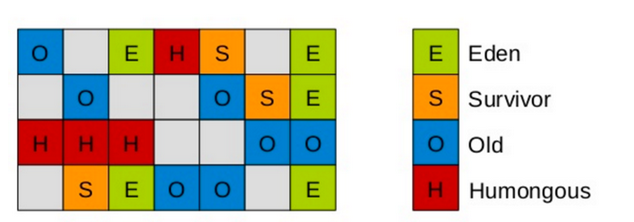
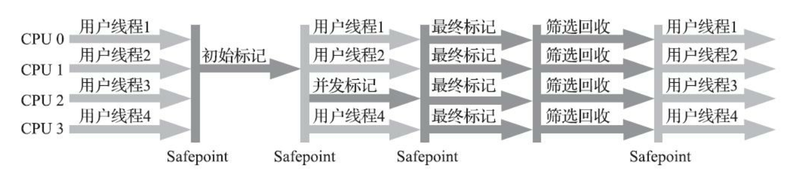

## G1收集器（-XX:+UseG1GC）

G1收集器**主要是针对配备多核处理器及大容量内存的机器**，以极高概率满足GC停顿时间要求的同时，还具备高吞吐量的性能特征。

G1收集器将Java堆划分为多个大小相等的独立区域（Region），JVM最多可以有2048个Region。一般Region大小等于堆大小除以2048。

G1保留了年轻代和老年代的概念，但不再是物理隔离了，它们是逻辑上的概念。

默认G1年轻代堆内存占比是5%，上限60%。年轻代中的Eden区和Survivor区和以前一样，默认是8:1:1。

假设一个4096M的堆大小，那么年轻代将占据200M的内存，大概对应100个Region。其中，eden区80个，s0和s1各10个。

**一个Region可能之前是年轻代，如果Region进行了gc，它可能将会变为空Region，也可能因为有大量对象要移动到老年代，它直接从年轻代变为老年代。也就是说，Region的区域功能可能会随时动态变化。**

关于大对象进入到老年代，G1专门分配存大对象的Region，叫Humongous区。**在G1中，大对象的判定规则是：一个大对象超过了一个Region大小的50%。例如一个Region2M，那么一个大对象超过1M就会被放入Humongous区，如果一个对象太大，它会跨多个Region来存放。**

Humongous区专门存放短期巨型对象，不用直接进入老年代，可以节约老年代的空间，避免因为老年代空间不够的GC开销。

### G1收集过程

**初始标记**

暂停所有的其他线程，并记录下gc roots直接能引用的对象，速度很快；

**并发标记**

同CMS的并发标记

**最终标记**

同CMS的重新标记

**筛选回收**

筛选回收阶段首先对各个Region的回收价值和成本进行排序，根据用户所期望的GC停顿时间来指定回收计划。

比如说老年代此时有1000个Region都满了，但因为根据预期停顿时间，本次垃圾回收可能只停顿200ms，通过之前回收成本计算得知，可能回收其中800个Region刚好需要200ms，那么就会只回收800个Region，尽量把GC导致的停顿时间控制在我们制定的范围内。

不管是年轻代还是老年代，G1回收算法都是复制算法，将一个region中的存活对象复制到另一个region中，不会像CMS那样回收完因为有很多内存碎片还需要整理一次，G1采用复制算法回收几乎不会有太多内存碎片。

G1收集器在后台维护了一个优先队列，每次根据允许的收集时间，优先选择回收价值最大的Region。比如一个Region花200ms就能回收10M垃圾，另外一个Region花50ms就能回收20M垃圾，那么G1会优先回收后一个Region。

### G1垃圾收集分类

**Young GC**

YoungGC并不是说现有的Eden区放满了就会马上触发，G1会计算下现在Eden区回收大概需要多久时间，如果回收时间远远小于参数-XX:MaxGCPauseMills设定的值，那么增加年轻代的region，继续给新对象存放，不会马上做Young GC。

**Mixed GC**

它不是FullGC，老年代的堆占有率达到参数（-XX:InitiatingHeapOccupancyPercent）设定的值则触发，回收所有的Young和部分Old以及大对象区，正常情况下G1垃圾收集器是先做MixedGC，把存活的Region拷贝到空的region中去，拷贝过程中如果没有足够的空region，则触发一次full gc。

**Full GC**

停止系统程序，然后采用单线程进行标记、清理和压缩整理，好空闲出来一批Region来供下一次MixedGC使用，这个过程是非常耗时的。

### G1收集器参数设置

  -XX:+UseG1GC:使用G1收集器
  -XX:ParallelGCThreads:指定GC工作的线程数量
  -XX:G1HeapRegionSize:指定分区大小(1MB~32MB，且必须是2的N次幂)，默认将整堆划分为2048个分区
  -XX:MaxGCPauseMillis:目标暂停时间(默认200ms)
  -XX:G1NewSizePercent:新生代内存初始空间(默认整堆5%)
  -XX:G1MaxNewSizePercent:新生代内存最大空间
  -XX:TargetSurvivorRatio:Survivor区的填充容量(默认50%)，Survivor区域里的一批对象(年龄1+年龄2+年龄n的多个
年龄对象)总和超过了Survivor区域的50%，此时就会把年龄n(含)以上的对象都放入老年代
  -XX:MaxTenuringThreshold:最大年龄阈值(默认15)
  -XX:InitiatingHeapOccupancyPercent:老年代占用空间达到整堆内存阈值(默认45%)，则执行新生代和老年代的混合
收集(MixedGC)，比如我们之前说的堆默认有2048个region，如果有接近1000个region都是老年代的region，则可能
就要触发MixedGC了
 -XX:G1MixedGCLiveThresholdPercent(默认85%)  region中的存活对象低于这个值时才会回收该region，如果超过这
个值，存活对象过多，回收的的意义不大。
  -XX:G1MixedGCCountTarget:在一次回收过程中指定做几次筛选回收(默认8次)，在最后一个筛选回收阶段可以回收一
会，然后暂停回收，恢复系统运行，一会再开始回收，这样可以让系统不至于单次停顿时间过长。
  -XX:G1HeapWastePercent(默认5%): gc过程中空出来的region是否充足阈值，在混合回收的时候，对Region回收都
是基于复制算法进行的，都是把要回收的Region里的存活对象放入其他Region，然后这个Region中的垃圾对象全部清
理掉，这样的话在回收过程就会不断空出来新的Region，一旦空闲出来的Region数量达到了堆内存的5%，此时就会立
即停止混合回收，意味着本次混合回收就结束了。

### G1收集器优化建议

什么场景适合使用G1
1. 50%以上的堆被存活对象占用
2. 对象分配和晋升的速度变化非常大
3. 垃圾回收时间特别长，超过1秒
4. 8GB以上的堆内存(建议值)
5. 停顿时间是500ms以内

假设参数 -XX:MaxGCPauseMills 设置的值很大，导致系统运行很久，年轻代可能都占用了堆内存的60%了，此时才触发年轻代gc。
那么存活下来的对象可能就会很多，此时就会导致Survivor区域放不下那么多的对象，就会进入老年代中。
或者是你年轻代gc过后，存活下来的对象过多，导致进入Survivor区域后触发了动态年龄判定规则，达到了Survivor区域的50%，也会快速导致一些对象进入老年代中。
所以这里核心还是在于调节 -XX:MaxGCPauseMills 这个参数的值，在保证他的年轻代gc别太频繁的同时，还得考虑每次gc过后的存活对象有多少,避免存活对象太多快速进入老年代，频繁触发mixed gc.

