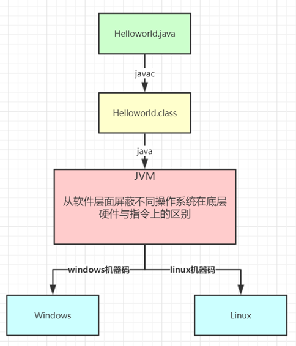
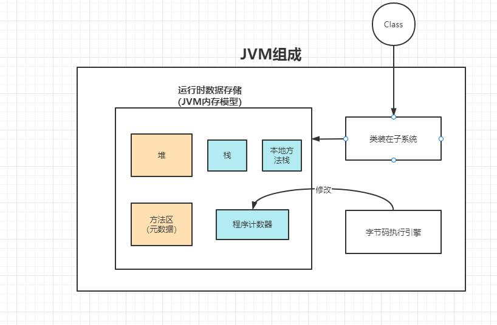
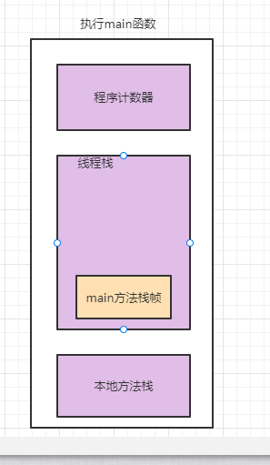
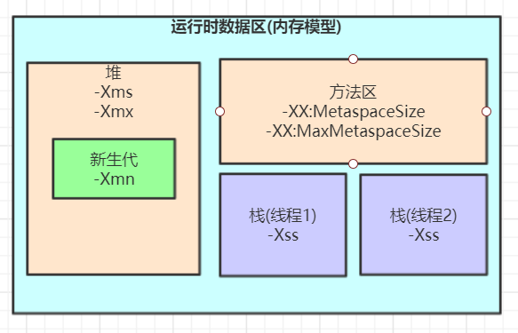
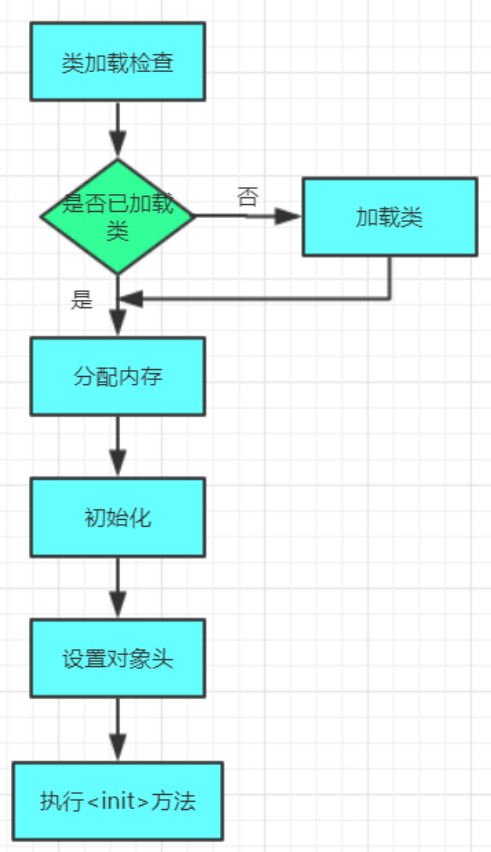
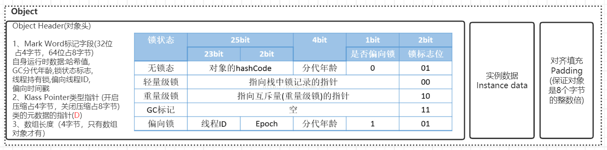
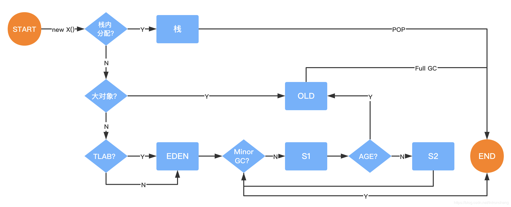
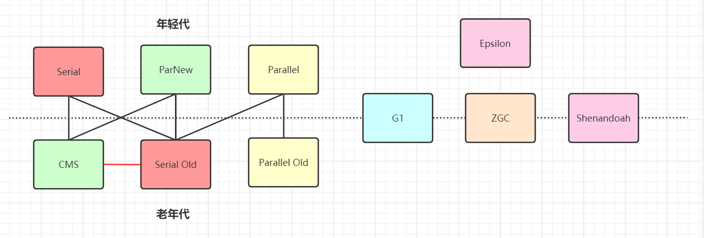
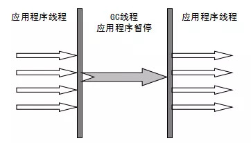
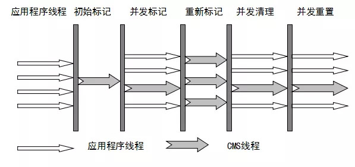

## Java语言的跨平台特性

Java语言可以跨平台运行。之所以能跨平台运行，主要是由于它有适配各种平台的运行环境。它被一个称为Java虚拟机的进行了包装，每个平台都有对应的java虚拟机。

## JVM整体结构及运行模型

### JVM组成

JVM的组成：类装在子系统、运行时数据存储（Java内存模型）、字节码执行引擎

当我们编写好一个类后，jvm会通过类加载器把我们的类加载到jvm，存储jvm内存模型中。当我们运行一个类时，字节码执行引擎会去修改程序计数器来确定执行位置。

### JVM内存模型

JVM的内存组成部分：堆、方法区（jdk8后也叫元空间）、栈（线程栈）、本地方法栈（native栈）和程序计数器。

当我们执行一个main函数时，通过java命令，会先调用c++代码，启动一个jvm，将我们的类加载到jvm中。被加载的信息存储在元数据空间。元数据空间里面主要存放的是：常量、静态变量、类信息（类名、方法引用等）

-----

被加载后的类被jvm调用后，分别会在线程栈、本地方法栈中分配栈帧，创建一块程序计数器内存空间。

该部分内存是线程私有的。每个线程都会分配自己的内存空间。

栈里面主要存放：局部变量表、操作数栈、动态链接、方法出口

- 局部变量表：方法里面定义的变量
- 操作数栈：操作指令，例如：1+1，会将计算机指令依次压入操作数栈
- 动态链接：指向运行时常量池的动态引用
- 方法出口：例如返回结果、调用方法

-----

如果我们在main方法里面创建了对象，该对象会被分配在堆里面，栈里面存储一个指向堆中对象的地址。

jvm根据对象的存活时间，又将堆分为了新生代和老年代。新生代用于存放刚创建的对象，老年代存放长时间存活的对象。根据垃圾回收情况，新生代又被划分为eden区和两个交换区。比例分别为：8：1：1。

## JVM内存参数设置

细节：

-XX:MetaspaceSize 是指定元空间触发fullgc的初始阈值，单位是字节，默认21M。达到该值就会触发full gc进行类型卸载，同时收集器会对该值进行调整：如果释放了大量空间，则适当降低该值；如果释放了很少的空间，那么则适当的提高。

-Xss设置越小的值，说明一个线程栈里能分配的栈帧就越少。对整个jvm来说，能开启的线程数会更多。1个线程默认分配1M内存。

## 对象的创建过程

**1. 类加载检查**

虚拟机遇到一条new指令时，首先将去检查这个指令的参数是否能在常量池中定位到一个类的符号引用，并且检查这个符号引用代表的类是否已经被加载、解析和初始化过。如果没有，则先进行一次类加载过程。

**2. 分配内存**

在类加载检查通过后，接下来虚拟机将为新生对象分配内存，对象所需的内存大小在类加载完成后便可完全确定，为对象分配空间的任务等同于把一块确定大小的内存从Java堆中划分出来。

这个步骤有两个问题：

1. 如何划分内存
2. 在并发情况下，可能出现正在给对象A分配内存，指针还没来得及修改，对象B又同时使用了原来的指针来分配内存的情况。

**划分内存的方法：**

- 指针碰撞

  > 如果Java堆中内存是绝对规整的，所有用过的内存都放在一边，空闲的内存放在另一边，中间放着一个指针作为分界点的指示器，那所分配内存就仅仅是把那个指针向空闲空间那边挪动一段与对象大小相同的距离。

- 空闲列表

  > 如果Java堆中内存并不是规整的，已使用的内存和空闲的内存相互交错，那就没有办法简单的进行指针碰撞了，虚拟机必须维护一个列表，记录哪些内存块是可用的，在分配的时候从列表中找到一块足够大的空间划分给对象实例，并更新列表上的记录。

**解决并发问题的方法：**

- CAS

  > 虚拟机采用CAS配上失败重试的方式保证更新操作的原子性来对分配内存空间的动作进行同步处理

- 本地线程分配缓存（TLAB）

  > 把内存分配的动作按照线程划分在不同的空间之中进行，即每个线程在Java堆中预先分配一小块内存。

**3. 初始化**

内存分配完成后，虚拟机需要将分配的内存空间都初始化为零值。

**4. 设置对象头**

初始化零值之后，虚拟机要对对象进行必要的设置，例如这个对象是哪个类的实例、如何才能找到类的元数据信息、对象的哈希码、对象的GC分代年龄等信息，这些信息存放在对象的对象头之中。

在HotSpot虚拟机中，对象被分为三块：对象头、实例数据、对齐填充。

**5. 执行init方法**

执行<init>方法，即对象按照程序员的意愿进行初始化。对应到语言层面上讲，就是对属性赋值和执行构造方法。

## 对象的内存分配

### **对象在栈上分配**

对象一般是在某个方法执行时被创建出来的，如果该对象只是在局部变量中使用，当方法执行结束后，该对象就立即变成了垃圾对象。如果将此对象分配在堆中，需要依靠gc来进行回收，给gc带来压力。

因此，JVM为了降低gc压力，会通过逃逸分析来确定该对象会不会被外部访问，如果该对象不会逃逸，则优先在栈上分配内存。这样，对象所占用的内存空间就可以随着方法结束而销毁。

**逃逸分析：**

分析对象的动态作用域，当它是局部变量时，则该对象是未逃逸状态。

**标量替换**

当通过逃逸分析得出某个对象不被外部引用时，会判断该对象是否能进一步被分解，如果可以，jvm会将该对象成员变量分解成若干个子对象，在栈中为这些子对象分配空间。这样的做法被称作标量替换。

标量替换的好处：不会因为没有一大块连续空间而导致对象内存不够分配。

一般标量是不能被进一步分解的量。在java中一般是基本数据类型和reference类型。能被进一步分解的被称作是聚合量。

### 对象在Eden区分配

一般对象都是在新生代的eden区分配。当eden区空间不足时，会触发一次minor gc。新生代的特点是朝生夕死，所以每次进行minor gc时，存活的对象会很少，而新生代一般都用复制算法来回收垃圾，所以新生代的空间被划分为一个eden区和两个survivor区。每次进行minor gc时，存活的对象会被复制到空的交换区。他们的比例默认是8:1:1。

### 对象在老年代分配

#### 大对象直接进入老年代

大对象就是需要大量连续内存空间的对象（比如：字符串、数组）。jvm参数 -XX:PretenureSizeThreshold 可以设置大对象的大小。如果对象大小超过设置大小时，则直接进入老年代。这个参数只能在Serial和ParNew两个收集器下有效。

为什么要将大对象直接放入老年代呢？

目的是为了避免大对象每次进行minor gc时，连续从交换区互相复制。

#### 长期存活的对象进入老年代

前面有介绍，每个对象的对象头里面都会维护一个4位(最大值15)的分代年龄，每次触发一次minor gc还没有被回收的对象，分代年龄+1，当分代年龄达到15次后（默认15次，CMS收集器默认是6次），下次进行minor gc时，该对象会被放入老年代。如果想提前进入老年代，可以通过参数： -XX:MaxTenuringThreshold  来设置进入老年代前minor gc的次数。

#### 对象动态年龄判断

由于每次minor gc发生后，存活的对象都会进入Survivor区，为了保证下次minor gc有新的对象进入，JVM做了一个动态年龄判断，当Survivor区中某一批对象的总大小大于等于survivor区总大小的50%时，对象年龄大于这一批的对象，将会直接被放入老年代中。例如：年龄1，年龄2……年龄10的对象总大小超过了50%，则年龄10以上的对象都会被提前放入老年代。

#### 老年代空间分配担保机制

每次minor gc之前，jvm都会去计算一下老年代剩余可用空间。如果老年代剩余可用空间小于年轻代里现有的对象总大小，则会去判断历史每次一进入老年代的对象平均大小是否大于老年代剩余的空间，如果大于，则触发一次full gc，对老年代和新生代同时进行一次垃圾回收，回收后还是没有足够空间，则出现OOM。

## 对象的内存回收

### 垃圾判断算法

#### 引用计数法

给每一个对象添加一个引用计数器，每当有一个地方引用它，则计数器+1，当引用失效后，计数器-1。某个对象计数器为0时，认为该对象是垃圾对象，可被回收。

该算法有个致命的缺点就是，如果两个对象是互相引用对象，但是没有被其它对象引用，那么这两个对象永远不会被回收。目前的jdk已经不用该回收算法了。

#### 可达性算法

将“GC Root”作为对象起点，从这些节点开始向下搜索引用对象，找到的对象都标记为非垃圾对象，其余未标记的都是垃圾对象。

GC Root：线程栈的局部变量、静态变量、本地方法栈变量、常量等。

### 垃圾回收算法

#### 标记-清除

先标记存活对象，再将未标记的垃圾对象清理。

优点：实现简单

缺点：会产生内存碎片、效率低

#### 标记-整理

和标记-清除类似，先标记存活对象，再将存活对象全部向一端移动，最后清理边界意外的所有对象。

优点：不会产生内存碎片

缺点：存活对象多时，标记效率低下

#### 复制算法

复制算法是为了解决标记效率低下的问题而出现的。它将内存分为大小相同的两个区域，每次只使用其中的一块，当这一块内存用完后，将还存活的对象复制到另一边去，然后再同一清理该块内存空间。如此反复。

该算法的缺点是，会浪费空间。每次都只有一半的内存可用。

#### 分代收集理论

根据对象的存活周期，将堆分为新生代和老年代，新生代中存放的大部分是朝生夕死的对象，只需要提供一小块空闲区域用来复制存活对象。该区域一般用复制算法。老年代一般存放持久对象，该区域可用标记清除或标记整理算法进行回收。

### 垃圾收集器

垃圾收集算法是一种理论，垃圾收集器是基于理论的一种实现。

常见的垃圾收集器：

#### Serial收集器

早期的计算机是一个单核计算机，所以在进行gc时，用单线程来执行。

Serial可用在新生代和老年代。新生代使用复制算法回收，老年代使用标记-清除算法进行回收。

serial收集器实现步骤：

当它进行gc回收时，会stop the world。

#### Parallel收集器

随着时间的推移，多核cpu出现，为了提升gc效率，降低stop the world时间，产生了新的收集器：并发收集器。

它的原理和Serial收集器一样，唯一不同的在于，它可以多线程并行gc。默认的线程数是cpu的核数。

#### ParNew收集器

ParNew收集器的原理与Parallel收集器一样。唯一的区别是，Parallel不能和CMS组合使用，而ParNew可以和CMS收集器组合。

#### CMS收集器

再之后，计算机需要的内存越来越大，垃圾越来越多，如果使用Parallel收集器，stop the world时间会更长。为了降低等待时间，CMS收集器出现了。CMS收集器的目的是：降低stop the world时间，但是整个gc时间会变长。

CMS收集器原理如下：

CMS收集器主要用于老年代。

- 初始标记：暂停所有的其它线程，并记录gc roots**直接能引用的对象**，速度很快。
- 并发标记：并发标记阶段是从上一阶段找到的对象开始遍历整个对象图的过程，这个过程耗时较长，但可以和用户线程共同进行。因为用户线程也在运行，会导致已经标记过的对象状态发生变化。
- 重新标记：重新标记阶段就是为了修正并发标记期间的变动情况。这个阶段的停顿时间会比初始阶段稍微长一点，主要用到三色标记里面的增量更新算法做重新标记。
- 并发清理：开始清理未被标记过的对象，这个阶段可以和用户线程同时进行。
- 并发重置：将标记过的对象状态清除。

CMS优点是stop the world时间短，缺点是：

1. 对cpu资源敏感，会和业务服务抢资源
2. 无法处理浮动垃圾（并发标记阶段和并发清理阶段产生的垃圾）
3. 并发full gc。本次full gc还未结束，因为和用户线程在同时进行，可能存在再次触发full gc的情况。此时，它会完全进入stop the world，使用serial old垃圾收集器来回收。

**CMS相关的核心参数：**

1. -XX:+UseConcMarkSweepGC：启用cms
2. -XX:ConcGCThreads：并发的GC线程数
3. -XX:+UseCMSCompactAtFullCollection：FullGC之后做压缩整理（减少碎片）
4. -XX:CMSFullGCsBeforeCompaction：多少次FullGC之后压缩一次，默认是0，代表每次FullGC后都会压缩一
次 
5. -XX:CMSInitiatingOccupancyFraction: 当老年代使用达到该比例时会触发FullGC（默认是92，这是百分比）
6. -XX:+UseCMSInitiatingOccupancyOnly：只使用设定的回收阈值(-XX:CMSInitiatingOccupancyFraction设
定的值)，如果不指定，JVM仅在第一次使用设定值，后续则会自动调整
7. -XX:+CMSScavengeBeforeRemark：在CMS GC前启动一次minor gc，目的在于减少老年代对年轻代的引
用，降低CMS GC的标记阶段时的开销，一般CMS的GC耗时 80%都在标记阶段
8. -XX:+CMSParallellnitialMarkEnabled：表示在初始标记的时候多线程执行，缩短STW
9. -XX:+CMSParallelRemarkEnabled：在重新标记的时候多线程执行，缩短STW

#### G1收集器

参考下篇

### 三色标记算法

在CMS收集器中，并发标记的过程中，因为标记期间是和应用线程同时跑，对象间的引用可能发生变化，有多标或漏标的情况发生。

jvm在进行对象遍历时，会根据“是否访问过”这个条件标记成三种颜色。

- 黑色：表示对象已经被垃圾收集器访问过，且这个对象的所有引用都已经扫描过。黑色的对象代表已经扫描过，它是安全存活的，如果有其它对象引用指向了黑色对象，无需重新扫描一遍。
- 灰色：表示对象已经被垃圾收集器访问过，但这个对象上至少存在一个引用还没有被扫描过。
- 白色：表示对象尚未被垃圾收集器访问过。

CMS收集器，在收集的过程中会产生浮动垃圾。例如：初始标记时，标记的对象，在并发标记过程中，失效了。

浮动垃圾不会影响垃圾回收的正确性，只是需要等到下一轮垃圾回收中才被清除。

而在初始标记过程中未被标记的对象，在并发标记的过程中，有可能被引用。这个时候就会出现漏标的情况。漏标影响垃圾回收的正确性。会在重新标记的过程中，采用增量更新和原始快照的方式来重新标记。

