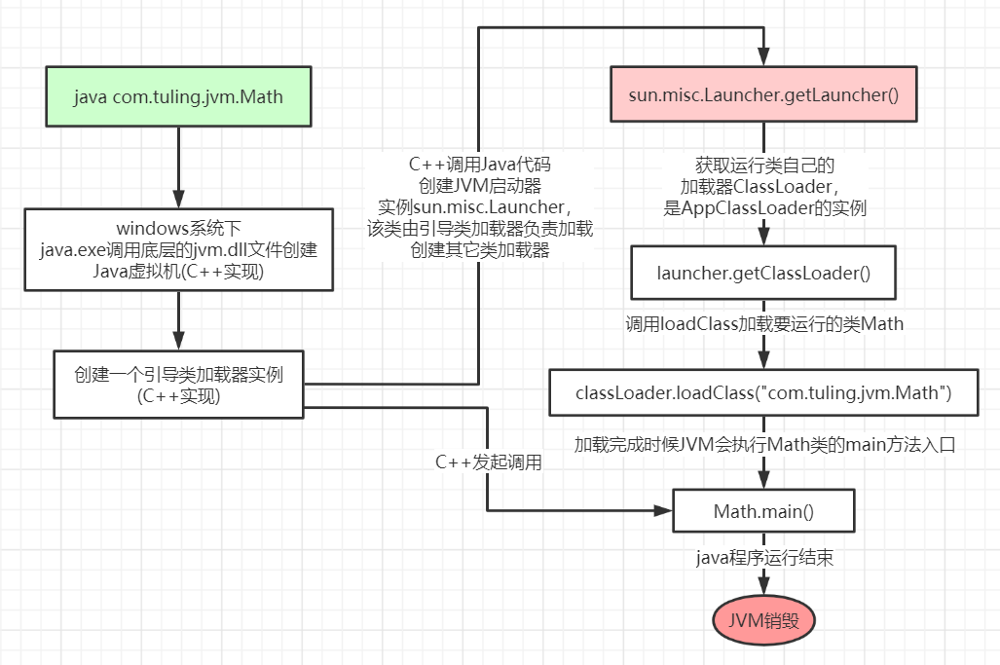
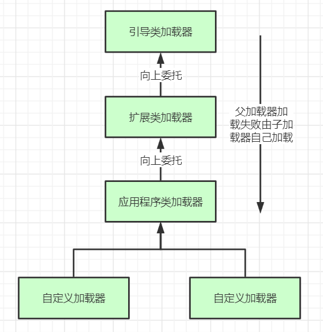

## 类加载过程

当我们用java命令运行某个类的main函数启动程序时，首先需要通过类加载器把主类加载到
JVM。

Java命令执行的大体流程如下：



其中，loadClass的类加载过程：加载->验证->准备->解析->初始化

**加载**

将编译好的class文件加载到jvm。即：从硬盘上查找并通过IO读入字节码文件。

在使用到类时才会加载，例如调用类的main方法，或者初始化类。在这个阶段，会在内存中生成一个代表该类的class对象，存储在方法区。

**验证**

校验字节码文件的正确性。

**准备**

当一个类经过校验后，会开始为这个类里面的静态变量分配内存，并赋予一个默认值。

例如：

```java
public class Demo {
    private static String name = "lizy";
}
```

此阶段，会为name分配一个内存空间，默认值为null。

**解析**

将符号引用替换为直接引用。该阶段会把一些静态方法替换为指向数据所存内存的指针，这是所谓的静态链接过程（类加载期间完成），动态链接是在程序运行期间完成的。

**初始化**

对类的静态变量进行初始化，并执行静态代码块。

类被加载到方法区中，主要包含 **运行时常量池、类型信息、字段信息、方法信息、类加载器的引用、对应class实例的引用** 等信息。

- 类加载器的引用：这个类到类加载器实例的引用
- 对应class实例的引用：类加载器在加载类信息放到方法区中后，会创建一个对应的Class类型的对象实例放到堆中，作为开发人员访问方法区中类定义的入口和切入点。


**注意：**

主类在运行过程中如果使用到其它类，会逐步加载这些类，jar包或war包里的类不是一次性全部加载的，是使用到时才加载。

例如：

```java
public class TestDynamicLoad {

    static {
        System.out.println("----load TestDynamicLoad----");
    }

    public static void main(String[] args) {
        new A();
        System.out.println("----load test----");
        B b = null;
    }

}


class A {
    static {
        System.out.println("----load A----");
    }

    public A() {
        System.out.println("----init A----");
    }
}

class B {
    static {
        System.out.println("----load B----");
    }

    public B() {
        System.out.println("----init B----");
    }
}
```

运行结果：

```
----load TestDynamicLoad----
----load A----
----init A----
----load test----
```

因为TestDynamicLoad是主类，在启动jvm后，jvm会去优先加载它。而其他的类属于运行时类，在运行过程中，再去加载。


## 类加载器

### Java中的几种类加载器

- 引导类加载器

  > 负责加载支撑jvm运行的位于JRE的lib目录下的核心类库，比如rt.jar，charsets.jar等

- 扩展类加载器

  > 负责加载支撑jvm运行的位于lib目录下的ext扩展目录中的jar包

- 应用程序类加载器

  > 负责加载ClassPath路径下的类包，主要是用户写的类

- 自定义类加载器

  > 负责加载用户自定义路径下的包

一个类加载器示例：

```java
public class TestJDKClassLoader {

    public static void main(String[] args) {
        // jvm定义的几种类加载器
        System.out.println(String.class.getClassLoader());
        System.out.println(DESKeyFactory.class.getClassLoader().getClass().getName());
        System.out.println(TestJDKClassLoader.class.getClassLoader().getClass().getName());

        System.out.println();

        // 每种类加载器的父子关系
        ClassLoader systemClassLoader = ClassLoader.getSystemClassLoader();
        ClassLoader systemClassLoaderParent = systemClassLoader.getParent();
        ClassLoader systemClassLoaderParentParent = systemClassLoaderParent.getParent();
        System.out.println("systemClassLoader : " + systemClassLoader.getClass().getName());
        System.out.println("systemClassLoader parent : " + systemClassLoaderParent.getClass().getName());
        System.out.println("systemClassLoader parent parent : " + systemClassLoaderParentParent);
    }

}
```

打印结果：

```
null
sun.misc.Launcher$ExtClassLoader
sun.misc.Launcher$AppClassLoader

systemClassLoader : sun.misc.Launcher$AppClassLoader
systemClassLoader parent : sun.misc.Launcher$ExtClassLoader
systemClassLoader parent parent : null
```

其中，引导类加载器是有C++实现，java无法获取c++对象，故引导类加载器打印的是null。


### 类加载器初始化过程

从上面可以看到，JVM启动后，会优先初始化一个Launcher类，该Launcher负责类加载过程。

Launcher的初始化过程如下：

```java
public Launcher() {
    Launcher.ExtClassLoader var1;
    try {
        // 构造扩展类加载器，在构造的过程中将其父加载器设置为null
        var1 = Launcher.ExtClassLoader.getExtClassLoader();
    } catch (IOException var10) {
        throw new InternalError("Could not create extension class loader", var10);
    }

    try {
        // 构造应用类加载器，在构造过程中将其父类加载器设置为ExtClassLoader
        // Launcher的成员变量loader是AppClassLoader，我们一般用这个类加载器来加载我们自己写的应用程序
        this.loader = Launcher.AppClassLoader.getAppClassLoader(var1);
    } catch (IOException var9) {
        throw new InternalError("Could not create application class loader", var9);
    }

    // ... 省略一些不重要的过程 ...
    }
}
```

从类加载器初始化的过程可以看出，类加载器有父子关系。

### 双亲委派机制



类加载过程就是**双亲委派机制**：加载某个类时会先委托父加载器寻找目标类，找不到再由子加载器来加载。

类加载过程，主要是调用的ClassLoader的loadClass方法。下面看下具体加载源码：

**ClassLoader**

```java
protected Class<?> loadClass(String name, boolean resolve)
    throws ClassNotFoundException
{
    synchronized (getClassLoadingLock(name)) {
        // First, check if the class has already been loaded
        Class<?> c = findLoadedClass(name);
        if (c == null) {
            long t0 = System.nanoTime();
            try {
                if (parent != null) {
                    c = parent.loadClass(name, false);
                } else {
                    c = findBootstrapClassOrNull(name);
                }
            } catch (ClassNotFoundException e) {
                // ClassNotFoundException thrown if class not found
                // from the non-null parent class loader
            }

            if (c == null) {
                // If still not found, then invoke findClass in order
                // to find the class.
                long t1 = System.nanoTime();
                c = findClass(name);

                // this is the defining class loader; record the stats
                sun.misc.PerfCounter.getParentDelegationTime().addTime(t1 - t0);
                sun.misc.PerfCounter.getFindClassTime().addElapsedTimeFrom(t1);
                sun.misc.PerfCounter.getFindClasses().increment();
            }
        }
        if (resolve) {
            resolveClass(c);
        }
        return c;
    }
}
```

从源码中可以看出：

1. 首先检查制定名称的类是否已经加载过，如果加载过了，就不需要再加载，直接返回。加载的缓存集合是写在C++里面。
2. 如果此类没有加载过，那么再判断一下是否有父加载器，如果有父加载器，则有父加载器加载，如果没有父加载器，则由bootstrap加载器来加载。
3. 如果父加载器及bootstrap加载器都没找到指定的类，那么再调用当前类加载器的findClass方法来完成类加载。


**为什么要设计双亲委派机制？**

- 沙箱安全机制

  > 保护java 核心api不会被篡改，例如用户自定义的java.lang.String类，是不会被加载到的。

- 避免类的重复加载

  > 父加载过的类，子就没必要再加载。


### 自定义类加载器

自定义类加载器只需要继承ClassLoader类，该类有两个核心方法，一个是loadClass，实现了双亲委派机制，另一个是findClass，默认实现是空方法，所以我们可以重写这两个方法来实现自定义类加载器。

```java
package com.wdzaslzy.jvm.classload;

import java.io.File;
import java.io.FileInputStream;
import java.io.IOException;

public class MyClassLoader extends ClassLoader {

    private String classPath;

    public MyClassLoader(String classPath) {
        this.classPath = classPath;
    }

    @Override
    protected Class<?> findClass(String name) throws ClassNotFoundException {
        try {
            byte[] bytes = loadByte(name);
            return defineClass(name, bytes, 0, bytes.length);
        } catch (IOException e) {
            throw new ClassNotFoundException(name, e);
        }
    }

    @Override
    public Class<?> loadClass(String name) throws ClassNotFoundException {
        return super.loadClass(name);
    }

    private byte[] loadByte(String name) throws IOException {
        name = name.replaceAll("\\.", "/");
        FileInputStream fileInputStream = new FileInputStream(new File(classPath + "/" + name + ".class"));
        int length = fileInputStream.available();

        byte[] dataByte = new byte[length];
        fileInputStream.read(dataByte);
        fileInputStream.close();
        return dataByte;
    }

    public static void main(String[] args) throws ClassNotFoundException, IllegalAccessException, InstantiationException {
        MyClassLoader myClassLoader = new MyClassLoader("F:/test");
        Class<?> clazz = myClassLoader.loadClass("com.wdzaslzy.jvm.classload.TestClass");
        Object testClass = clazz.newInstance();
        System.out.println(clazz.getClassLoader().getClass().getName());

    }

}
```

当我们从F盘下去load类时，发现使用的ClassLoader还是AppClassLoader。主要是因为，我们自定义的ClassLoader他的父加载器是AppClassLoader。根据双亲委派机制，它会先让AppClassLoader去加载。而我的工程里面已经有TestClass了，所以，使用AppClassLoader来加载了。当我把工程里面的TestClass删除后，再加载，则使用了我们自定义的类加载器正确加载了。


### 打破双亲委派机制

在上面的逻辑基础上，重写loadClass方法。

```java
public Class<?> loadClass(String name) throws ClassNotFoundException {
    synchronized (getClassLoadingLock(name)) {
        // First, check if the class has already been loaded
        Class<?> c = findLoadedClass(name);
        if (c == null) {
            long t0 = System.nanoTime();
            try {
                // 我们的调整：如果不写此if判断，jvm会先去加载Object，而Object是不能被自己加载的。
                if (!name.startsWith("com.wdzaslzy.jvm.classload")) {
                    c = super.loadClass(name, false);
                } else {
                    c = findClass(name);
                }
            } catch (ClassNotFoundException e) {
                // ClassNotFoundException thrown if class not found
                // from the non-null parent class loader
            }

            if (c == null) {
                // If still not found, then invoke findClass in order
                // to find the class.
                long t1 = System.nanoTime();
                c = findClass(name);

                // this is the defining class loader; record the stats
                sun.misc.PerfCounter.getParentDelegationTime().addTime(t1 - t0);
                sun.misc.PerfCounter.getFindClassTime().addElapsedTimeFrom(t1);
                sun.misc.PerfCounter.getFindClasses().increment();
            }
        }
        return c;
    }
}
```

现在即使我们的classPath下有了TestClass，也能使用我们自定义的类加载器来加载。

### 思考

**以Tomcat类加载为例，Tomcat如果使用默认的双亲委派机制行吗？**

一个tomcat可以部署多个应用程序，而每个应用程序所依赖的第三方类库有可能是不同的版本。如果tomcat使用默认的双亲委派机制，当他加载某个版本的类后，则无法再继续加载其它版本的类，就会导致应用程序出错。因此，tomcat打破了双亲委派机制，实现了自己的类加载过程。
