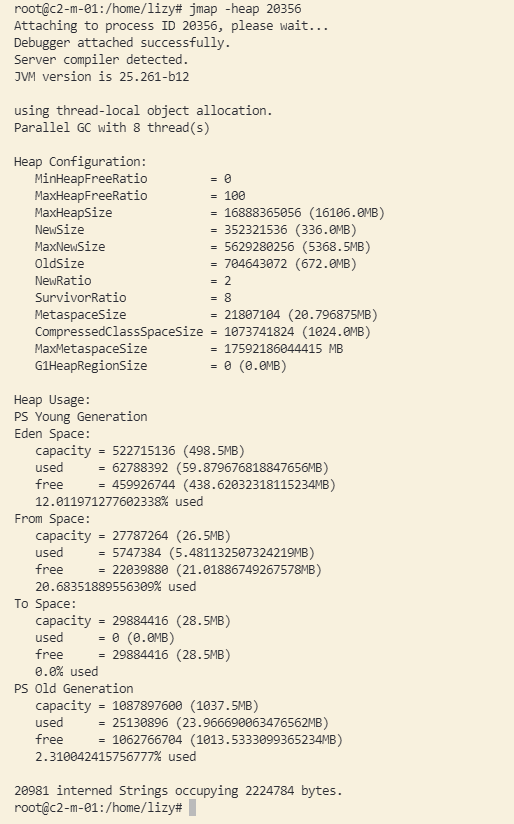
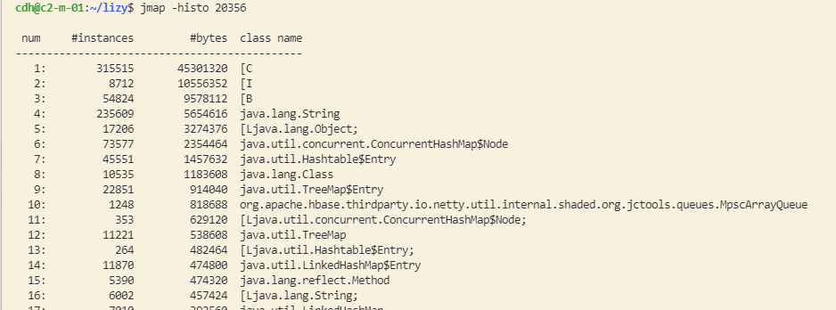
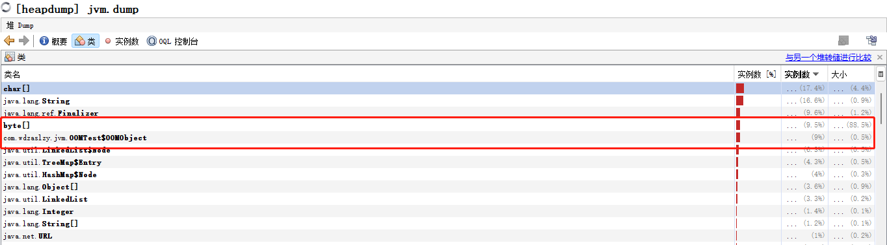
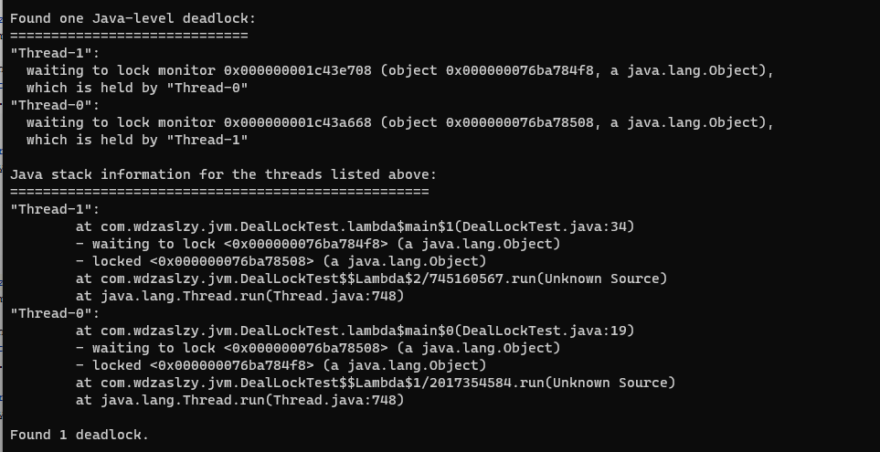

## jdk自带的一些工具

启动一个web应用程序，什么样的都可以，尝试先用jdk自带的一些工具来看看当前应用程序的执行情况。

### Jmap

此命令可以用来查看内存信息、实例个数以及占用内存大小。

**jmap提供的命令**

```sh
> jmap
Usage:
    jmap [option] <pid>
        (to connect to running process)
    jmap [option] <executable <core>
        (to connect to a core file)
    jmap [option] [server_id@]<remote server IP or hostname>
        (to connect to remote debug server)

where <option> is one of:
    <none>               to print same info as Solaris pmap
    -heap                to print java heap summary
    -histo[:live]        to print histogram of java object heap; if the "live"
                         suboption is specified, only count live objects
    -clstats             to print class loader statistics
    -finalizerinfo       to print information on objects awaiting finalization
    -dump:<dump-options> to dump java heap in hprof binary format
                         dump-options:
                           live         dump only live objects; if not specified,
                                        all objects in the heap are dumped.
                           format=b     binary format
                           file=<file>  dump heap to <file>
                         Example: jmap -dump:live,format=b,file=heap.bin <pid>
    -F                   force. Use with -dump:<dump-options> <pid> or -histo
                         to force a heap dump or histogram when <pid> does not
                         respond. The "live" suboption is not supported
                         in this mode.
    -h | -help           to print this help message
    -J<flag>             to pass <flag> directly to the runtime system
```

重要的几个操作：

- heap：查看堆信息
- histo：查看对象信息
- dump：堆内存dump


**heap使用**

```sh
> jmap -heap 20356
```



从打印结果可以看到堆内存的配置信息：Heap Configuration

**histo使用**

```sh
> jmap -histo 20356 > ./log.txt
```



- num：序号
- instances：实例数量
- bytes：占用空间大小
- class name：类名称，【C is a char[]，I is a int[]，S is a shot[]，B is a byte[]】

当应用程序出现内存泄漏时，可以通过该命令来查找是什么对象引起的内存泄漏。

（PS：实际线上一个对象可能被多个地方引用，需要借助其他方式来定位具体的位置。）

**堆内存dump**

```sh
jmap -dump:live,format=b,file=heap.hprof 20356
```

一般线上情况下，当出现内存泄漏或内存溢出时，根本没时间手动去执行dump文件。则可以通过配置参数来开启自动dump。

```sh
-XX:HeapDumpOnOutOfMemoryError -XX:HeapDumpPath=./heap
```

dump文件，可以使用Java自带的工具来打开。Java VisualVM，也可以使用JProfiler打开。


**OOM问题定位**

```java
/**
 * -Xms10M -Xmx10M -XX:+PrintGCDetails -XX:+HeapDumpOnOutOfMemoryError -XX:HeapDumpPath=D:/jvm.dump
 */
public class OOMTest {

    public static List<Object> list = new ArrayList<>();

    public static void main(String[] args) {

        List<Object> values = new ArrayList<>();
        int i = 0;
        int j = 0;
        while (true) {
            values.add(new OOMObject(i++));
            new OOMObject(j--);
        }

    }

    public static class OOMObject {
        private byte[] v = new byte[5 * 1024];
        private int id;

        public OOMObject(int id) {
            this.id = id;
        }

        @Override
        protected void finalize() throws Throwable {
            System.out.println(id + "被回收");
        }
    }

}
```

启动后，可以看到，每次进行gc回收时，id为负的总能被回收，而id为正的无法回收。也恰恰说明，一个是强引用，一个是无引用。

通过堆的dump文件可以看到，实例数差不多的两个对象分别是：byte[] 和 OOMObject对象，其中byte[]数组占用内存达到了88.5%，通过这个简单代码可以快速定位到是什么对象发生了内存泄漏。对于一个大系统来说，要快速定位到发生内存泄漏的位置，还需要借助其他方式。




### Jstack

jstack可以查看线程使用情况。

```sh
> jstack
Usage:
    jstack [-l] <pid>
        (to connect to running process)
    jstack -F [-m] [-l] <pid>
        (to connect to a hung process)
    jstack [-m] [-l] <executable> <core>
        (to connect to a core file)
    jstack [-m] [-l] [server_id@]<remote server IP or hostname>
        (to connect to a remote debug server)

Options:
    -F  to force a thread dump. Use when jstack <pid> does not respond (process is hung)
    -m  to print both java and native frames (mixed mode)
    -l  long listing. Prints additional information about locks
    -h or -help to print this help message
```

当发生死锁时，可以通过jstack快速定位。死锁代码：

```java
public class DealLockTest {

    private static Object lock1 = new Object();
    private static Object lock2 = new Object();

    public static void main(String[] args) {
        new Thread(() -> {
            synchronized (lock1) {
                System.out.println("thread1 begin.");
                try {
                    Thread.sleep(5000);
                } catch (InterruptedException e) {
                    e.printStackTrace();
                }

                synchronized (lock2) {
                    System.out.println("thread1 end.");
                }
            }

        }).start();

        new Thread(() -> {
            synchronized (lock2) {
                System.out.println("thread2 begin.");
                try {
                    Thread.sleep(5000);
                } catch (InterruptedException e) {
                    e.printStackTrace();
                }
                synchronized (lock1) {
                    System.out.println("thread2 end.");
                }
            }

        }).start();

        System.out.println("main thread end.");
    }
}
```

使用jstack pid可以看到发生死锁的位置。



### Jstat

jstat命令可以查看内存各部分的使用量，以及加载类的数量。

```shell
> jstat -options
-class
-compiler
-gc
-gccapacity
-gccause
-gcmetacapacity
-gcnew
-gcnewcapacity
-gcold
-gcoldcapacity
-gcutil
-printcompilation
```

使用命令：jstat [-options] [vmid] [间隔时间] [查询次数]

**垃圾回收统计**

jstat -gc pid 最常用，可以评估程序内存及GC压力整体情况。

```sh
> jstat -gc 6797
 S0C    S1C    S0U    S1U      EC       EU        OC         OU       MC     MU    CCSC   CCSU   YGC     YGCT    FGC    FGCT     GCT   
19968.0 43008.0  0.0    0.0   358400.0 158067.5  696832.0   24544.7   35496.0 34507.5 4608.0 4343.3      2    0.085   2      0.134    0.220
```

| header | 含义                         |
| ------ | ---------------------------- |
| S0C    | 第一个幸存区的大小，单位是KB |
| S1C    | 第二个幸存区的大小           |
| S0U    | 第一个幸存区的使用大小       |
| S1U    | 第二个幸存区的使用大小       |
| EC     | Eden区大小                   |
| EU     | Eden区使用大小               |
| OC     | 老年代大小                   |
| OU     | 老年代使用大小               |
| MC     | 元数据空间大小               |
| MU     | 元数据空间使用大小           |
| CCSC   | 压缩类空间大小               |
| CCSU   | 亚索雷空间使用大小           |
| YGC    | 年轻代垃圾回收次数           |
| YGCT   | 年轻代垃圾回收耗时，单位s    |
| FGC    | 老年代垃圾回收次数           |
| FGCT   | 老年代垃圾回收耗时，单位s    |
| GCT    | 垃圾回收总耗时，单位s        |

其它的几个options也基本类似。例如：-gcnew 表示年轻代垃圾回收信息，-gcold表示老年代垃圾回收信息。

## JVM运行情况预估

用jstat -gc pid命令可以计算出一些关键信息，有了这些关键信息就可以采用一些优化思路，来给自己的系统设置一些初始性的jvm参数。例如堆内存大小、年轻代大小、Eden和Survivor比例，老年代大小、大对象阈值等等。

- 年轻代对象增长速率

  > 可以执行命令 jstat -gc pid 1000 10，每隔1秒打印一条记录，一共打印10条。通过观察EU来估算每秒eden大概新增多少对象，如果系统负载不高，可以把频率1秒换成1分钟。
  > 注意：尽量观察不同时间段的对象增长速率。（一般现在的监控看板都会有）

- Young GC的触发频率和每次耗时

  > 知道年轻代增长速率，就可以根据eden区大小推算出young gc大概多久触发一次，young gc的平均耗时也可以通过YGCT/YGC得出，根据这些结果就能知道系统大概多久会因为young gc的执行而卡顿多久。

- 每次young gc后有多少对象存活和进入老年代
- Full GC的触发评率和平均耗时

优化思路：尽量让每次Young GC后的存活对象小于Survivor区域的50%，都留在年轻代里。尽量别让对象进入老年代。尽量减少FullGC的频率，避免频繁FullGC对JVM性能的影响。

### 调优案例

环境信息

----------

机器配置：2核4G

JVM内存大小：2G

系统运行时间：7天

期间发生FullGC次数和耗时：500多次，200多秒

期间发生YoungGC次数和耗时：1万多次，500多秒

估算下来，每秒发生3次full gc，每次full gc都在400ms左右。

JVM参数设置如下：

```sh
‐Xms1536M ‐Xmx1536M ‐Xmn512M ‐Xss256K ‐XX:SurvivorRatio=6 ‐XX:MetaspaceSize=256M -XX:MaxMetaspaceSize=256M ‐XX:+UseParNewGC ‐XX:+UseConcMarkSweepGC -XX:CMSInitiatingOccupancyFraction=75 ‐XX:+UseCMSInitiatingOccupancyOnly
```


