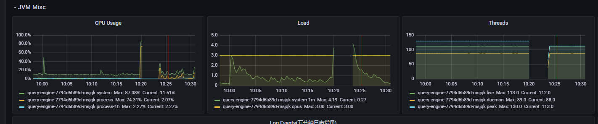
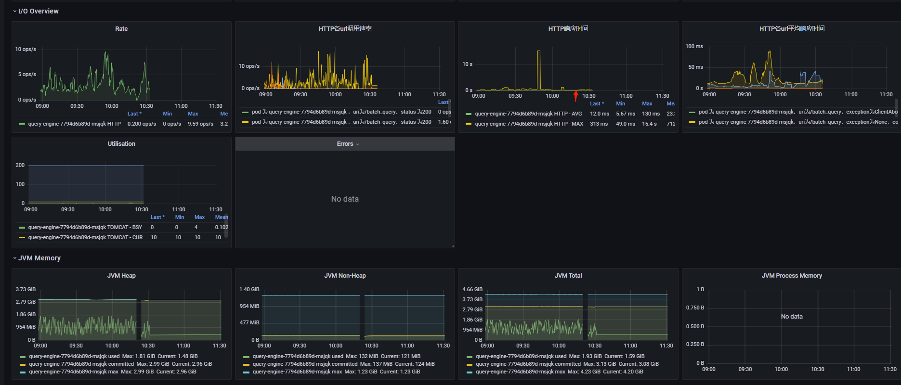
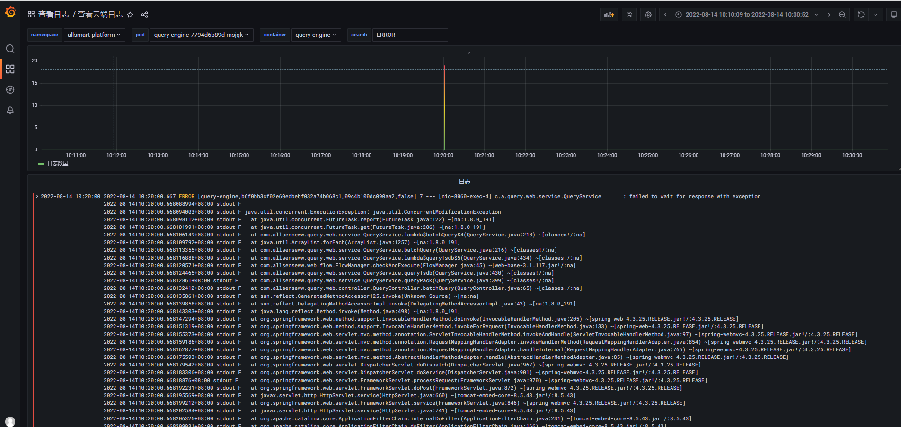
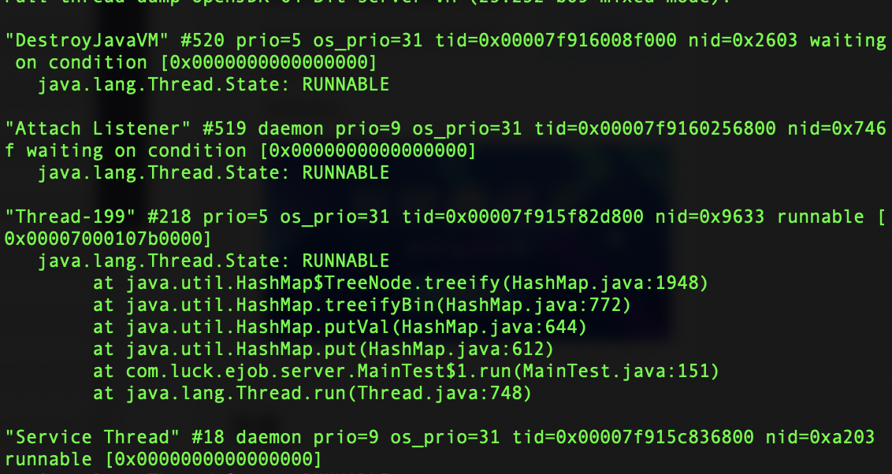

如果在工作中使用了第三方的一些开源库，或者Java底层理解不深，很容易发生死锁风险。

就在上周，我们一个服务突然出现假死现象被杀死。看监控面板一切都正常，但是日志里面还是暴露了一些信息。

线上关键监控项如下：







通过以上监控面板可以看出，cpu突然升高，而tomcat基本没什么压力。说明，cpu升高的原因，不是外部压力导致。

看日志，在这个时间点有大量并发修改问题。经查代码，发现是HashMap引起的。


## 万恶的HashMap

也许大部分人都知道，HashMap是线程不安全的，但真正了解HashMap的却屈指可数。比如：HashMap并发使用时可能发生死循环，导致CPU 100%。

HashMap的数据结构不再介绍，主要介绍一下HashMap是如何引起死循环的。（不管JDK几，都会）。

### JDK1.8之前引起的死循环

在往HashMap中写数据时，当HashMap的值达到一定阈值后，会进行扩容。扩容的逻辑是，新建一个数组，将原来的数组中的数据移动到新数组。这个扩容的过程就容易引起死循环。

**步骤一**

线程 T1 和线程 T2 要对 HashMap 进行扩容操作，此时 T1 和 T2 指向的是链表的头结点元素 A，而 T1 和 T2 的下一个节点，也就是 T1.next 和 T2.next 指向的是 B 节点，如下图所示：

[](https://s4.51cto.com/oss/202201/18/77ef901ffe13e9c65e2a6131114925fc.jpg)

**步骤2**

死循环的第二步操作是，线程 T2 时间片用完进入休眠状态，而线程 T1 开始执行扩容操作，一直到线程 T1 扩容完成后，线程 T2 才被唤醒，扩容之后的场景如下图所示：图片从上图可知线程 T1 执行之后，因为是头插法，所以 HashMap 的顺序已经发生了改变，但线程 T2 对于发生的一切是不可知的，所以它的指向元素依然没变，如上图展示的那样，T2 指向的是 A 元素，T2.next 指向的节点是 B 元素。

**步骤3**

当线程 T1 执行完，而线程 T2 恢复执行时，死循环就建立了，如下图所示：

[](https://s4.51cto.com/oss/202201/18/cdb5adff7169ddc4eb0ebdf243a4ca45.jpg)

因为 T1 执行完扩容之后 B 节点的下一个节点是 A，而 T2 线程指向的首节点是 A，第二个节点是 B，这个顺序刚好和 T1 扩完容完之后的节点顺序是相反的。T1 执行完之后的顺序是 B 到 A，而 T2 的顺序是 A 到 B，这样 A 节点和 B 节点就形成死循环了，这就是 HashMap 死循环导致的原因。


### JDK1.8之后引起的死循环

复现方式：下面程序需要多次执行，并不是100%能发生。

```java
public class MainTest {
	Map<String,String> map = new HashMap<>();
	
    public void hashMapTest() {
        for (int i = 0;i < 500;i++) {
            new Thread(new Runnable() {
                @Override
                public void run() {
                    for (int j = 0;j < 500;j++) {
                        map.put(Thread.currentThread().getName() + "-" + j, j+"");
                    }
                }
            }).start();
        }
        try {
            Thread.sleep(2000);
//            map.forEach((x,y) -> System.out.println(x));
            System.out.println(map.size());
        } catch (InterruptedException e) {
            e.printStackTrace();
        }
    }
}
```

多执行几次，会发现它会出现一次卡死现象。

此时通过jstack打印出线程堆栈，可以看到它卡死的缘故。

有几种场景：

**场景一**



```java
final void treeify(Node<K,V>[] tab) {
    TreeNode<K,V> root = null;
    for (TreeNode<K,V> x = this, next; x != null; x = next) {
        next = (TreeNode<K,V>)x.next;
        x.left = x.right = null;
        if (root == null) {
            x.parent = null;
            x.red = false;
            root = x;
        }
        else {
            K k = x.key;
            int h = x.hash;
            Class<?> kc = null;
            //说明线程在这个for循环中一直没有返回，导致了死循环
            for (TreeNode<K,V> p = root;;) {
                int dir, ph;
                K pk = p.key;
                if ((ph = p.hash) > h)
                    dir = -1;
                else if (ph < h)
                    dir = 1;
                else if ((kc == null &&
                          (kc = comparableClassFor(k)) == null) ||
                         (dir = compareComparables(kc, k, pk)) == 0)
                    dir = tieBreakOrder(k, pk);

                TreeNode<K,V> xp = p;
                if ((p = (dir <= 0) ? p.left : p.right) == null) {
                    x.parent = xp;
                    if (dir <= 0)
                        xp.left = x;
                    else
                        xp.right = x;
                    root = balanceInsertion(root, x);
                    break;
                }
            } // 1948行
        }
    }
    moveRootToFront(tab, root);
}
```

通过代码可以看出，在链表转换为树的时候，for循环一直无法跳出，导致死循环。

**场景二**

```java
java.lang.Thread.State: RUNNABLE
	at java.util.HashMap$TreeNode.balanceInsertion(HashMap.java:2239)
	at java.util.HashMap$TreeNode.treeify(HashMap.java:1945)
	at java.util.HashMap$TreeNode.split(HashMap.java:2180)
	at java.util.HashMap.resize(HashMap.java:714)
	at java.util.HashMap.putVal(HashMap.java:663)
	at java.util.HashMap.put(HashMap.java:612)
	at com.luck.ejob.server.MainTest$1.run(MainTest.java:151)
	at java.lang.Thread.run(Thread.java:748)
```

balanceInsertion方法是对树进行一个重新的平衡。它也会引起死循环。

**场景三**

```java
java.lang.Thread.State: RUNNABLE
	at java.util.HashMap$TreeNode.root(HashMap.java:1824)
	at java.util.HashMap$TreeNode.putTreeVal(HashMap.java:1978)
	at java.util.HashMap.putVal(HashMap.java:638)
	at java.util.HashMap.put(HashMap.java:612)
	at com.luck.ejob.server.MainTest$1.run(MainTest.java:151)
	at java.lang.Thread.run(Thread.java:748)
```

```java
final TreeNode<K,V> root() {
    for (TreeNode<K,V> r = this, p;;) {
        if ((p = r.parent) == null)
            return r;
        r = p; //1824行
    }
}
```


HashMap在1.8版本多线程情况下也会出现死循环。


## 总结

在我们的场景下，也是使用了HashMap，在高并发情况下，hash冲突了，就很容易导致死循环，cpu突然飙升，出现假死现象。

因此，在实际高并发使用中，一定要避免使用HashMap。
