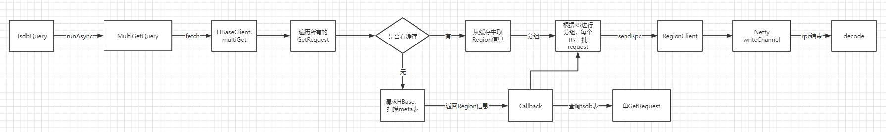

## 背景

OpenTSDB + HBase是一个比较常用的时序数据库。因为OpenTSDB长时间不维护，里面遗留着很多问题都没有解决。例如OpenTSDB的查询性能。查询量一增加，OpenTSDB查询就慢。


## OpenTSDB查询流程

为了解决性能问题，需要阅读OpenTSDB源码。OpenTSDB的查询基本流程图如下：



从流程图上可以看出，tsdb在进行MultiGet查询时，重复发了两遍。在没有缓存的情况下，是串行发送的GetRequest。我们来看下它的调用流程：


TsdbQuery发起查询请求

```java
public Deferred<DataPoints[]> runAsync() throws HBaseException {
    Deferred<DataPoints[]> result = null;
    if (this.use_multi_gets && this.override_multi_get) {
        // tsdb官网并没有开启multi_get请求，但是我调整了它的逻辑，使它支持了multi_get
        result = this.findSpansWithMultiGetter().addCallback(new TsdbQuery.GroupByAndAggregateCB());
    } else {
        result = this.findSpans().addCallback(new TsdbQuery.GroupByAndAggregateCB());
    }

    if (this.rollup_usage != null && this.rollup_usage.fallback()) {
        result.addCallback(new TsdbQuery.FallbackRollupOnEmptyResult());
    }

    return result;
}
```


MultiGetQuery中的fetch逻辑：

```java
private void startFetch() {
    this.prepareConcurrentMultiGetTasks();
    this.fetch_start_time = System.currentTimeMillis();
    if (LOG.isDebugEnabled()) {
        LOG.debug("Start to fetch data using multiget, there will be " + this.multi_get_wait_cnt + " multigets to call");
    }

    for(int con_idx = 0; con_idx < this.concurrency_multi_get; ++con_idx) {
        List<MultiGetQuery.MultiGetTask> con_mul_get_tasks = (List)this.multi_get_tasks.get(con_idx);
        int task_index = ((AtomicInteger)this.multi_get_indexs.get(con_idx)).incrementAndGet();
        if (task_index < con_mul_get_tasks.size()) {
            MultiGetQuery.MultiGetTask task = (MultiGetQuery.MultiGetTask)con_mul_get_tasks.get(task_index);
            MultiGetQuery.MulGetCB mgcb = new MultiGetQuery.MulGetCB(con_idx, task.getTSUIDs(), task.getGets());
            // 将一批get_request打包成一个MultiAction，进行fetch
            mgcb.fetch();
        }
    }
}
```


```java
private List<Deferred<GetResultOrException>> multiGet(List<GetRequest> requests) {
    List<Deferred<GetResultOrException>> result_deferreds = new ArrayList(requests.size());
    Map<RegionClient, MultiAction> batch_by_region = new HashMap();

    // 核心处
    for(int i = 0; i < requests.size(); ++i) {
        GetRequest request = (GetRequest)requests.get(i);
        byte[] table = request.table;
        byte[] key = request.key;
        RegionInfo region = this.getRegion(table, key);
        RegionClient client = null;
        if (region != null) {
            client = Bytes.equals(region.table(), this.split_meta ? HBASE98_ROOT_REGION : ROOT) ? this.rootregion : (RegionClient)this.region2client.get(region);
        }

        if (client != null && client.isAlive()) {
            request.setRegion(region);
            MultiAction batch = (MultiAction)batch_by_region.get(client);
            if (batch == null) {
                batch = new MultiAction();
                batch_by_region.put(client, batch);
            }

            batch.add(request);
            result_deferreds.add(request.getDeferred().addBoth(MUL_GOT_ONE));
        } else {
            // 核心处，如果上面缓存中没有Region，则在该处发送rpc请求，获取region
            result_deferreds.add(this.sendRpcToRegion(request).addBoth(MUL_GOT_ONE));
        }
    }

    Iterator var11 = batch_by_region.entrySet().iterator();

    // 针对上面获取的Region，进行分组，确保一批request在同一个RS下
    while(var11.hasNext()) {
        Entry<RegionClient, MultiAction> entry = (Entry)var11.next();
        MultiAction request = (MultiAction)entry.getValue();
        Deferred<Object> d = request.getDeferred();

        final class MultiActionCallback implements Callback<Object, Object> {
            final MultiAction request;

            public MultiActionCallback(MultiAction request) {
                this.request = request;
            }

            public Object call(Object resp) {
                // 请求处理完之后的回调
                if (!(resp instanceof Response)) {
                    if (resp instanceof BatchableRpc) {
                        return null;
                    } else if (resp instanceof Exception) {
                        return this.handleException((Exception)resp);
                    } else {
                        throw new InvalidResponseException(Response.class, resp);
                    }
                } else {
                    Response response = (Response)resp;
                    ArrayList<BatchableRpc> batch = this.request.batch();
                    int n = batch.size();

                    for(int i = 0; i < n; ++i) {
                        BatchableRpc rpc = (BatchableRpc)batch.get(i);
                        Object r = response.result(i);
                        if (r instanceof RecoverableException) {
                            if (r instanceof NotServingRegionException || r instanceof RegionMovedException || r instanceof RegionServerStoppedException) {
                                try {
                                    HBaseClient.this.handleNSRE(rpc, rpc.getRegion().name(), (NotServingRegionException)r);
                                } catch (RuntimeException var9) {
                                    HBaseClient.LOG.error("Unexpected exception processing NSRE for RPC " + rpc, var9);
                                    rpc.callback(var9);
                                }
                            }
                        } else {
                            rpc.callback(r);
                        }
                    }

                    return null;
                }
            }

            private Object handleException(Exception e) {
                // ... 异常处理代码省略
            }

            public String toString() {
                return "multi-action response";
            }
        }
		
        // 将一个RS下的请求打包发送至HBase
        d.addBoth(new MultiActionCallback(request));
        ((RegionClient)entry.getKey()).sendRpc(request);
    }

    return result_deferreds;
}
```


上面关注的两个点，一个是遍历每个Request时发送的rpc，另一个是打包以后发送的一批rpc。我们先看遍历时，rpc的处理过程。

sendRpcToRegion

```java
Deferred<Object> sendRpcToRegion(final HBaseRpc request) {
    if (this.cannotRetryRequest(request)) {
        return tooManyAttempts(request, (HBaseException)null);
    } else {
        ++request.attempt;
        byte[] table = request.table;
        byte[] key = request.key;
        RegionInfo region = this.getRegion(table, key);
        // 第一次请求，该处region为空，此处逻辑不会走到。
        if (region != null) {
            Deferred d;
            if (knownToBeNSREd(region)) {
                NotServingRegionException nsre = new NotServingRegionException("Region known to be unavailable", request);
                d = request.getDeferred();
                this.handleNSRE(request, region.name(), nsre);
                return d;
            }

            RegionClient client = this.clientFor(region);
            if (client != null && client.isAlive()) {
                request.setRegion(region);
                d = request.getDeferred();
                client.sendRpc(request);
                return d;
            }
        }

        // region获取后的回调函数，此处是发送单个GetRequest至HBase的地方
        final class RetryRpc implements Callback<Deferred<Object>, Object> {
            RetryRpc() {
            }

            public Deferred<Object> call(Object arg) {
                if (arg instanceof NonRecoverableException) {
                    HBaseException e = (NonRecoverableException)arg;
                    if (e instanceof HasFailedRpcException && ((HasFailedRpcException)e).getFailedRpc() != request) {
                        e = ((HBaseException)e).make(e, request);
                    }

                    request.callback(e);
                    return Deferred.fromError((Exception)e);
                } else {
                    // 当请求结束后，发送了一个request的rpc请求，此处就是影响慢查询的地方
                    return HBaseClient.this.sendRpcToRegion(request);
                }
            }

            public String toString() {
                return "retry RPC";
            }
        }

        return this.locateRegion(request, table, key).addBothDeferring(new RetryRpc());
    }
}
```

以上时遍历GetRequest时，串行发送的request，当把它处理完之后，会打包进行发生一批request。


RegionClient中，真实发送rpc请求。

```java
void sendRpc(HBaseRpc rpc) {
    if (this.chan != null) {
        if (rpc instanceof BatchableRpc && !(rpc instanceof GetRequest) && (this.server_version >= 29 || rpc instanceof PutRequest)) {
            BatchableRpc edit = (BatchableRpc)rpc;
            if (edit.canBuffer() && this.hbase_client.getFlushInterval() > 0) {
                this.bufferEdit(edit);
                return;
            }

            this.addSingleEditCallbacks(edit);
        } else if (rpc instanceof MultiAction) {
            MultiAction batch = (MultiAction)rpc;
            if (batch.size() == 1) {
                rpc = this.multiActionToSingleAction(batch);
            } else {
                this.hbase_client.num_multi_rpcs.increment();
            }
        }

        // 序列化以后，写到channel中
        ChannelBuffer serialized = this.encode((HBaseRpc)rpc);
        if (serialized == null) {
            return;
        }

        Channel chan = this.chan;
        if (chan != null) {
            if (this.check_write_status && !chan.isWritable()) {
                ((HBaseRpc)rpc).callback(new PleaseThrottleException("Region client [" + this + " ] channel is not writeable.", (HBaseException)null, (HBaseRpc)rpc, ((HBaseRpc)rpc).getDeferred()));
                this.removeRpc((HBaseRpc)rpc, false);
                this.writes_blocked.incrementAndGet();
                return;
            }

            ((HBaseRpc)rpc).enqueueTimeout(this);
            Channels.write(chan, serialized);
            this.rpcs_sent.incrementAndGet();
            return;
        }
    }

    boolean tryagain = false;
    boolean dead;
    synchronized(this) {
        dead = this.dead;
        if (this.chan != null) {
            tryagain = true;
        } else if (!dead) {
            if (this.pending_rpcs == null) {
                this.pending_rpcs = new ArrayList();
            }

            if (this.pending_limit > 0 && this.pending_rpcs.size() >= this.pending_limit) {
                ((HBaseRpc)rpc).callback(new PleaseThrottleException("Exceeded the pending RPC limit", (HBaseException)null, (HBaseRpc)rpc, ((HBaseRpc)rpc).getDeferred()));
                this.pending_breached.incrementAndGet();
                return;
            }

            this.pending_rpcs.add(rpc);
        }
    }

    if (!dead) {
        if (tryagain) {
            this.sendRpc((HBaseRpc)rpc);
        } else {
            LOG.debug("RPC queued: {}", rpc);
        }
    } else {
        if (((HBaseRpc)rpc).getRegion() != null && !((HBaseRpc)rpc).failfast()) {
            this.hbase_client.sendRpcToRegion((HBaseRpc)rpc);
        } else {
            ((HBaseRpc)rpc).callback(new ConnectionResetException((Channel)null));
        }

    }
}
```


## OpenTsdb请求处理过程

### 程序入口：TSDMain.java

TSDMain中，执行的是main函数。主要逻辑：

1. 初始化config

2. 创建NIO，ServerBootstrap。用于接收rpc请求。

   > server设置了一个PipelineFactory，当一个rpc请求被序列化以后，进入rpchandler

3. 初始化TSDB

TSDMain启动时的核心代码如下：

```java
public static void main(String[] args) throws IOException {
    // 1. 配置初始化
    Config config = CliOptions.getConfig(argp);
    
    // 2. 创建ChannelFactory
    Executor executor = Executors.newCachedThreadPool();
    NioServerBossPool boss_pool = new NioServerBossPool(executor, 1, new BossThreadNamer());
    NioWorkerPool worker_pool = new NioWorkerPool(executor, workers, new WorkerThreadNamer());
    factory = new NioServerSocketChannelFactory(boss_pool, worker_pool);
    
    // 3. 创建ServerBootstrap
    ServerBootstrap server = new ServerBootstrap((ChannelFactory)factory);

    // 4. 设置PipelineFactory
    server.setPipelineFactory(new PipelineFactory(tsdb, manager, connections_limit));
}
```

在PipelineFactory中，依赖了RpcHandler，当请求被decode以后，进入RpcHandler。核心代码如下：

```java
protected Object decode(ChannelHandlerContext ctx, Channel chan, ChannelBuffer buffer) throws Exception {
    if (buffer.readableBytes() < 1) {
        return null;
    } else {
        int firstbyte = buffer.getUnsignedByte(buffer.readerIndex());
        ChannelPipeline pipeline = ctx.getPipeline();
        pipeline.addLast("timeout", PipelineFactory.this.timeoutHandler);
        pipeline.remove(this);
        pipeline.addLast("handler", PipelineFactory.this.rpchandler);
        return buffer.readBytes(buffer.readableBytes());
    }
}
```


### 发起rpc请求

当一个rpc请求进入后，服务端会通过worker线程进行decode，之后进入rpchandler。rpchandler主要用来处理当前发起的http请求。具体方法为：messageReceived

```java
public void messageReceived(ChannelHandlerContext ctx, MessageEvent msgevent) {
    Object message = msgevent.getMessage();
    if (message instanceof HttpRequest) {
        this.handleHttpQuery(this.tsdb, msgevent.getChannel(), (HttpRequest)message);
    }
}

/**
 * 流程：
 *	
 **/
```

