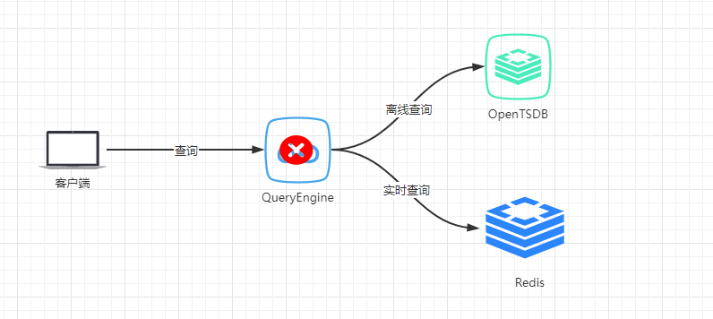
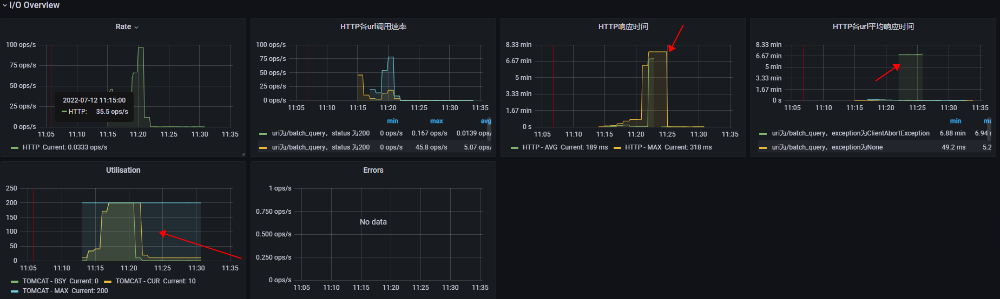
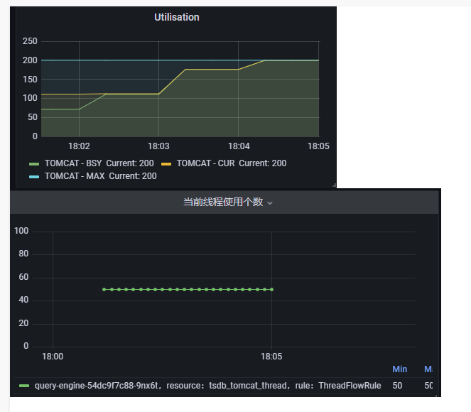
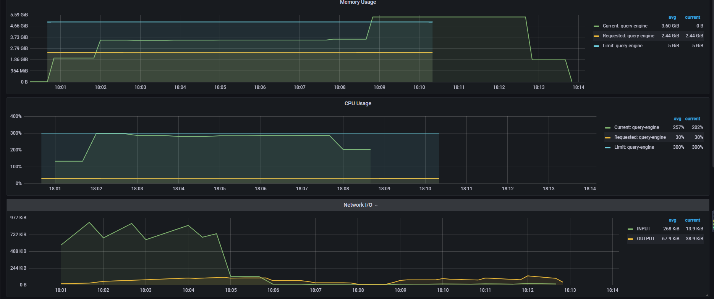
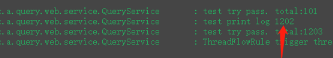
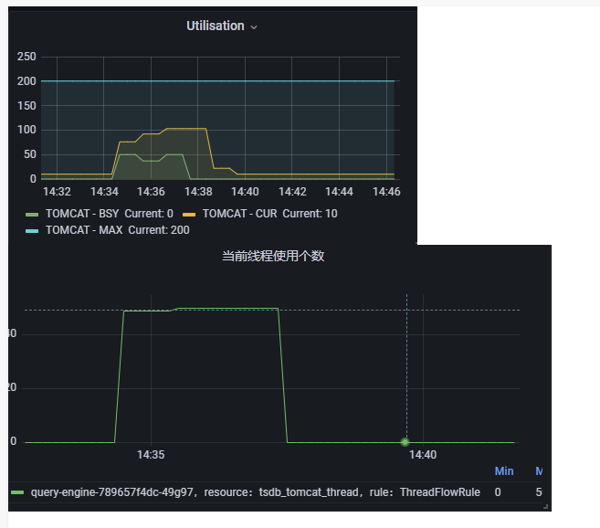
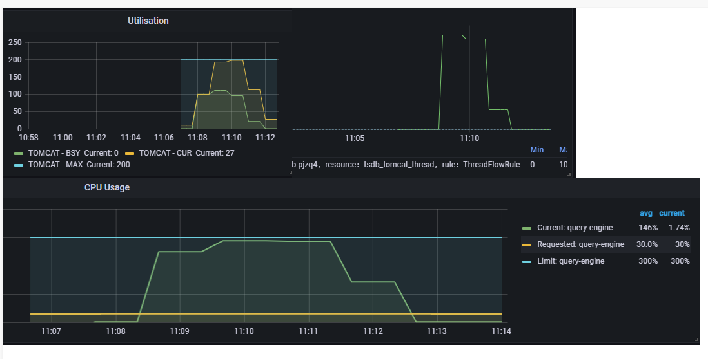

## 背景

查询引擎QueryEngine负责业务的所有查询。包括：实时数据查询、历史数据查询。

实时数据存储于Redis，特点：查询频率高、返回结果小、要求低延迟

历史数据存储于时序数据库（OpenTSDB+HBase），特点：查询频率低，但有突发查询，返回结果大，延迟较高。

当对QueryEngine进行多线程+大范围+高频率的请求时，导致QueryEngine整体响应变慢，最后出现假死状态，最终OOM后服务重启。

## 业务隔离

通过监控发现，由于历史查询的突发查询，导致QueryEngine的tomcat线程被占用，所有线程都处于busy状态，导致其它的请求无法被处理。因此整体响应变慢。如下图：

因此，基于这种现象，我们计划根据业务进行线程隔离。历史查询和实时查询，分别有独立的线程池去响应。

当历史查询的并发达到限制后，拒绝请求。以便让历史查询更快结束，给实时查询让路。

功能开发完成后，经测试，即使历史查询被限制，阻塞了超过阈值的请求，随着时间的推移，QueryEngine依然会出现响应变慢、假死、OOM现象。我们限制了历史查询的最大并发为50。

### 异常打印超慢

我们试想的是，将历史查询并发限制后，tomcat的线程就不会再被全部占用。

然而实际并非如此。实际的情况是，tomcat线程依然会被占满。如下图：

这个超过了我们的预期。因为我们认为，阻塞一个请求的时间应该很快，即使请求很频繁，也不应该把tomcat的busy线程全部耗完。

经检查，阻塞当前请求时会打印异常堆栈，在高并发下，打印异常堆栈非常耗时。

意味着，发过来的请求，即使单纯的把它阻塞，也需要几秒的时间。当并发和请求频率很高的时候，200个tomcat线程会全部处于busy状态。

如果不能理解为什么阻塞慢会导致tomcat线程被占满。想象一下：当存在200个并发线程去发送请求时，有50个线程会被放行（配置的阈值是50），剩余150个会被阻塞，而因为打印阻塞时的**异常堆栈**慢，导致这150个线程在这段时间内一直处于busy状态。

**收获：**高并发下，打印异常堆栈非常耗时，非必要error，尽可能不打堆栈，只打error msg。

### 修复后

修复所有高并发下耗时的代码后，再次进行尝试，tomcat中busy线程已控制在阈值范围内，但，服务响应依然很慢、假死、OOM。如下图：

通过tomcat线程使用可以看出，tomcat现在有足够的线程可以来响应网络IO，但是，实时查询还是很慢。问题在哪呢？

**猜测一：高并发下，还存在一些垃圾代码，非常耗时，影响了实时查询**

为证明这个猜测，我们加了很多日志，几乎每一步操作都会出现慢现象。

**猜测二：CPU被全部占用，没有时间片让给实时查询**

关于猜测一，我注释掉了所有认为在高并发下慢的点，只保留了真实的查询，虽然实时查询稍有提升，但是最终还是OOM。所以，代码并不是直接影响原因。

对于猜测二，大量查询下，cpu被耗尽是正常的，但是为什么cpu一直让不出时间片给实时查询使用呢？

经检查，进行历史数据查询时，发送的是http请求，该请求没有设置超时时间。在高并发且频繁查询下，历史查询延迟变长，http请求始终在等待响应。因此cpu始终不释放，导致服务出现假死情况。直至OOM。

客户端的请求，超过10s未响应时，自动断开连接，发起下一次查询。QueryEngine查询时，发起请求后，一直等待响应。这就导致了，客户端源源不断的将请求发给服务端，服务端接收到新的请求后，每次都要发出一个新的查询，然后一直处于等待状态。等待时间会越来越长。最后出现假死。直到请求结果被响应后，大量的数据传到服务端，OOM。

### 为查询增加超时时间

QueryEngine在进行历史数据查询时，设置超时时间，默认等待30s，30s无响应时，自动断开连接，释放cpu。

经过调整后，CPU使用率虽然能达到100%，但实时查询依然能被响应（有稍微的延迟）

## 总结

限制历史查询，可以保证服务可用。但在资源使用完的情况下，实时查询性能会稍微受到一点影响。
