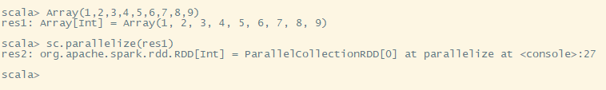
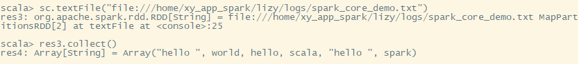
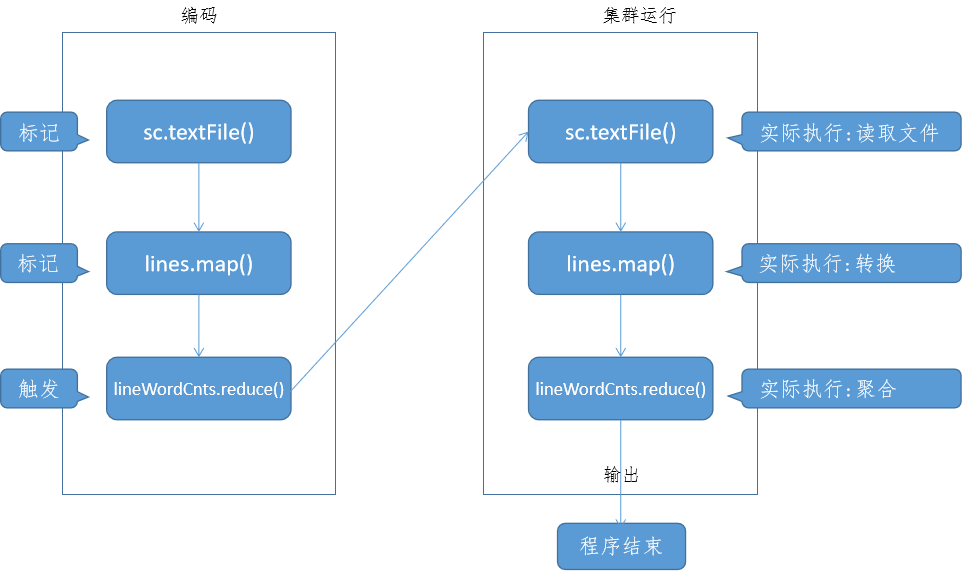
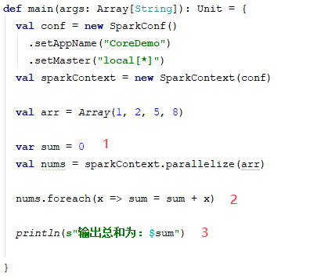
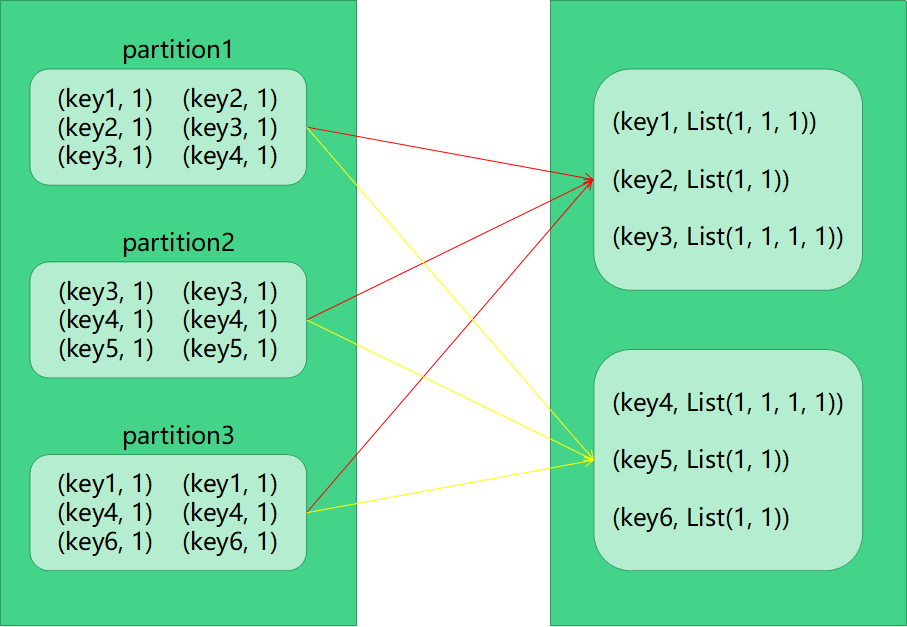

## 概述

spark提供了一个抽象的数据集：弹性分布式数据集(RDD)。这是一个多集群数据集合，意味着它可以并行操作，每个节点操作自己所拥有的元素，所有节点的并行操作就是RDD的一个算子。
RDD可以从Hadoop文件系统创建(任何Hadoop能支持的文件系统，例如HDFS、HBase等)，也可以从Driver端已有的一个集合转换而来。
用户可以将RDD缓存在集群的内存中，以便该RDD可以被重复使用。
除了RDD，spark还提供了 另一个抽象概念：共享变量。spark程序在集群的多节点上运行时，每个task任务都会拷贝一份共享变量。spark支持两种类型的共享变量，分别是:广播变量(broadcast)和累加器(accumulators)。
下面便详细介绍rdd、broadcast 和accumulators。

## 环境准备

spark可以在多种环境上运行任务。在本地环境和集群环境上运行时，我们需要手动来初始化spark环境。


### 初始化

spark初始化前，需要先添加spark的依赖：spark-core。spark2.4.4版本必须要使用scala2.12版本。所以，如果你使用的scala版本是2.12以下的，请依赖spark2.4.4以下的版本。

```xml
<dependency>
	<groupId>org.apache.spark</ groupId
	<artifactId>spark-core_2.11</artifactId>
	<version>2.2.0</version>
</dependency>
```

添加好依赖后，我们来创建spark context。sparkcontext是spark的上下文，spark程序运行必须要通过上下文来运行，因为sparkcontext中指明了spark如何来运行。sparkcontext有一个必要的参数是：SparkConf。该参数就是用来制定所运行的环境。

```scala
def main(args: Array[String]): Unit = {
	val conf = new SparkConf()
		.setAppName("CoreDemo")
		.setMaster("local[*]")
	val sparkContext = new SparkContext(conf)
}
```

SparkConf中提供了很多参数可以进行设置，我们可以将这些设置硬编码到程序中，也可以在使用spark-submit时动态指定。期中：appName是Spark-UI上展示的名称，用来快速找到对应的运行任务，master是用来指定运行的环境。可以是spark集群，可以是yarn集群，如果使用local则表示本地环境。

**重点：每个JVM只能启动一个sparkcontext，如果启动多个sparkcontext必须要先停止已经启动的context。
ps：spark-sql提供了SparkSession，我们可以从SparkSession中来实例化SparkContext，应尽量废弃new的方式。**


### 使用spark-shell

spark-shell是一个很重要的工具，我们在实际开发中，如果需要调试，则使用spark-shell，是一个很方便的工具。

可以使用spark-shell -h来查看spark-shell命令需要传递哪些参数。我们捡一些比较重要的参数来说明：

| 参数              | 说明                                                         |
| ----------------- | ------------------------------------------------------------ |
| --master          | 指定spark-shell运行的环境。工作中，常用的一般为：yarn或local |
| --deploy-mode     | 部署模式，默认是client，可选：cluster。区别是一旦关闭连接，client模式对应的任务也会被关闭，而cluster对应的任务始终会被保留。 |
| --name            | 给这个spark-shell取一个自己的名字，用来区分是谁启的          |
| --jars            | spark环境额外依赖的jar文件，如果你的程序需要依赖第三方jar，可以通过该参数传递过来，这样在spark-shell就能正常依赖了。多个jar用逗号分隔。 |
| --driver-memory   | driver端内存，默认1G                                         |
| --executor-memory | execute端内存，默认1G                                        |
| --queue           | yarn模式专用，指定yarn上的一个队列，默认default              |
| --conf            | 设置一些其他参数。以key=value的形式设置                      |

下面是我们实际工作中使用到的开启一个spark-shell的命令：

```sh
spark-shell --master yarn \
--queue xy_yarn_pool.development \
--driver-memory 2G \
--executor-memory 2G \
--num-executors 10 \
--executor-cores 2 \
--jars xxx
```

spark-shell默认已经给我们创建了SparkContext对象，变量名是sc。如果你再在spark-shell中创建sc，则不会有效。
接下来我们就用spark-shell来学习spark的抽象概念：RDD


## 弹性分布式数据集

上面已经介绍了，spark的程序都是围绕RDD进行。

### 创建RDD

#### 从已有数据集转换

sparkContext提供了一个方法：`parallelize`，该方法可以将Driver已有的集合转换为分布式集合（RDD）。



可以看到，变量res1是定义在Driver的一个Array数组，它是实际存储在Driver中。res2是我们从res1转换而来的，它的类型是一个RDD。它被分发到集群中的每个节点上，也就是每个节点保存着一部分元素，所有节点合并后就是Driver端的一个Array集合。


#### 从文件系统读取

在读文件时，我们先在本地创建一个文本文件，里面存储一些单词。

sparkContext提供了另外一个方法：`textFile`，该方法可以从文件系统中读取文件中的内容。



如果是本地文件，则使用：file://，如果是HDFS，则使用：hdfs://

有一些细节需要注意：

- 如果读取的是本地文件，该文件必须要被分享到每个节点上，否则集群环境下，有一部分节点是无法读取到，会报FileNotFoundException。
- spark读取文件，只要文件是文本形式，可以是目录、压缩文件、通配符文件。例如：textFile（/home/file）或textFile（/home/file.gz）或textFile（/home/*.txt）
- 可以手动指定需要几个分区来读取这些文件


### RDD操作

#### RDD操作介绍

每个java对象都有方法，RDD也不例外，它作为一个对象，也提供了许多方法，只不过我们把它们叫做算子。通常我们可以把这些算子分为两类：transformation和action。transformation算子是用来做转换的，从一个数据集转换为另一个数据集，action是用来做输出的，将结果返回给Driver端。

transformation算子是一种延迟算子，在RDD上调用了它，不会立即执行计算，而是会记住，在该数据集上，会有一个transformation算子需要执行。真正触发计算的是在action算子中。也就是说，你定义一系列计算过程后，只有在真正需要的时候，才开始进行计算，你只定义但不需要，则该系列永远不会被计算到。这样设计使得spark程序执行更有效率。试想一下，如果每个算子都触发一次计算，100个节点，每个节点的数据大小可能不同，计算速度有快有慢，每个算子计算一次，都需要全部节点计算完成之后才能进行下一个算子的计算。这样严重的浪费了计算效率，使那些提前计算完毕的节点处于等待状态。而设计成这种形式后，每个节点的数据集只需要按序从头计算到尾即可，大大降低了等待过程，更使得那些定义了但不用的算子不被计算到，充分提高了spark的整体计算效率。

**(ps:重点，spark程序比MapReduce快的原因之一)**

默认情况下，如果你计算多个结果，即使它们的一部分计算方式是一样的，每次计算也需要从头算到尾。这样会有重复计算的过程，其实这部分计算过程，我们是可以省下来的，即我们把这部分计算结果进行缓存，下次计算时，直接在缓存的基础上去计算，避免了重复计算。

为了更好的理解上述概念，我们用一个简单的程序来说明：

```scala
def main(args: Array[String]): Unit = {
    //1. spark环境准备
    val conf = new SparkConf()
        .setAppName ("CoreDemo")
        .setMaster ("local[*]")
    val sparkContext = new SparkContext (conf)
    
    //2.读某一文件
    val lines: RDD[String] = sparkContext.textEile("file:///home/xy_app_spark/lizy/1ogs/spark_core_demo.txt")
    
    //3.进行转换
    val lineWordCnts: RDD[Int] = lines.map(line => line.split(" ").1ength)
    
    //4.聚合计算
    val totalWordCnt: Int = lineWordCnts.reduce((tl, t2) => t1 + t2)
    
    //5 .输出结果
    printIn(s"-共{stotalWordCnt}个单词")
}
```

我们描述一下整个流程：



从这个流程图我们可以清晰的看到，在transformation算子中，只定义而不实际执行，一旦遇到action算子，则立即执行。前面的这个定义过程，在spark中被称作：构建DAG(有向无环图)。

ps：我们在spark-shell中，可以边写边构建DAG，直到遇到action则立即执行。而在实际开发中，我们会先写好程序，然后通过spark-submit进行提交，提交后，spark会先分析我们的程序构建DAG，接着才根据已经构建的DAG触发执行。


#### RDD函数传递

我们通过上面的简单程序可以看到，在RDD的算子中，每个算子都需要传递一个函数。传递函数有两种方式：

1. 匿名函数
2. 外部函数

上面的写法就是定义了一个匿名函数。匿名函数一般用在比较简短或局部地方使用。

外部函数的传递方式如下：

```scala
object Function0bj {
    def myFunction(value: String): Int = {
        value.split(" ") .1ength
    }
    def testPunction(): Unit ={
        //...
    }
}
val lineWordCnts: RDD[Int] = lines.map(FunctionObj.myFunction)   // 外部函数
```

外部函数一般用于一些公用方法，一些比较复杂的方法。

spark程序在执行过程中，需要将依赖的代码全部拷贝一份发送到执行任务的节点上。也就意味着，如果你的一个外部类很大，但是在你的程序中只用到了一个小方法，为了在集群上执行这个依赖方法，需要将整个FunctionObj发送到集群，将会存在网络传输的情况。为了避免这个问题，我们可以通过这种形式来写：

```scala
val myFunction = FunctionObj.myFunction _
val lineWordCnts: RDD[Int] = lines.map(myFunction)
```

你可能认为这两种方法没啥区别呀？其实是有区别的。我们必须要分清楚，Driver端执行的代码和Executor执行的代码分别是哪部分。我们知道，RDD的每个算子都需要传递一个函数，那么，非传递在RDD中的函数，在Driver中执行，而传递在RDD的函数，需要分发到集群上执行。

理解了这个，我们再来看两种方式的区别：

- 第一种，传递了FunctionObj.myFunction，要在集群中执行myFunction，必须要把FunctionObj传递过去方可执行
- 第二种，传递的是一个拷贝function，而FunctionObj.myFunction是在Driver端中执行的，无需将FunctionObj对象复制，大大节省了网络传输


#### 了解闭包

闭包是一个比较重要的概念，了解了它，我们在进行编码的时候才能写出更高效的代码。

所谓的闭包，其实就是一些变量和方法的生命周期。如果混淆，则会出现意想不到的bug，却无从找起。

举个例子：



这个程序可能会达不到预期想要的效果。spark任务的执行，是将相同的执行操作分发到多个节点一起执行，所以它在执行前，需要先计算出哪部分需要进行分发，需要分发的这部分（方法、变量），也就是它们的闭包范围。

前面我们提到，哪部分在Driver执行，哪部分在集群上执行。我们可以根据前面讲到的知识得出，foreach中的sum是从Driver端中的sum拷贝而来，每个task都拥有自己的拷贝，它们之间是独立互不影响的。所以可以得出，标记1、3是Driver端的，它们是一个sum。而标记2是executor端的，它们是多个sum。所以最终我们可以得出这个程序的结果是0而非我们期望的16。

如果要在driver和executor共享一个变量，且允许executor更新这个变量，则应该使用累加器。累加器在后面我们再详细介绍。

ps：如果你还不了解什么是driver，什么是executor，只要先记住driver是任务提交的机器，executor是任务执行的机器即可。后面在介绍spark运行机制是，会详细介绍。 

除了上面的这个示例外，还有一个需要注意的就是打印结果，虽然很少使用，但是在调试代码中，可能会有用到。

例如：rdd.foreach(print)

执行该方法可能在你的driver看不到输出结果，因为它们是在executor中被输出了。


#### spark常用算子介绍

下面是spark提供的一些重要的算子及它们的作用。

transformation：

| 算子                                                      | 介绍                                                         |
| --------------------------------------------------------- | ------------------------------------------------------------ |
| map(func)                                                 | 转换为一个新的RDD                                            |
| filter(func)                                              | 过滤不需要的数据集，函数中定义的是要保留的规则               |
| flatMap(func)                                             | 将func中的一个集合进行压扁后转换为一个新的RDD                |
| mapPartitions(func)                                       | 和map类似，区别在于map每次操作一条数据，mapPartitions每次可以操作一个分区中的数据 |
| mapPartitionsWithIndex(func)                              | 类似于mapPartitions，只是多了该分区的索引值。(一般用不着)    |
| sample(withReplacement, fraction, seed)                   | 样本数据，进行抽样，一般不用。                               |
| union(otherDataset)                                       | 合并另一个数据集                                             |
| intersection(otherDataset)                                | 取两个数据集的交集                                           |
| distinct([numPartitions])                                 | 去重，numPartitions可选                                      |
| groupByKey([numPartitions])                               | 根据key进行分组，一般用于元组                                |
| reduceByKey(func, [numPartitions])                        | 根据key进行聚合，func定义聚合规则                            |
| sortByKey([ascending], [numPartitions])                   | 根据key进行排序                                              |
| aggregateByKey(zeroValue)(seqOp, combOp, [numPartitions]) | 也是聚合操作，和reduceByKey不同点在于，每个分区的聚合和分区间的聚合可以不同 |
| join(otherDataset, [numPartitions])                       | 一般用于元组，连接两个相同key的数据                          |
| cogroup(otherDataset, [numPartitions])                    | 也是分组，和groupByKey不同点在于，gogroup只在单个数据集上进行合并，最后输出一个元组。(key, (group1, group2)) |
| repartition(numPartitions)                                | 重新定义分区数量                                             |


action：

| 算子                                     | 介绍                                     |
| ---------------------------------------- | ---------------------------------------- |
| reduce(func)                             | 聚合                                     |
| collect()                                | 将executor端的数据收集在driver端。(慎用) |
| count()                                  | 统计数量                                 |
| first()                                  | 取第一个                                 |
| take(n)                                  | 取前n个                                  |
| takeSample(withReplacement, num, [seed]) | 取n个样本                                |
| takeOrdered(n, [ordering])               | 排序后取n个                              |
| saveAsTextFile(path)                     | 将数据保存在某个文件                     |
| saveAsSequenceFile(path)                 | 以sequence的形式保存                     |
| saveAsObjectFile(path)                   | 以object的形式保存                       |
| countByKey()                             | 根据key进行统计数量                      |
| foreach(func)                            | 遍历                                     |


### RDD深入

#### shuffer操作

在spark的某些操作中可能会触发shuffer动作，shuffer并不是某一个算子，而是数据重新进行分配的动作，有很多算子能触发shuffer，比如groupByKey、reduceByKey……

为了说明shuffer背后的动作，我们以groupByKey为例来说明。



面这张图就是groupByKey的数据实际shuffer的过程。一开始有3个分区，通过key聚合后，相同的key被放在同一个分区中，最终变为两个分区（shuffer后的分区个数可以人为的指定）。
我们可以看到，每个分区中的数据都可能会被移动到其他分区。shuffer动作其实就是数据重新分配的一个过程。
shuffer是一个比较昂贵的动作，因为在重新分配数据的过程中，会涉及到磁盘I/O、网络I/O、数据序列化、反序列化。这一系列的动作会造成spark程序执行缓慢。
理解了shuffer动作，我们再了解一下spark底层是如何来完成这个动作的。spark借鉴了MapReduce的思路，在准备shuffer时，spark启动了两类任务(task)，分别是Map任务和Reduce任务。如果熟悉MapReduce，我想应该很好理解这句话。Map阶段，是针对每个分区种的数据先根据Key进行分组，将分组后的结果保存在内存中，如果内存满了则向本地磁盘写（写入一个文件，该文件是根据key做了排序的），直到所有的分区分组全部结束。Map阶段完成后，Reduce阶段开启，Reduce阶段主要是负责将分区之间的数据，根据Key进行聚合，最终将分布在多个分区中的某个key聚合在一个分区。
ps：spark比MapReduce快的原因二
我们知道了shuffer的机制后，就应该知道，在向内存写数据后，shuffer结束需要一个垃圾回收动作，在向磁盘写数据时，会有一个磁盘I/O动作。这将是我们后期优化spark任务的一个重要依据。


#### 数据缓存

数据缓存是一个非常有用的机制，试想一下，你从一个原始数据经过一系列计算后，要输出两种结果，每输出一种结果都需要从头计算一遍，输出十种、一百种，这种重复的计算就是一个浪费。spark提供了缓存机制，我们就可以把这些重复计算的结果值进行缓存，输出其他结果时，在该缓存的基础上去输出，大大降低了重复计算，提高了spark任务执行效率。
**ps：spark比MapReduce快的原因三**
对数据进行缓存，可以调用.cache算子，也可以调用.persist算子。
cache是将数据缓存在内存中，如果内存不够，则会有内存溢出的情况而导致任务停止。
persist是一种更灵活的缓存方式，可以由用户来定义缓存级别。spark提供的缓存级别有：

| 缓存级别        | 说明                                                         |
| --------------- | ------------------------------------------------------------ |
| memory_only     | 仅仅缓存在内存中。cache内部就调用的该方式                    |
| memory_and_disk | 先在内存中缓存，内存不够了缓存至硬盘                         |
| disk_only       | 只缓存在硬盘                                                 |
| xxx_2           | 其他的后面带2的，和上面的缓存机制一样，不同点在于它将会缓存两份数据 |

spark提供了这么多的缓存级别，主要的目的是让我们在内存的使用和cpu效率之间进行衡量，那么我们该如何来选一个合适的缓存级别呢？有以下参考点可以来参考：

- 内存空间比较大，单个分区中的数据完全可以放入内存中，可以选择memory_only，因为即使你不用，多余的内存也会被浪费
- 如果单个分区的数据量比内存大，可以选择memory_and_disk
- 如果计算比较简单，则不需要进行缓存。例如读到数据后只做了一个map转换，重复计算的时间都比缓存下后再读要快

在使用完成后如不再使用，调用unpersist来释放缓存。如果不写，spark程序也会定期的去清理一些无引用的缓存。


### 共享变量

一般情况下，当spark程序在集群上运行时，传递给RDD的函数中的变量，是变量的一个副本。每个节点上的变量都是独立互不影响的。这些变量是从Driver端拷贝到Executor端，并且Executor端的变量并不会回传到Driver端。

如果要在Driver端和Executor共享一个变量，spark给我们提供了两种类型的变量，分别是广播变量和累加器。


#### 广播变量

广播变量的作用是将一个只读的变量缓存在每个节点上，而不是给任务一个副本。如何理解它们的区别呢。

一个JVM可以运行很多个任务，任务和任务之间的变量是独立的，也就是说，它们的副本是多个。而如果在JVM里面缓存一个静态变量，多个任务是可以共用这个静态变量的。这儿的广播变量就相当于在每个节点的JVM里面缓存了一个静态变量，每一个运行的任务都可以拿来使用。而将变量传递在方法中，是给了每一个任务一个副本，一个JVM里面会有多个副本。

下面是广播变量的使用方式：

```scala
val array = Array[1,2,3,4,5]
val broadcastArray = sparkContext.broadcast(array)
val useArray = broadcastArray.value
```

第一行是定义一个变量，第二行是将该变量广播出去，第三行是在executor使用该变量。

注意：

- 广播变量必须是只读的
- 广播变量不适合广播比较大的数据集，适合广播较小的

广播变量不能被更新，主要是在集群环境下很难去更新，因为集群是并发工作的，为了保证数据一致性，必须要对该变量做特殊处理：比如放在mysql，用mysql的锁保证数据一致性。但是如此操作会造成spark性能很差，因此，广播变量是只读的，无法更新。

广播变量只广播小数据，主要是因为在广播过程中会涉及到对数据的序列化、反序列化、数据传输。如果广播变量比较大，那么传送过程将会很慢很慢，也不适合进行广播。


#### 累加器

累加器是一个仅用来做added操作的变量。它一般用于计数、统计sum。在spark离线处理下，几乎用不着。在流失处理中可以使用，因为流处理是一个无限数据集，每次都是提交一小批数据，累加器可以用来累加这一小批。一般流处理目前用的比较多的是flink，flink有状态管理，因此累加器这儿不做详细的介绍了。