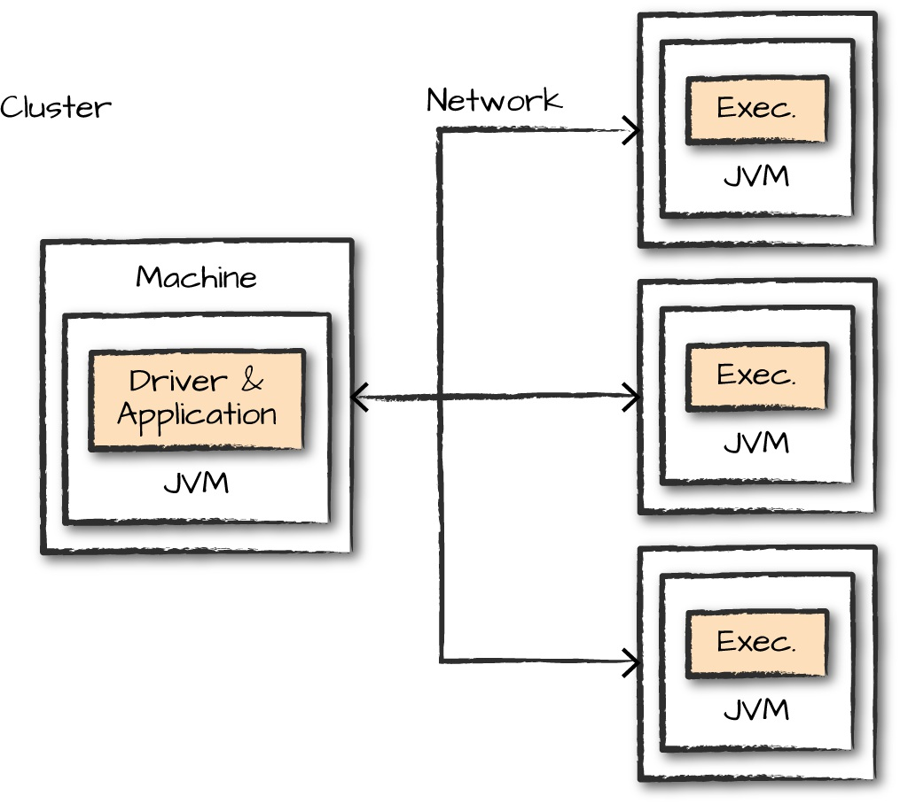
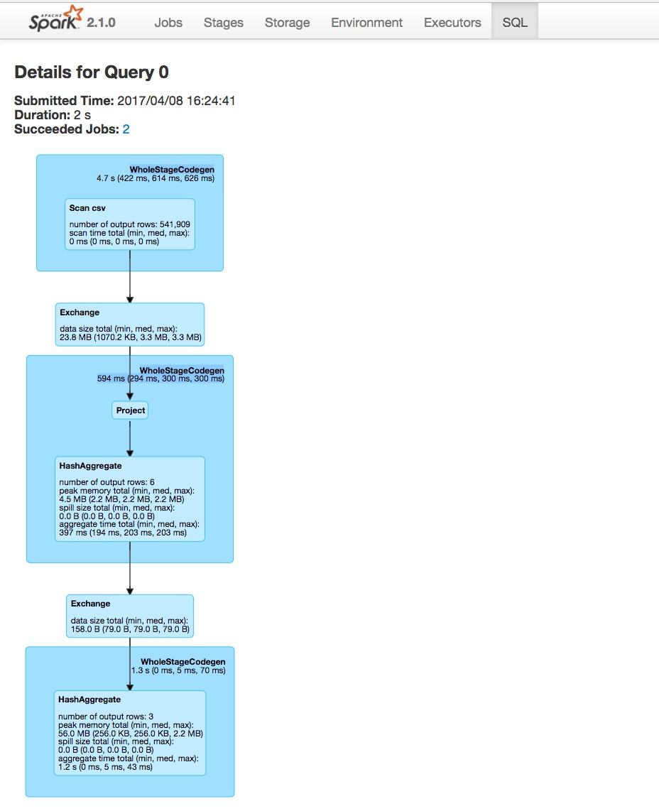
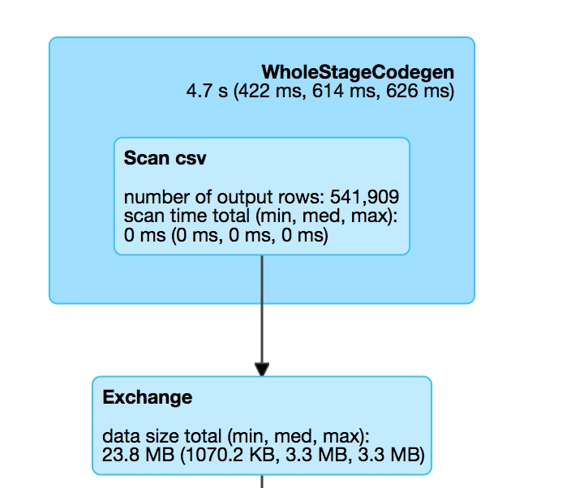
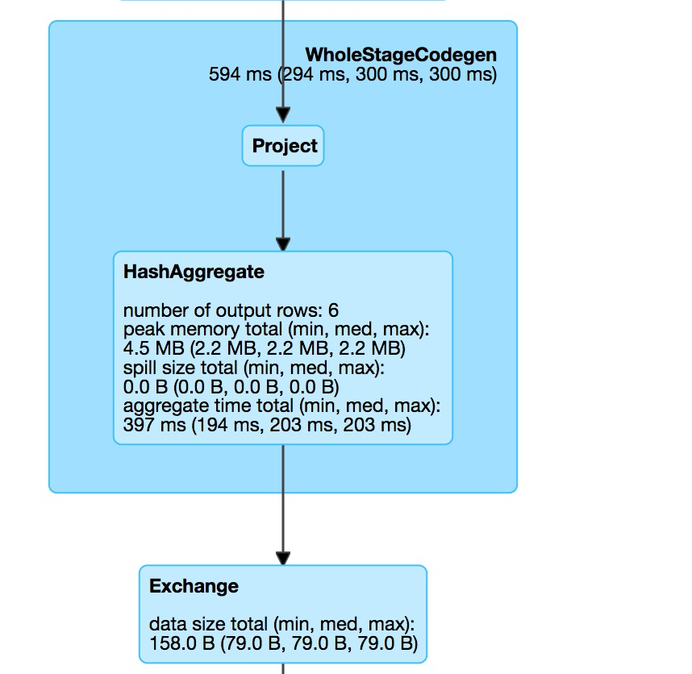
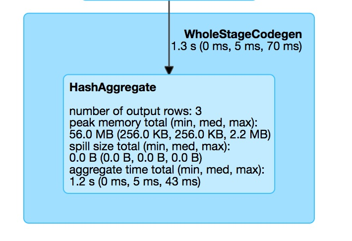
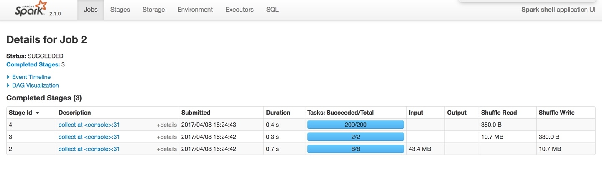
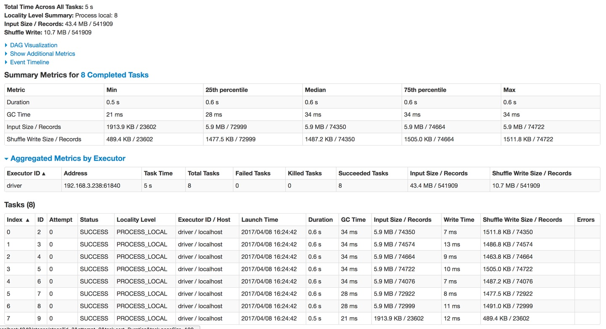

这是一个重点知识，如果你已经有了一定的基础知识，请务必细看本节。这将对你排查问题以及追踪代码执行进度时，起到很大的作用。

### Spark环境监控

在大部分时间里，都需要监控spark应用的执行过程以排查出现的问题。下面是spark任务运行的一个图，从图中入手，可以得出一些监控方式。



#### Spark Applications and Jobs

如果你想更好地了解应用程序如何在集群上执行，那么你第一个要看的就是SparkUI、Spark logs。这里有spark应用执行的详细信息，如果你还不会查看SparkUI和SparkLogs，别担心，下面我会详细来介绍。

 

#### JVM

spark中的executor process都运行在单个jvm中，因此，在了解了整体SparkUI后，可以监控单个JVM来查看某个executor的执行过程。如果你了解jvm内部结构，你可以使用用于追踪堆栈的jistack工具、用于创建堆转储的jmap等等工具来辅助你追踪jvm运行信息。

 

#### OS

因为jvm是运行在操作系统上的，你可以监控操作系统的资源情况，来了解一些信息。比如某个executor操作比较缓慢时，你可以监控这个节点的cpu、io等信息，了解是否有充足的资源在使用。

 

#### cluster

集群监控也是很重要的，比如常用的Yarn集群。在刚做大数据时，遇到一个问题：Solr查询非常缓慢、且每天凌晨不定期的会出现服务异常情况。因为Solr服务本身没有大量的作业，但是还是经常出现异常，由于不了解整体概念，所以很难排查原因，后来才晓得，Solr服务异常是由于其他大作业占用了所有的cpu和io。

对于spark的监控，大致就这几个点。我们已经知道了我们需要从这四个方面来监控spark的任务，那么，我们在监控时，需要关注哪些点呢？其实大致有两点：

1. 运行程序的进程（CPU使用率、内存使用率等）

   > 监控spark任务的进程，肯定是来监控Driver进程，因为Driver是整个spark应用的核心，所有的状态都由Driver进程来维护

2. 运行的任务（job和task）

下面详细的介绍一下如何来监控它们。


### Spark UI

Spark UI是最直观的监控方式，也是最常用的。下面是spark ui提供的几个选项页面。


- Jobs

  > spark应用的所有jobs，一个action算子为一个job，job之间的执行是随机的

- Stages

  > 每个job对应的stages

- Storage

  > 当前spark应用的数据存储信息

- Environment

  > 当前spark应用启动时的配置信息

- Executors

  > 每个executor的详细执行信息


使用下面的代码来看下监控信息

```scala
sparkSession.read.option("header", "true")
	.csv("/xx.csv")
	.repartition(2)
	.selectExpr("instr(Description, 'GLASS') >= 1 as is_glass")
	.groupBy("is_glass")
	.count()
	.collect()
```

这个代码使用了SQL查询，我们可以到SQL页下来查看它的具体运行信息，如下图：



第一个看到的是一个整体信息：

Submitted Time: 2017/04/08 16:24:41

Duration: 2 s

Succeeded Jobs: 2

它描述了：任务提交的时间、任务当前持续时间、成功的job数。

图中每个蓝色框代表一个阶段，我们对每个阶段进行分析：


#### 读csv文件并重分区



上边WholeStateCodegen的蓝色框表示对csv文件的一个完整扫描，扫描结果得出以下信息：

- 一共花费4.7秒（最小422ms，中等614ms，最大626ms）
- csv文件一共541909行
- 扫描一共花费0ms

 

下面的Exchange框是我们强制分区(reparation(2))的结果，即分区间数据交换的过程。图中给我们的信息是：

- 交换数据一共23.8M


#### 取数据并进行聚合



这个阶段对应的代码是：

```scala
.selectExpr("instr(Description,'GLASS')>=1asis_glass")
.groupBy("is_glass")
```

从该阶段，我们可以看出，它的操作流程是：

原始数据集 => 选取符合条件的数据集 =>  分区内进行聚合 => shuffer

通过这个信息，我们可以发现，spark-sql的groupBy和spark-core的groupBy是不同的。spark-core中的groupBy是直接进行shuffer的，而spark-sql中的groupBy显然是做了优化，先在分区内进行聚合，再进行shuffer，其中的聚合方式是hash聚合。


#### 最后阶段：统计阶段



最后这个阶段，是.count()函数的执行阶段。因为我们对is_glass做了分组，所以，这个count是统计每组的一个count。从DAG可以看到，最后输出3行，即表示有三种类型的is_glass。


#### spark jobs

了解了该程序的执行过程，我们再来一起看下整个应用的整体过程。



我们从Jobs选项可以看到，一共有3个stage，与我们从DAG中看到的一致。每个stage的持续时间、提交时间，每个job一共运行多少个task等等。每个阶段的task是不同的，第一个阶段read csv使用了8个分区，该方式和spark读任务有很大的关系，它会将一个文件根据行数和spark运行环境进行均分，让每个partition可以均匀的来读取，最终的计算结果是8，第二个stage，因为我们强制设置了分区数量，因此它具有2个分区，第三个阶段一共有200的task，因为默认的shuffer分区是200。


#### spark stages



单击第一个stage，可以看到该stage的详细执行信息。顶部的Summary Metrics是整个stage的一个汇总，在看该图时，一般都看这部分值的分布情况。例如Duration，如果min和max差距很大，说明有一部分分区出现了数据倾斜的情况。此图中分布是比较均匀的。在该图的最下边Tasks中，是每个task的一个执行信息，如果数据出现了倾斜，可以从task中看到是哪部分数据。

上面是spark ui中比较重要的几个选项，其他几个选项主要描述了spark应用环境的一些信息。


### Spark UI History Server

Spark UI只能在spark应用执行期间被看到，而如果程序出现意外，崩溃后，Spark UI是没有办法立即知道崩溃原因的。我们有两种方式来查看崩溃情况：

- 读Spark Logs
- 通过Spark UI History Server

Spark Logs一般用于解读程序中出现错误的某一行，用于修正代码上面的问题，而一些资源问题等情况，要查看Spark UI History Server。查看Spark UI History Server，需要提前配置保存事件日志。配置参考文章：http://spark.apache.org/docs/latest/monitoring.html

- 启用eventlog

  spark.eventLog.enabled = true

- 配置eventlog存放目录

  spark.eventLog.dir hdfs://namenode/shared/spark-logs

这两个参数在：spark-defaults.conf中配置。


### spark问题汇总及处理方式

上面是spark任务监控的一种方式，某些时候可能由于spark过于缓慢，需要去查看具体的原因（数据倾斜可能是原因之一，但并非都是由它造成），下面具体介绍一下来排查spark故障缘由的一些方式及解决方案。

#### spark job 启动相关

在某些时候，spark任务提交后，job其实并未启动成功。这种情况大部分出现在新搭建集群中。有下面几种失败场景

- spark job启动失败
- 除了driver process之外，SparkUI不显示集群上任何节点信息
- SparkUI报出了错误

解决方案：

当集群或应用程序需求资源配置不够时，通常会出现spark job启动失败。对应的解决方案就是扩大集群资源。

spark是一个分布式计算框架，它的配置也是一个分布式配置。在配置spark时，可能由于一些错误的配置导致spark的dirver节点不能正常和execute节点通信，从而会出现在SparkUI上只能看到driver process而看不到其他节点信息。解决方式就是来检查spark集群中的节点是否正常通信，如果不正常，重新配置ip地址和端口。

另一个原因是，运行spark应用需要的资源超过了集群的资源。即提交spark时，设置的资源大于集群总资源，这样driver端就会一直等待资源来启动executor。

在实际生产环境中，这些情况一般不会发生，因为实际生产的资源远大于某个应用所需要的资源。


#### 执行前发生的错误

spark应用程序执行过程中，出现错误。例如下面几种场景：

- 某个job执行成功，在执行下一个job时失败
- 昨天提交的任务，运行到今天运行失败了
- 历史运行正常，突然某天不正常

对于第一个问题，可以根据job信息，查看错误发生在哪儿，通过对比数据和代码确认问题所在。对于第二个问题，参考的范围比较广，比如确定数据量大小、查看集群资源使用情况，是否由于资源不够导致任务运行缓慢等等。第三个问题，最根本的原因可能是数据的格式发生了变化。


#### 慢任务

慢任务是spark优化的一个比较常见的问题。出现慢任务有两种情况，一是数据倾斜，二是某个节点资源不够。

出现慢任务的表现有：

- spark的某个阶段一直在执行，期中99%的task已经完成，只有个别几个task还在执行中
- 重复执行后发现这些慢任务是在操作同一个数据集
- 扩大给spark应用的资源后，运行效果并不会明显提升

 

对于慢任务，一定要明确它慢的原因，再根据对应的原因来解决。不过大部分慢的原因是数据并未均分给所有task。如何来确定是否发生了数据倾斜呢？可以通过spark ui来查看某个task的详细信息，查看是否有某个task操作的数据远大于其他task操作的数据。面对这些情况，有下面几种解决方式：

- 增加分区数量，使每个分区处理的数据降低（并不能解决数据倾斜问题）

- 尝试通过追加后缀重新分区（解决数据倾斜的方式之一）

  数据倾斜常发生在groupByKey中，相同的key被放在同一个分区，可以通过增加后缀，使key变为key1，key2……keyN，让一个分区的key分在n个分区

- 可以适当增加executor内存。在内存中的计算比磁盘中的计算要快。（前提是明确知道任务慢是由内存占满导致的，否则盲目增加内存并不会带来实际效果）

- 重复执行，检查速度慢的executor是否为同一台，因为可能会存在某个executor资源不够，例如磁盘被占满，IO被其他程序占用

- 确保聚合函数在一个小的数据集上使用，因为在做聚合时，通常是把所有数据都拉在内存中进行聚合，如果聚合后的结果集超大，那么整体运行还是会比较慢。

- 查看是否在操作数据时创建大的对象。因为数据集比较大时，如果频繁创建对象，必然会有垃圾回收器来回收这些对象，垃圾回收会降低执行速率。

 

上面是任务执行缓慢可以参考的几个优化点，因为实际情况出现的问题会多样化，因此需要先明确原因，再根据对应的方案进行优化。


#### 慢聚合

在某些聚合操作时，会变得非常慢，例如groupByKey或reduceByKey。它们都是将相同的key存放在一个分区，因此，在遇到聚合操作缓慢时，优先根据上边慢任务来排查问题。

聚合慢主要有下面两种表现：

- 聚合过程慢
- 聚合后的任务也慢

对应的解决方式，其实就是排查是否有数据倾斜问题，如有，解决数据倾斜问题。后续会有一章来介绍如何解决数据倾斜问题。如果并非数据倾斜，但依然比较慢，可以通过以下方式来进行优化：

- 聚合前适度增加分区数量，让每个分区中的数据集缩小，从而提高聚合效率。（注意最大并行度）
- 检查内存是否全部使用完，如有则可以适当提高单个executor内存，因为在内存计算比磁盘计算要快。
- 如果聚合后的任务依然很慢，说明聚合后的数据集分布还是不够均匀，可以通过repartition进行重新分区（key随机分区）使数据分布更均匀，如果repartition后以后慢，数据不均匀，那么就是出现了数据倾斜，某个key具有大量的数据集。
- 如果程序中有filter这样的操作，一定要在聚合前filter，因为filter会过滤掉一部分数据，做聚合时计算会减少，提高聚合效率。
- 如果对于null的值，尽量写null，而不是给一个默认值，如空字符串。因为spark优化器会自动跳过null的数据集，但是不会跳过特殊设置的占用符，因此，如果有空的值，尽量保证它是null。


#### 慢join

join操作也是经常遇见的一个操作，它和聚合函数相似，都是一个shuffer算子。因此它们的表现形式和处理方式大致相同。

- 对于多个join，可以尝试改变join顺序。因为某两个数据集在join后，会过滤掉大量的数据集，从而后面的join将会变得更轻松。
- 同理就是filter等操作要在join之前，因为filter后会减少一部分数据，再join就会相对较快了。


#### 读写慢

spark应用一般避免不了两点：从数据源读数据和向数据仓库写数据。某些时候读写也会变得很慢。

例如前段时间，线上hbase出现故障，故障修复后，原来的程序变得非常缓慢，原来只要几分钟就能执行完的，现在需要几个小时。通过监控，发现在读HBase中的数据时，变得非常缓慢。

对于读写慢，可以有下面几种措施来处理：

- 设置spark.speculation为true，可以提高读写速率。

  > 因为负载不均、资源不均等问题引起某个job中的多个task运行速度不一致，某些慢的task拖延了整体job的运行速度。设置该参数后，spark内部会在多个executor中启动同一个task，哪个先执行完成，就用哪个返回的结果，顺便将其他运行中的task关闭。这是一种空间换时间的方式。其主要目的是用来推测是否是由于某个节点资源缺乏导致的。不能实际解决数据倾斜问题。如果在集群资源紧缺的情况下，不建议开启此配置。

- 确保有足够的带宽可以访问数据源和文件系统

- 数据倾斜时，重新分配数据源（如HBase的Regin）


#### Driver程序内存溢出

Driver程序内存溢出其实很容易理解。可以先回顾一下Driver程序都在做什么事：

- 运行driver程序
- 向executor分发任务
- 监控executor运行状态
- 接收executor返回结果

从这几方面可以看出，能在driver端发生内存溢出的场景，无非就是Driver端程序操作了大量数据（前面有介绍如何判断Driver程序和Executor程序）和Executor返回了大量数据。

所以解决方式也是比较简单的。

- 查看是否在driver端读取了大量数据集，比如广播变量时，变量太大
- 查看是否有大循环创建对象
- 查看是否通过collect从executor收集数据
- 如果很多操作都是必须的，可以适度增大driver内存


#### Executor程序内存溢出

Executor内存溢出也是经常发生的事，需要你充分了解RDD的所有算子的运行机制，这样才能避免内存溢出的情况发生。因为大数据集并不会造成内存溢出（内存不够会使用磁盘），只有在部分不合适的算子中才会出现。

executor内存溢出有如下表现：

- SparkUI中可以看到某个executor出现OutOfMemoryErrors
- executor崩溃或无响应（通常访问spark ui时变得缓慢）

对应的处理方式有如下措施：

- 尝试增加executor内存和增大executor数量
- 查看是否创建大量对象
- 查看是否有不合适的算子。例如（mapPartition）


#### 结果中出现了意想不到的空值

spark程序中已经过滤了null值，但是在输出结果中还是出现了null值。

例如在向hive写数据时，发现某些字段是null，可能原因是hive中对应的数据结构和输出时的数据结构不一致。