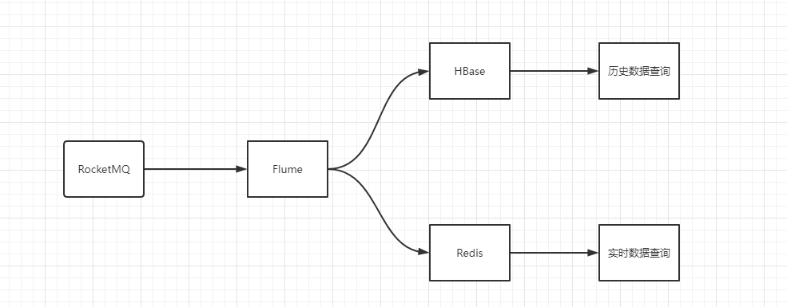

### 背景

<!--more-->

数据是工业时序数据。采集方式是，每个商户每个设备下采集的每个点。这些数据点需要实时查询，也需要历史查询。查询包括云端查询和边缘端查询。

实时查询，保存在Redis，历史数据查询，保存在HBase。两者查询互不影响。



### 第一版设计方案

Redis中，存储的是一个Hash。

```
key: corpId_type_uid
value: Map<metric, Map<timestamp, value>>
```

由于实时数据，只保留最近的几笔（假如180笔），而这种结构下，key无法进行过期，只能在每次写入时，通过delete，把过期的数据删掉。

每次写入时做删除，导致写入效率很慢。主要是删除动作耗时非常大。而不删除的话，Redis内存会持续升高。


### 第二版设计方案

在考虑到第一版的不足以后，我们采取了桶分布策略。即：提前规划180个桶。当数据来之后，轮询的将数据写入这180个桶中。此时的数据结构为：

```
key: corpId_type_uid_N
value: Map<metric, value>
```

此方案只需要负责写即可，不存在写的时候进行删除等操作，效率明显提升。

但是随着业务的发展，出现了一个设备下的多个点上报不是一次上报，而是多次上报。例如：先上报metric_1，再上报metric_2。

如果按照现在的这种方式存储的话，metric_1占一个桶。metric_2占另一个桶。而用户查询最近一笔数据时，只能查到后来的这个metric，另一个metric查不到。就导致了问题发生。


### 第三版设计方案

将第二种方案中的Hash展开。即：结构变为如下：

```
key: corpId_type_uid_metric_N
value: v
```

这种方案，虽然满足了查询条件，但是key会膨胀很多。key膨胀存储上没多大问题，但是查询时，会受到影响。例如：keys 操作和 scan 操作会变得很慢。查询多个点，也没有之前一次取出来方便。


### 第四版设计方案

只保留最近的几笔热查询数据。其它数据不查询即不保留。第一次查询时，从hbase中查询。之后将它识别为热查询，后续从redis中查。

这样，redis中保留的数据将会大大降低。效率也相对提升。

但是，hbase保存的是历史数据，这个数据流中，或许会存在数据堆积问题。一旦数据发生堆积，对历史数据查询并无太大影响，而实时数据查询，则出现问题。

为了保证实时数据可用，现在需要解决的是，让数据不堆积。

这儿有个疑问：`为什么往hbase写会堆积，而往redis写，就不存在堆积呢？`

主要原因是，flume在转发到redis时，做了校验，如果数据是这个时间窗的，则进行转发，如果不是这个时间窗的，则丢弃。扔数据是比较快的，只要不是源头发生了堆积(例如网络断开，数据无法上报)，redis中的转发就一定不会堆积。

为了达到hbase也不堆积，我们的方案是，在hbase中新建一张表，原先写入redis的这一步，转到向hbase新表写。

因为数据堆积发生的概率很小，因此往hbase中写数据时，流量会翻倍，而且大多和历史数据表是重复的。

所以，考虑到这点，我们不往新表中写。而是增加一个判断条件，如果写入hbase发生了堆积，则向redis写的改为向hbase写，而hbase不发生堆积时，即不往redis写，也不往hbase写。

整体流程变为如下：


由于边缘端资源有限，而且数据量并不是很大，因此在边缘端部署一套HBase，相对复杂，故边缘端由RocksDB来代替HBase。