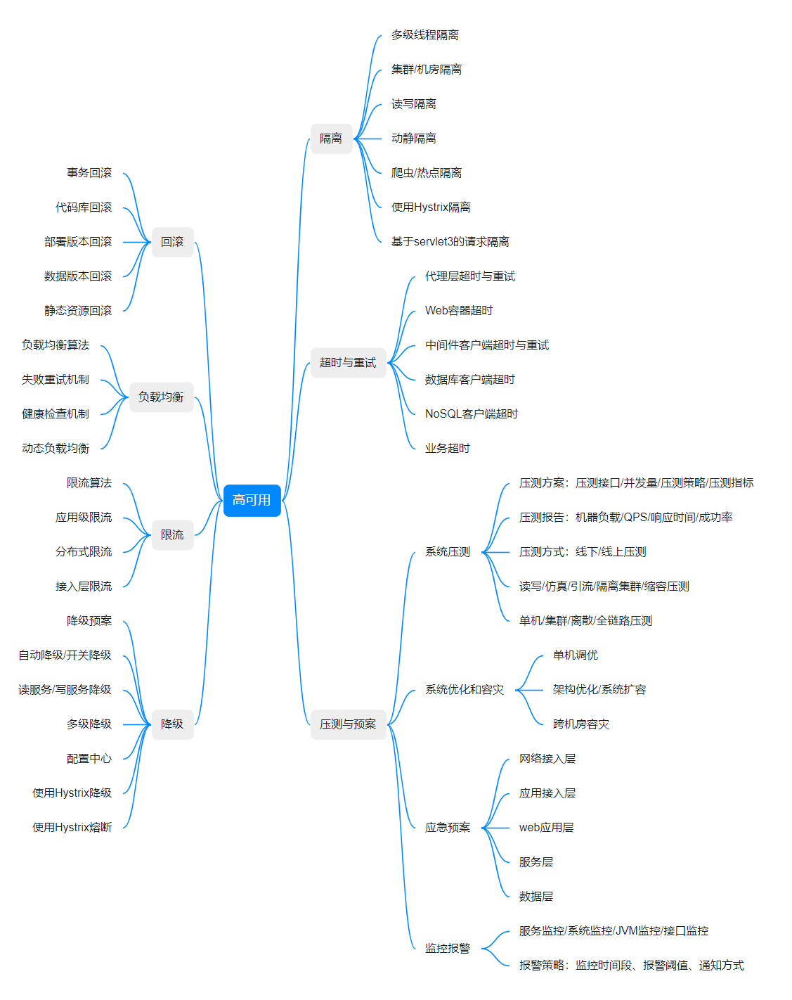
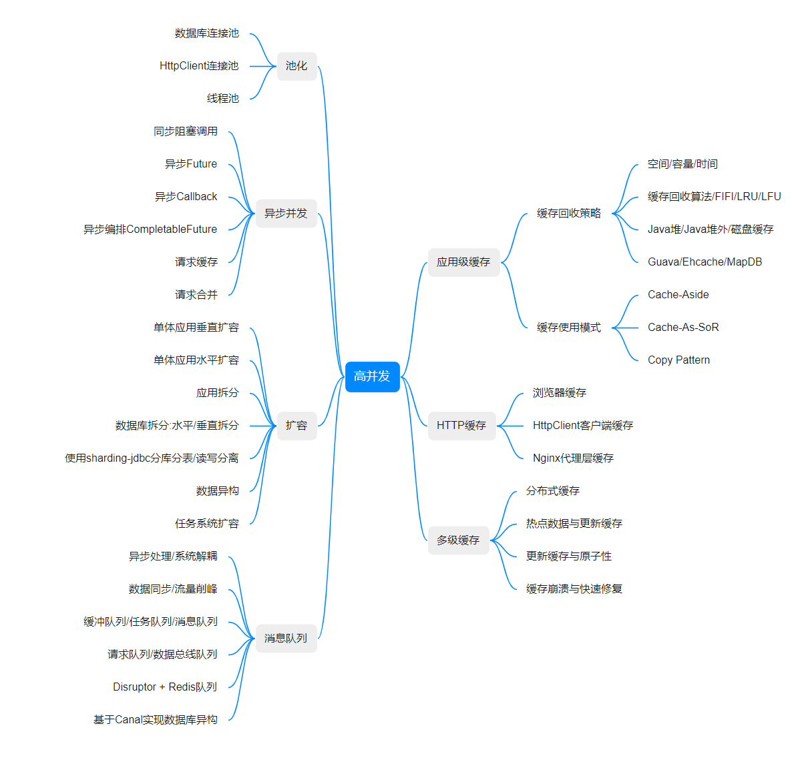

现在的系统架构时代，早已不是当年那个“不行就加机器”的时代了。因为现在上网的越来越多，数据产生越来越大，流量越来越大。不行就加机器，成本实在是太高了。

如何构建一个高并发、大流量的系统，不是架构师闭门造车冥想出来的，是通过不断交流总结的。每个企业的业务都不同，但是思想是可以借鉴的。像阿里、腾讯、京东这些大厂，已经总结了很多构建大流量系统用到的高可用和高并发原则。

系统设计是一个不断迭代的过程，在迭代中发现问题并修复问题，即满足需求的系统是不断迭代优化出来的，这是一个持续的过程。不过，如果一开始就有好的基础系统设计，未来可以更容易达到一个比较满意的目标。

一个好的系统设计要做到，**解决现有需求和问题，把控实现和进度风险，预测和规划未来，不要过度设计，从迭代中演进和完善**。

在持续开发系统的过程中，会有一些设计原则/经验可以用来遵循和指导我们。

## 高并发原则

### 无状态

如果设计的应用是无状态的，那么应用比较容易进行水平扩展。实际生产环境可能是这样的：应用无状态，配置文件有状态。

### 拆分

在系统设计初期，是设计一个大而全的系统还是按功能模块拆分系统，这个需要根据环境进行权衡。

如果是一个访问量比较小、业务比较单一的系统，可以做一个大而全的系统。如果是一个访问量比较高，业务比较复杂的系统，则可以考虑按功能拆分系统。

关于系统的拆分，可以通过以下几个维度来考虑。

- 系统维度

  按照业务拆分，一个业务一个系统

- 功能维度

  对一个复杂的业务系统进行按功能拆分。

- 读写维度

  如果一个系统，读写比例非常明显，则可以按读写进行拆分。例如我们公司的查询引擎。它会有少量的写，但是具有非常大的读。

### 服务化

内部服务调用的演化过程：进程内服务 -> 单机远程服务 -> 集群手动注册服务 -> 自动注册和服务发现 -> 服务的分组/隔离/路由 -> 服务治理（限流/黑白名单）

### 消息队列

消息队列是用来解耦一些不需要同步调用的服务或者订阅一些自己系统关心的变化。

不仅如此，消息队列也用于流量削峰的场景。确保突发性的流量，不会将服务冲挂。

例如：大流量缓冲。

当大量流量进来去写入数据库时，必然会导致响应时间延长。响应时间延长，就无法响应高并发请求。所以，对于写数据库的这些操作，可以先在内存中更改（例如redis），再通过消息队列，异步更新到数据库中。

例如去年（2021）年底的西安疫情，大家被封在家，无菜可吃的时候，只有淘菜菜每天晚上10点的时候可以抢菜，数量有限。记得很清楚，当时整点抢菜时，经常页面无响应、服务返回500。等流量冲击一波之后，才恢复正常。当时还在吐槽，这服务可靠性、高并发做的实在差。

就拿抢菜来说，数据库里面肯定会维护一个库存信息。如果每个请求过来都去更新数据库库存，那么数据库压力将会持续变大。最终导致大部分请求超时、异常。

但是如果把这个将扣减库存的逻辑放在redis中，先更新redis，同时发往消息队列，再异步将消息更新到数据库中。那么，这个响应一定能更快。因为它是牺牲了强一致性，保证最终一致性的手段。

### 数据异构

经营分析、报表，这些聚合数据是保存在MySQL中。当客户增多时，数据会越来越大，会涉及到分库分表。然而，有些报表并不是一张表就能查出结果。需要聚合多个表数据，这样会导致查询性能很低。

对于这个问题，可以考虑从客户角度来进行分库分表。

### 缓存

缓存对于读服务来说，绝对是抗高并发的最佳手段。有以下几种缓存手段。

| 流程节点       | 缓存技术                                                     |
| -------------- | ------------------------------------------------------------ |
| 客户端         | 使用浏览器缓存   客户端应用缓存                           |
| 客户端网络     | 代理服务器开启缓存                                           |
| 广域网         | 使用代理服务器（含CDN）  使用镜像服务器  使用P2P技术   |
| 源站及源站网络 | 使用接入层提供的缓存机制  使用应用层提供的缓存机制  使用分布式缓存   静态化、伪静态化  使用服务器操作系统提供的缓存机制 |

### 并行化

假设一个读服务需要如下数据：

| 目标数据 | 数据A | 数据B | 数据C | 数据D | 数据E |
|  --- | --- |  --- |  --- |  --- |  --- |
| 获取时间 | 10ms | 15ms | 20ms | 5ms | 10ms |

如果串行读取，需要60ms，而如果并行读取，则只需要20ms。

## 高可用原则

### 降级

对于高可用服务，很重要的一个设计就是降级开关，在设计降级开关时，主要依据以下思路：

1. 开关集中化管理：通过推送机制把开关推送到各个应用。
2. 可降级的多级读服务：比如服务调用降级为只读取本地缓存、只读分布式缓存、只读默认降级数据。
3. 开关前置化：如架构是Nginx -> Tomcat，则可以将开关前置在Nginx接入层，在Nginx层做开关，请求流量只有一小部分会到后端应用。
4. 业务降级：当高并发流量来袭，为了保证核心也能能被使用，可以降级一些不重要的服务。

### 限流

限流的目的是防止恶意请求流量、恶意攻击，或者防止流量超出系统峰值。

1. 恶意请求流量只访问到cache。
2. 对于穿透到后端应用的流量，可以考虑使用Nginx的limit模块处理。
3. 对于恶意IP可以使用nginx deny进行屏蔽。

### 切流量

对于一个大型应用，切流量是非常重要的。也许机房掉电，造成服务不可用这种情况很少发生，但是恶意攻击或者bug本身导致服务不可用的问题非常常见。例如发生死锁，服务不能响应。这些情况都需要切流量，保证整体服务可用。可以使用以下方式进行流量切换。

1. DNS：切换机房入口
2. HttpDNS：主要APP场景下，在客户端分配好流量入口。
3. LVS/HaProxy：切换故障的Nginx接入层
4. Nginx：切换故障的应用层。

### 可回滚

版本化的目的是可以追溯，可以回滚。当程序出错时，可以尽快回滚到一个稳定的版本。

## 总结

以上是当前系统架构需要参考的一些基本原则。

对于一个系统设计来说，不仅需要考虑实现业务功能，还要保证系统高并发、高可用、高可靠等。一个完整的系统，需要全面评估以下几个方面：

- 系统容量规划

  > （流量、容量）

- SLA制定

  > 吞吐量、响应时间、可用性、降级方案

- 压测方案

  > 线下、线上

- 监控报警

  > 机器负载、响应时间、可用率等

- 应急预案

  > 容灾、降级、限流、隔离、切流量、可回滚等

以上是一些原则的简单介绍，后续会详细介绍每个原则的实时方案，以及我遇到的问题的解决方案。

