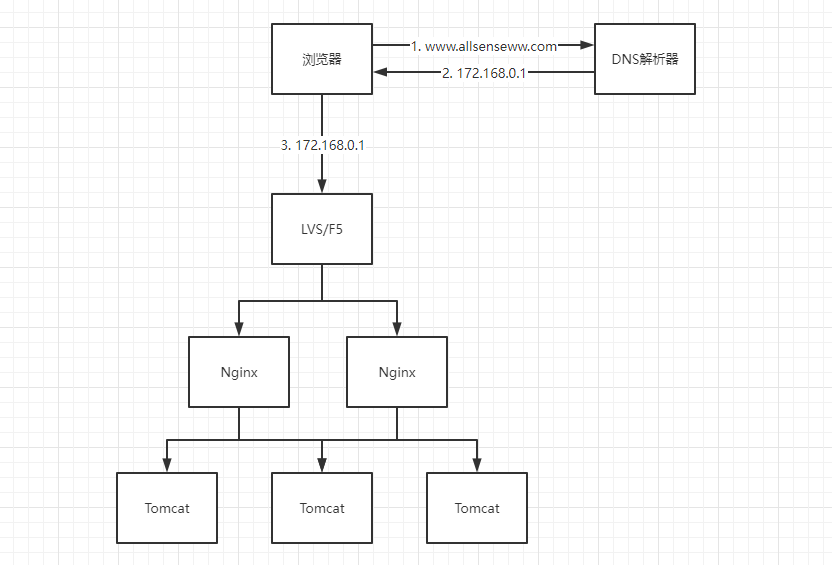
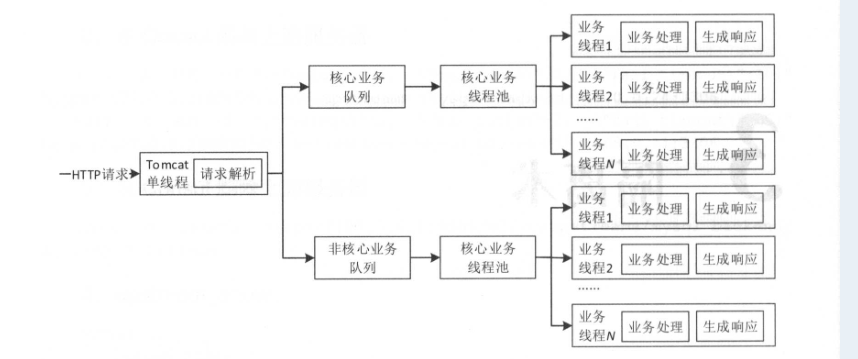
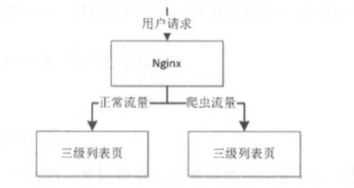
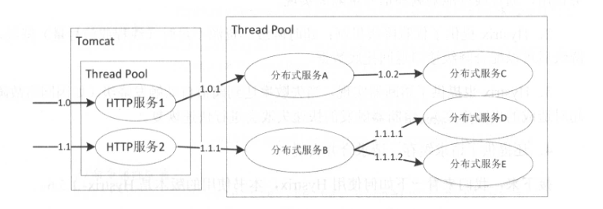
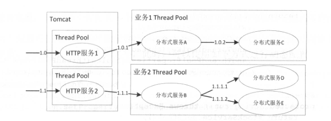
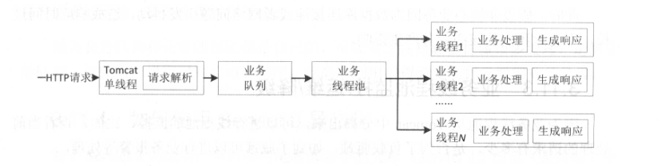
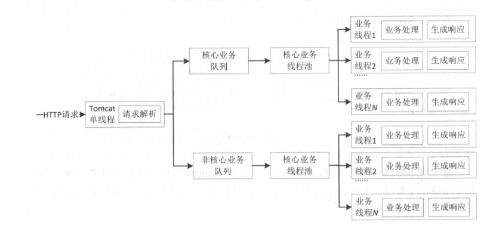

## 背景

参考之前的文章：[频繁高并发请求导致服务响应变慢、假死、OOM](https://wdzaslzy.github.io/2022/07/13/other/%E9%A2%91%E7%B9%81%E9%AB%98%E5%B9%B6%E5%8F%91%E8%AF%B7%E6%B1%82%E5%AF%BC%E8%87%B4%E6%9C%8D%E5%8A%A1%E5%93%8D%E5%BA%94%E5%8F%98%E6%85%A2%E3%80%81%E5%81%87%E6%AD%BB%E3%80%81OOM/)

这是我们查询服务所遇到过的问题。当出现大量并发请求，就会导致服务不可用。所以，一个系统，首先必须要做到高可用。

## 高可用策略

### 负载均衡与反向代理

当我们的应用单实例不能支撑用户请求时，此时需要扩容，从一台服务器扩容到两台、几十台、几百台。然而，当用户发起一个请求时，浏览器首先会查询DNS服务器获取对应的IP，然后发通过此IP访问对应的服务。

此时，一种方式是一个域名映射多个IP，但是它存在一个严重的问题，某台服务器出现故障，DNS会有一定的缓存时间，故障后切换时间长。因此，此时应该考虑使用负载均衡器来协助。

Nginx是目前比较热门的负载均衡器。但Nginx一般用于七层负载均衡，吞吐量是有一定限制的。为了提升整体吞吐量，会在DNS和Nginx之间引入接入层，如使用LSV（软件负载均衡器）、F5（硬件负载均衡器）可以做四层负载均衡。即：首先DNS解析到LSV/F5，然后再有LSV/F5转发给Nginx，再由Nginx转发给后端Server。

关于7层负载均衡和4层负载均衡的概念，参考前文。

大部分场景下，我们只需要关心Nginx负载均衡即可。LVS/F5由运维来负责。

Nginx提供的负载均衡，可以实现上游服务器的负载均衡、故障转移、失败重试、容错、健康检查等。当某些上游服务器出现问题时可以将请求转到其它上游服务器以保障高可用，并通过OpenResty实现更智能的负载均衡，如将热点与非热点流量分离、正常流量与爬虫流量分离等。

Nginx负载均衡器本身也是一台反向代理服务器，将用户请求通过Nginx代理到内网中的某台上游服务器处理，反向代理服务器可以对响应结果进行缓存、压缩等处理以提升性能。

关于Nginx的具体使用，请参考官网。

### 隔离术

隔离是指将系统或资源分隔开，系统隔离是为了在系统发生故障时，能限定传播范围和影响范围，即发生故障后不会出现滚雪球效应，从而保证只有出问题的服务不可用，其它服务还是可用的。

#### 线程隔离

线程隔离主要是指线程池隔离，在实际使用时，我们会把请求分类，然后交给不同的线程池处理。当一种业务的请求处理发生问题时，不会将故障扩散到其它线程池，从而保证其它业务可用。下图是线程隔离的目标设计。

#### 进程隔离

一个系统设计初期，不会一上来就进行拆分。随着业务的慢慢发展，原来单一的系统会变的越来越庞大，系统中的某一个模块/功能出现问题，整个系统就不可用了。

首先想到的方案是通过部署多个实例，通过负载均衡进行路由转发。但是这种情况无法避免某个模块因BUG而出现如OOM导致整个系统不可用的风险。因此，这种多实例部署方案只是一个过渡方案，长期方案是将系统拆分为多个子系统来实现物理隔离。通过进程隔离使得一个子系统出现问题不会影响其它子系统。

#### 集群隔离

随着系统的发展，单实例服务无法满足需求，此时需要服务化技术，通过部署多个服务形成服务集群，来提升系统容量。当系统中的某个服务/模块的调用频率增大，就会影响其它服务的稳定性，此时应该考虑将该服务/模块单独提取出来，作为一个单独的集群。即使它出现问题，也不会影响到别人，从而实现了故障隔离。

#### 机房隔离

随着对系统可用性的要求，会进行多机房部署，每个机房的服务都有自己的服务分组。本机房的服务应该只调用本机房服务，不进行跨机房调用。其中一个机房服务发生问题时，可以通过DNS/负载均衡将请求全部切到另一个机房，或者考虑服务能自动重试其它机房的服务，从而提升系统可用性。

#### 读写隔离

现在大部分大数据中间件都有主从模式，它们就是将读写进行了分离。例如：RocketMQ。它的架构模式是多集群架构，单集群下又分主从结构。当某个子集群的主节点发生故障时，从节点依然可以消费数据。写入的数据会被写入到其它子集群中。从而保证整个服务的读写都高可用。

#### 动静隔离

现在大部分的前后端都是分离的。一般来说，都没有问题。假如前后端不分离，用户在访问某个页面时，需要加载js/css/img等静态资源时，如果访问量增大，必然会导致带宽打满，从而出现不可用。

因此，现在一般静态页面和后端服务都是分离的。一般应该将静态资源放在CDN上。

#### 爬虫隔离

某些应用，可能会为爬虫提供单独的访问接口。而爬虫流量一旦增大，就有可能导致服务不可用。一种解决办法是通过限流解决，另一种解决办法是在负载均衡层（Nginx）将爬虫路由到单独集群，从而保证正常的流量可用，爬虫流量尽量可用。

举一反三，该例可应用到内部访问和外部访问上。内部大量的建模查询请求，会影响外部客户的使用。为保证客户能及时响应，在Nginx层面将它们的流量进行切分开。

实际情况下，可能不仅仅是正常的爬虫流量，一些恶意的攻击，我们也可以采用相同的做法。例如通过统计IP访问量来配置阈值，超过阈值时，将它们进行分流。不过，这种情况会存在一定的误杀，因为公司的公网IP一般情况下是同一个，大家使用同一个公网出口IP访问网站。因此可以考虑IP+Cookie的方式。或者能唯一标记用户身份的ID亦可。

#### 热点隔离

刚毕业跳槽阿里时，被面试时问到过一个问题：如何做一个秒杀系统。

现在想想，对于秒杀系统，一定会有热点问题。热点会造成其他正常服务不可用。所以，我们需要将它做成一个独立的系统进行单独部署。即使秒杀系统出现问题，我们也可以使用降级的手段来给用户一个友好的提示。

像秒杀系统这种例子，热点是我们能提前预知的。还有一部分热点，我们是无法预知的。例如写热点。大数据分析的结果，会突发性的进入系统。这类热点数据，我是通过队列模式来进行削峰的。

#### 资源隔离

最常见的资源：磁盘、CPU、网络。这些宝贵的资源，都会存在竞争问题。

例如Docker容器部署的服务，有些服务写磁盘非常频繁，则可以将它们独立出来，挂载不同的磁盘。

### 实现隔离的几种方式

#### 使用Hystrix实现隔离

Hystrix是前几年比较流行的第三方开源库，大部分应用都用它来做资源的隔离、限流和降级。虽然后面Hystrix逐渐被其它开源库替代，但不管怎么替代，思想都是基于Hystrix的。

下图是一个典型的应用设计图：

大多数人在使用Tomcat时，多个HTTP请求会共享一个线程池。假设其中一个HTTP服务响应很慢，将会造成Tomcat大部分线程被堵塞，从而影响其它服务延迟增加，甚至不可用。

使用Hystrix可以做到在Tomcat层进行服务隔离。如下图：

当其中一个服务响应变慢或者不可用时，另一个服务将不受影响。

#### 基于Servlet3实现异步化

Tomcat在收到Http请求后会按照以下流程来处理请求：

1. 容器负责接收并解析请求为HttpServletRequest
2. 然后交给Servlet进行业务处理
3. 最后通过HttpServletResponse写出响应

在Servlet 2.x规范中，所有这些处理都是同步进行的。也就是说在一个线程中完成接收请求、业务处理到响应。而Servlet3规范中，使用了NIO机制，可以请求异步化。请求异步化后的好处如下：

1. 基于NIO能处理更高的并发连接数
2. 请求解析和业务处理线程池分离
3. 根据业务重要性对业务分级，并分级线程池
4. 对业务线程池进行监控、运维、降级等处理

因此，异步化之后的线程模型如下：

可以看到，当Tomcat线程解析完请求后，将请求扔到业务队列，即结束。业务线程池再从业务队列中取出请求进行业务处理。

因此，有了异步化之后，即可以在服务内进行业务线程隔离。线程模型如下图：

和Hystrix相比，该方式更灵活，不需要引入第三方的依赖库。可以根据业务类型来定义不同的队列大小、线程池大小。

异步化之后，吞吐量会进行提升，但是响应时间也会略微变长。

### 限流策略

在开发高并发系统时，有很多手段来保护系统。如缓存、降级和限流。缓存的目的是提升系统的访问速度，增大系统的处理能力。而降级是当服务出现问题或者影响到核心流程的性能，需要暂时屏蔽掉，待高峰过去或者问题解决了再打开场景。而有些场景是不能通过缓存和降级来解决的。比如稀缺资源（秒杀、抢购）等，这个时候就需要限流来保护系统。

限流的目的是通过对并发访问/请求进行限速或者在一个时间窗口内的请求进行限速来保护系统。一般常见的限流有以下方式：

- 限制总并发数（如数据库连接池、线程池）
- 限制瞬时并发数
- 限制时间窗口内的平均速度
- 以及限制远程接口调用速率
- 限制MQ的消费速率等等

关于限流的算法，常见的有：令牌桶和漏桶。

#### 令牌桶

令牌桶算法，是一个存放固定容量令牌的桶，按照固定速率往桶里添加令牌。

#### 漏桶

漏桶算法是有一个固定容量的漏桶，按照常量固定速率流出水滴。

#### 算法对比

- 令牌桶是按照固定速率往桶中添加令牌，请求是否被处理需要看桶中令牌是否足够，当令牌数减为0时，则拒绝新的请求。
- 漏桶则是按照常量固定速率流出请求，流入速率任意，当流入的请求数量累计到漏桶容量时，则新流入的请求被拒绝。
- 令牌桶限制的是平均流入速率。
- 漏桶限制的是常量流出速率。
- 令牌桶允许一定程度的突发，而漏桶主要目的是平滑速率。

### 降级特技

在进行降级之前要对系统进行梳理分析，看看系统是不是可以丢卒保帅。先列出可以进行降级的点。降级可以是自动降级也可以是人工开关降级。

#### 自动开关降级

自动降级是根据系统负载、资源使用情况、SLA等指标进行降级。例如：

1. 超时降级

   > 当访问数据库/远程调用/HTTP请求响应慢，且服务不是核心服务时，可以在超时后自动降级。

2. 统计失败次数降级

   > 例如一些错误查询，失败率达到一定阈值后自动降级。然后通过异步线程去探测服务是否恢复了，恢复则取消降级。

3. 故障降级

   > 例如远程调用的服务挂掉了，则可以直接降级。降级后的处理方案有：默认值、兜底数据、缓存等。

4. 限流降级

   > 例如一些秒杀活动，大家共同抢某一个资源，可能会因访问量太大，导致系统崩溃，为了保护系统，一般都会做限流。被限制的用户，可以得到一个降级后的方案。

#### 人工降级开关

例如新上线的服务，在进行灰度验证时，如果验证有问题，则可以通过开关切换到老服务。再比如，HBase的双集群，如果其中某一个集群出现了异常（调用失败），则需要立马切到另一个集群。

#### 读服务降级

读服务降级一般用的比较多。一般的读服务都有缓存。例如：接入层缓存->应用层本地缓存->分布式缓存->DB。当某一个缓存不可用时，自动降级为不调用。只走最外层缓存即可。

#### 写服务降级

写服务在大多数场景下是不可降级的。不过，可以通过一些旁路来解决问题。

例如：大量的写入请求，可以使用消息中间件来进行削峰。通过异步化的方式来将数据输出。

#### 多级降级

例如读服务降级，当DB不可用时，在分布式缓存处开启降级。当分布式缓存不可用时，在本地缓存处开启降级。

### 超时与重试

一般的系统都会涉及到远程调用。为了保证服务的高可用，都需要考虑在远程调用失败时进行重试。

### 回滚机制

在新升级某个服务时，必须要考虑到回滚。因为意外总是在预料之外的。

例如：当时我们当时HBase存储存在数据热点问题。为了解决热点问题，我们调整了RowKey设计。但是历史数据也要恢复，我们采用了同一个集群中，读老表，修改rowkey后，往新表写的方案。而写的过程中，HBase集群意外崩溃，导致整个HBase服务近一天不可用。

这次事故就是我们未考虑到回滚，导致服务一旦出现故障，我们只能挨批。

所以在线上进行任何操作时，都要先考虑到，一旦失败，是否能立即回滚。

## 总结

高可用是一个系统的最基本保障。如果一个系统经常崩溃无法服务，那么将无法再深入的去解决更多的问题。

一个系统的演进方向一定是：可用->效率->功能
