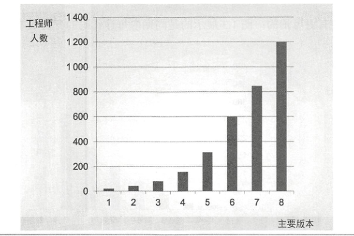
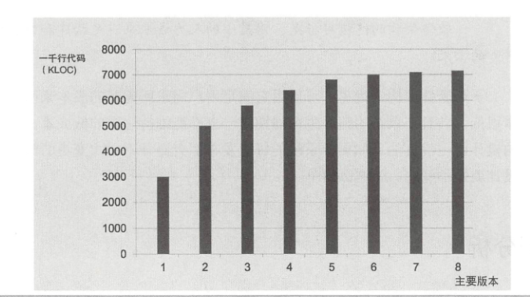
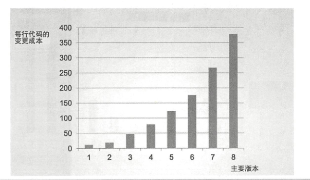

## 前言

最近对公司内部项目做了一些重构，对项目架构这一块也有了一定的理解，结合在企业内部的实际项目，来记录一下个人在架构这块学到的一些经验和知识。

## 案例分析

在写一个新的项目之前，先来看一个例子。

这个是某个开发团队规模的增长图。通过图能直接看到，团队人数在扩张，也能间接的反应，该团队的业务在越来越多，越来越重要。

而该团队的生产效率如何呢？

这个图是该团队的生产效率图，这明显是有问题的。

伴随着产品的每次发布，公司的工程师团队在持续扩大，而代码增长的行数却几乎没变。说明该团队大部分时间都花在了维护系统稳定上，而不是去开发新的产品。

再来看一个图。

该图是每行代码的变更成本，显然，该团队的维护成本要比开发成本高很多，一个变动会引起一堆意想不到的问题。即使该公司的盈利很高，如果按照图中的趋势发展下去，整个公司的利润都会被该团队一点点榨干。因为技术人员的花费会越来越高。

这就是一个典型的乱麻系统。它前期虽然给公司盈利了，但后期却在榨取着公司的利润。这种系统一般是没有经过设计，匆忙被构建起来的，然后为了加快发布速度，拼命的往团队里加入新人。

那么这种不管设计，只管业务，不断添加新人的方式，究竟能不能加快产品的研发呢？

答案是不能。

现在的研发工程师，明知道这种乱麻系统不好，但是他们不会重视，因为他们总能找到一个借口：我们可以未来再重构代码，产品上线最重要。

只要是写过代码的，一定会有过这样的借口，一定也知道，一旦上线了，重构哦工作几乎没人再提起，更没人再敢去重构（因为怕重构出更多的问题）。

那么随着时间的推移，该团队的生产效率将会直线下降，直至为零。那个时候，大家的大量时间都在维护系统，而不是在研发系统。

所以，从长期的角度来看（3-5年），胡乱编写代码的工作速度一定比良好架构的速度要慢。

对于这种情况，大家一定要牢记：

**想要跑的快，先要跑得稳。**

## 架构的目标

那么回到本质，我们为什么要进行架构。或者说，为什么要有架构师的存在。

**软件架构的终极目标是，用最小的人力成本来满足构建和维护该系统的需求。**

一个稳定的系统，它的维护成本一定是0。

当然，我所在的公司，虽不能说每个系统都做到了这点，但是，大部分稳定的系统，几乎不需要去维护。

例如我们自研的消息中间件。该系统我在后面也会作为一个架构案例来介绍的。

