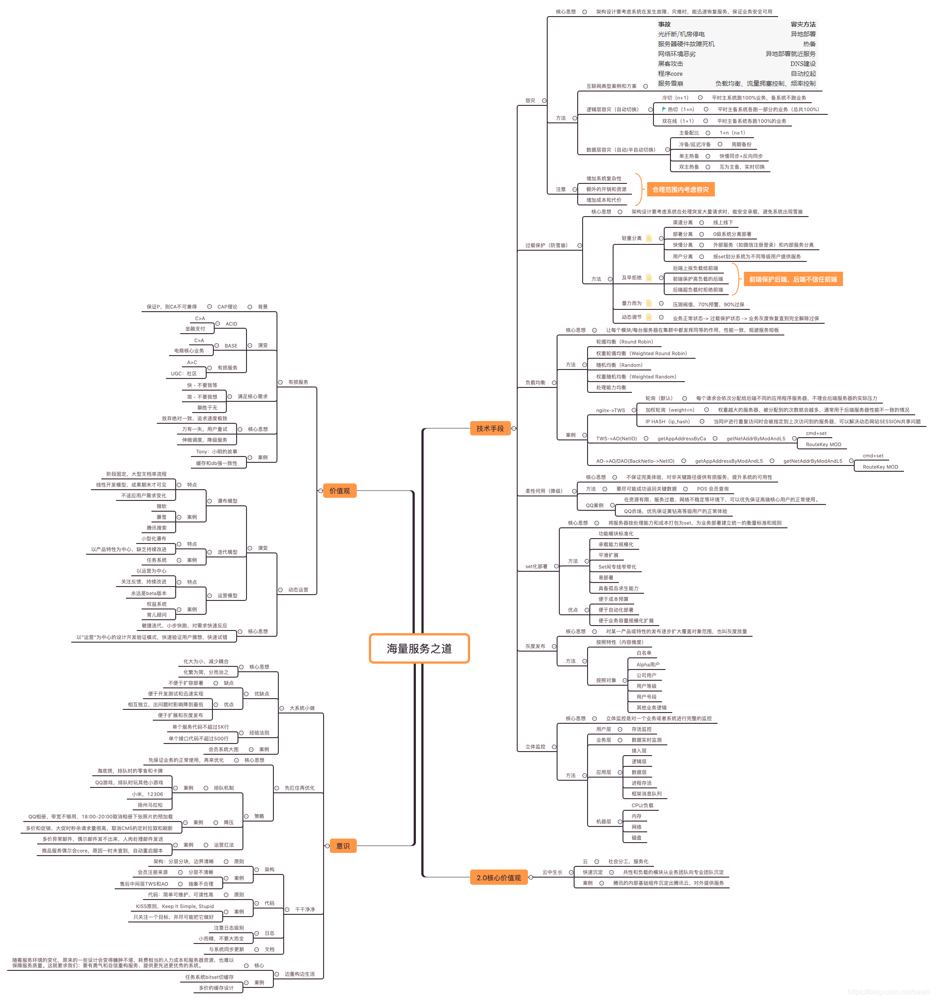

一直对腾讯做产品的能力比较敬佩的，我们组做消息推送系统，而腾讯的信鸽就是我们学习的榜样。京东很多做产品的思想是跟腾讯学的，而京东很多同事也从腾讯过来的(京东合并了腾讯电商)，耳濡目染学到很多东西。

前几天前腾讯的同事给我们分享了《解密腾讯海量服务之道》，讲了几个腾讯开发产品的经验原则，比较受益，遂总结下。

**2个价值技术观, 7个技术手段, 4个意识**
腾讯的海量服务之道是由2个价值技术观和7个技术手段，4个意识组成。技术价值观是总体思想，意识是我们的态度，技术手段是实现技术价值观的手段或者方法。

## 海量服务的技术价值观

### 有损服务

**CAP理论**
理论式系统基础理论CAP为分布式的应用提供了理基础:
C: Consistency，一致性；包括三种类型(强一致性，弱一致性，最终一致性)
A:Availability，可用性（主要指的是快速获取数据的能力，即性能）
P:tolerance of network Partition，分区容错性（亦包括可分布性）

**有损服务经历了3个阶段的演变: **

1. ACID事物保证阶段(金融，电信，石油，银行)
   特点：通过硬件中间件、数据库（支持事务）的层层事务保障，提供给用户非此即彼的服务结果，数据一致性优先于反应速度。
   缺点：系统冗余高，架构复杂，开发维护及运营成本非常高。
2. BASE理论阶段(电商)
   特点：BASE是Basically Available、Soft state、Eventually consistent三个词组的简写。通过牺牲【强一致性】，获得基本可用性和柔性可靠性并要求达到【最终一致性】
   缺点：牺牲部分一致性，只能保证最终一致性。
3. 有损服务阶段(UGC)
   特点：
   a.放弃绝对一致，追求速度极致；
   b.万有一失，让用户重试；
   c.伸缩调度，降级服务；

通过精心细分场景，选择牺牲一部分一致性、完整性，以达到通过较低的成本，能够支持海量服务需求，并且满足服务基本可用。

### 动态运营

核心思想就是敏捷迭代， 所谓小步快跑，对用户的需求快速反应。简而言之就是“快速求证对用户猜想”的过程。

许多伟人都说过类似的话：用户往往不知道真正想要什么，而且大多是时间是拿来“试错”的。动态运营就是快速求证对用户猜想的过程，这个过程是建立在以”运营”为中心的设计开发验证模式。

## 海量服务的7个技术手段

### 容灾

互联网硬件容灾方案：

| 事故               |                         容灾方法 |
| :----------------- | -------------------------------: |
| 光纤断/机房停电    |                         异地部署 |
| 服务器硬件故障死机 |                             热备 |
| 网络环境恶劣       |                 异地部署就近服务 |
| 黑客攻击           |                          DNS建设 |
| 程序core           |                         自动拉起 |
| 服务雪崩           | 负载均衡、流量拥塞控制、频率控制 |

**互联网业务逻辑层容灾**

1. 独立逻辑的逻辑层，被接入层负载均衡调用。
   通过监控及时扩容，保证系统整体负载能力有冗余，一台服务器死机时，配置系统将其状态置为不可用，将其上的流量（平均）分给系统中其他服务器(s)上。
2. 分号段逻辑的逻辑层，每个逻辑层只能处理指定号段的请求。
   n+n容灾：1对1容灾，比较奢侈，备份系统要么热备（平时负担50%请求）要么冷备（平时不工作，空跑），事故发生时，备机承担全部请求。
   n+1容灾：备机平时冷备，拥有全局号段路由表，任何一台主机死亡后，备机都可以转成死亡主机的角色，负责相应号段的逻辑工作。

**互联网业务数据层容灾**

1. 写唯一式同步
   业务写请求只发给数据层主机，由主机采用快、慢同步结合的方式同步给各台备机。
2. 同时写式同步
   业务将写请求发给所有数据层服务器，得到所有/多数ack才算写完成。Yahoo的Zookeeper使用多数ack（如5台服务器有3+台ack）即成功的方式（读写都是），这种类似投票表决的方式被验证过可以严格保证数据一致性，也不用担心唯一的主机写失败，但是实现比较复杂。

### 过载保护

在分布式集群系统中，某台设备故障，会造成系统整体的繁忙不可用；在做营销推广时，某个服务单元负载极大的现象会很快蔓延到其它服务单元，最终导致全部服务的不可用；用户群越大，系统规模越大，负载超限的情况扩散的就越快，最终会造成系统整体崩溃。上述现象在自然界用一个最直接的名词就是”雪崩”。

**过载保护的四个方法:**

1. 轻重分离
   轻重分离的主旨是对服务的内容进行细分，按照高内聚低耦合的方式部署服务，使得局部的过载不扩散到整个系统。
2. 及早拒绝
   问题解决的阶段越早，成本越低，影响越小。因此我们一个系统的设计原则：【前端保护后端，后端不信任前端】，在发现系统有过载趋势时，前端系统就要开始拒绝新的用户请求接入。
3. 量力而为
   过载保护是立体工程，各个层级都要首先做好自我保护，再考虑对关联系统的保护。运营时要有容量管理（即容量监控）。一般而言，建议容量管理按照70%预警，过载保护按照90%启动。
4. 动态调节
   动态调节的核心思想是系统运营时通过持续监控业务状态数据寻找【平衡点】，形成一个正向动态反馈的循环：
   业务正常状态-> 过载保护状态 -> 业务灰度恢复直到完全解除过保。

### 负载均衡

负载均衡和过载保护机制很像，其实两者的目地是一样的，即都有效保护后台服务，减轻后台服务的压力，但实现的手段和方法是不一样的。而且即使实现了负载均衡，也是需要提供过载保护机制。负载均衡考虑的是把请求合理分配到后台服务器上。 过载保护考虑的是防止后面的服务器的雪崩。

**负载均衡的算法：**

1. 轮循均衡（Round Robin）
   每一次来自网络的请求轮流分配给内部中的服务器，从1至N然后重新开始。此种均衡算法适合于服务器组中的所有服务器都有相同的软硬件配置并且平均服务请求相对均衡的情况。
2. 权重轮循均衡（Weighted Round Robin）
   根据服务器的不同处理能力，给每个服务器分配不同的权值，使其能够接受相应权值数的服务请求。例如：服务器A的权值被设计成1，B的权值是3，C的权值是6，则服务器A、B、C将分别接受到10%、30％、60％的服务请求。此种均衡算法能确保高性能的服务器得到更多的使用率，避免低性能的服务器负载过重。
3. 随机均衡（Random）
   把来自网络的请求随机分配给内部中的多个服务器。
4. 权重随机均衡（Weighted Random）
   此种均衡算法类似于权重轮循算法，不过在处理请求分担时是个随机选择的过程。
5. 处理能力均衡
   此种均衡算法将把服务请求分配给内部中处理负荷（根据服务器CPU型号、CPU数量、内存大小及当前连接数等换算而成）最轻的服务器，由于考虑到了内部服务器的处理能力及当前网络运行状况，所以此种均衡算法相对来说更加精确，尤其适合运用到第七层（应用层）负载均衡的情况下。

负载均衡算法的实现有软件和硬件两种，这里重点分析软件的实现负载均衡的反向代理方式：
**反向代理（Reverse Proxy）方式**是指以代理服务器来接受internet上的连接请求，然后将请求转发给内部网络上的服务器，并将从服务器上得到的结果返回给internet上请求连接的客户端，此时代理服务器对外就表现为一个服务器。

反向代理负载均衡能以软件方式来实现，如nginx、apache等，也可以在高速缓存器、负载均衡器等硬件设备上实现。反向代理负载均衡可以将优化的负载均衡策略和代理服务器的高速缓存技术结合在一起，提升静态网页的访问速度，提供有益的性能；由于网络外部用户不能直接访问真实的服务器，具备额外的安全性。

### 柔性可用

在有损服务价值观支撑下的一种做法：重点接口重点保障，次要接口有损保障，并提供紧急时刻的降级能力，同时在前端设计时，即使降级也能保证用户体验。即不保证完美体验，对非关键路径进行有损，提升系统的可用性。
实现上会结合用户使用场景，根据资源消耗，调整产品策略，设计几个级别的、不同的用户体验。最大程度的保证关键服务的可用性。对应互联网服务来说就是要实现两点:

- 要尽可能成功返回关键数据
- 要尽可能正常接收请求，不能堵死

### 分SET部署

Set化部署主要为海量服务的运营和部署提供支持，为业务部署建立统一的衡量标准和规则。

- 从业务层面来看到是一组服务器的处理能力，处理能力有两个量来描述，PCU（万人/在线）和存储（GB）。
- 来自于成本层面，即这一组服务器有多少台机器和外网带宽。综合评估设定合理的单位服务支撑能力。

SET模型的一个重要特点是较强的自给自足能力，或者说，SET模型在很大程度上是自治的。从这个意义上说，SET模型与集团军也很具有可比性。

**SET模型的特点：**

- 一般来说，一个SET模型部署在一个IDC之内。
- 高内聚，或者说自治系统——这是模块化的体现。
- 同一业务的不同SET间通信：SET间专线窄带化。这是降低业务对专线带宽占用，同时也是降低专线抖动对业务的影响，提高业务的专线抖动免役力。
- 即使SET间专线故障，独立SET也应至少提供基础服务，而不致停服。

Set化部署的例子：
Qzone日志TDB仓库设定180A1+20B5+20C1+2B2+23A3为一个Set。

### 灰度发布

互联网行业的变化很多很快，导致代码发布也很多，因而引入bug的可能性也大了不少，与服务系统的稳定性形成了突出的矛盾。如何解决这个矛盾？如何既能基本保障服务稳定性，又能进行灵活反应、快速发布？

**灰度发布的优势：**

1. 灰度发布能降低发布出问题的影响
2. 降低发布正常时的用户感知
3. 降低对测试的依赖

**灰度发布的维度：**

1. 按照特性（内容维度）
   每次只发布少部分特性、模块

2.按照对象
白名单
Alpha用户
公司用户
用户等级等级
用户号段
其他业务逻辑

### 立体监控

立体监控是对一个业务或者系统进行完整的监控，而业务从系统层次上又可以分为接入层，逻辑层，数据层。或者从基础的资源到用户实际体验来划分：

按照上述层次划分，每层需要监控的技术指标如下：

**报警**
有了监控，还需要有效的通知方式。目前用的最多的是设置告警了。当某个监控指标不正常时，通过向相关负责人发送告警，以便及时处理。但告警不宜设置过多，非关键的或者重复的告警需要考虑去掉，以免告警过多，接收人会对告警不敏感。

## 海量服务的4个意识

### 大系统做小

大系统小做的核心思想是将功能复杂较大的系统，化大为小，减少模块耦合，降低相关联性，用多个独立的模块来实现整体系统的功能。
总的来说，大系统小做采用的是化繁为简、分而治之，便于开发和迅速实现；同时当某个模块出了问题时，因为相互独立，能将影响降到最低，不至于扩大影响范围。我们在实际工作也经常采用这种方法。
比如电商领域，会把系统分成订单模块，商品模块，售后，物流等模块，每个模块独立实现，互不影响。 再如物流的次日达项目，就按照交易线，物流线，结算线分开，每快互相独立，定义接口，最后把整个系统分解很多小块。
这样做本身容易开发，还有一点就是为以后系统的扩展和做灰度升级提供方便。即可以只灰度发布某一个模块，而不用发布整个模块。

### 先抗住再优化

先扛住再优化简单来说就是先保证业务的正常使用，即先扛住，再来优化。因为在复杂的优化工作交付之前，交互中故障模式的数量早就足以磨灭人们的信心。

1. 排队机制
   游戏满负荷时，给新来的用户弹出提示语“服务器已满，您前方有XXX个玩家在排队。服务器会帮你自动登录，请您耐心等候”。游戏满负荷时，让新进的玩家定向另一款小游戏去，让玩家在娱乐中等待。
2. 降压
   QQ相册。原来的方案是用户浏览照片，没按下一张之前就会预加载下张照片，以便提升用户体验。后来发现在高峰期，带宽不够用，用户叫苦连连。现在改为在18:00-20:00时段，取消自动加载照片功能。很快消去了这个封尖。
3. 运营扛法
   当初QQ幻想想收费，玩15分钟扣1个q点。账户系统时不时会core，core了以后公司就不能收钱了。但是core的原因一时又没找到。解决的办法是添加监控脚本，监控到程序不在了就拉起。

### 干干净净

干干净净可以说是开发人员的一个编程态度。

1. 干干净净对产品而言，我们经常会看到很多产品从初期简单清晰的功能规划，不断叠加产品逻辑、不断推出新的功能、给用户更多更全的特性入口。而这些不断叠加的逻辑、功能、特性，是否是用户所真正所需要的，往往会被忽视，所以我们需要干干净净的态度对待产品，善于用减法的思路对待产品。
2. 干干净净对架构而言，很多产品设计之初的架构都比较容易做到清晰高效，而运营过程中，为了应对一些临时的活动，或针对一些初期未考虑到的特殊情况，等等，新的差异化于初期架构因素会不断被引入，架构层次及定位逐渐不再清晰，最终很大程度上造成架构效率的降低。
3. 干干净净对开发而言，我们会看到在开发不断交接更替的情况下，程序中会不断有带有个人风格的代码库、中间件等被引入，在长期发展情况下，不及时清理干净，最终会变得臃肿而难以承接。
4. 干干净净对运营而言，高效的运营需要清晰的运营架构和有序明了的运营环境，实际工作中如因为交替等因素，会造成运营环境中的脚本、目录，甚至进程、端口处于无序的状态，这些都会给后续的运营工作带来很大的风险和低效。

### 边重构边生活

随着业务的发展：
系统变得复杂，功能更加强大；
服务器/带宽/成本增加；
运营环境如千丝万缕，运维难度增加；
代码风格不一；
用户数量级不断增加……
这些因素，当其发展到某个量级时，会变得臃肿不堪，耗费相当的人力成本和服务器资源，也难以保障服务质量。这就要求我们：要有勇气和自信重构服务，提供更先进更优秀的系统。

## 海量服务之道附图

本文转载自：[《解密腾讯海量服务之道》讲座笔记](https://baozh.github.io/2015-12/tencent-massive-service-discipline/)
