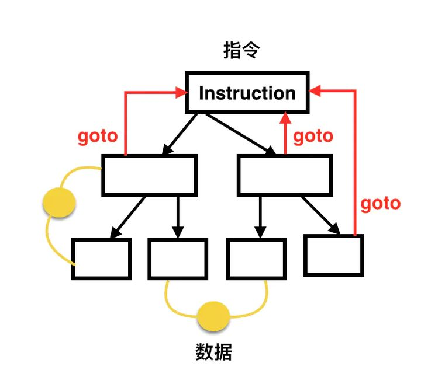
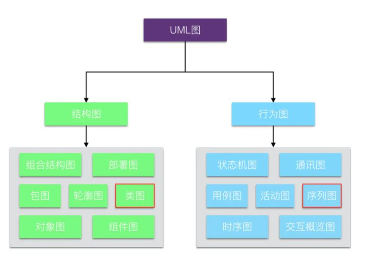
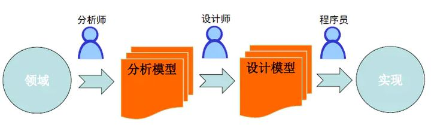
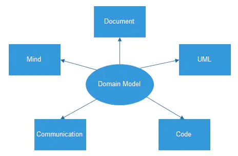
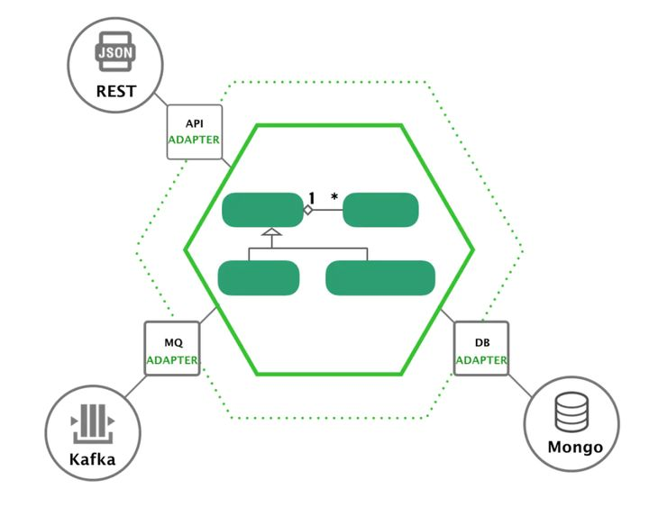

有了架构的想法，那么如何才能做一个好的架构呢。有没有什么原则呢？

答案是有的。其实一个良好的架构师，都具有一个良好的习惯。

这儿有三个编程范式，它的目的不是告诉一个工程师如何编码，而是**限制**和**规范**工程师的编码风格。这些编程范式主要是为了告诉我们**不能做什么**，而不是**可以做什么**。

### 结构化编程范式

在使用低级语言编程的年代，程序员站在直接使用指令的角度去思考，习惯按照自己的逻辑去写，指令之间可能共享数据，这其中最方便的写法就是需要用到哪块逻辑就 goto 过去执行一段代码，然后再 goto 到另外一个地方。当代码规模比较大时，就难以维护了，这种编程方式便是非结构化编程。

迪克斯特拉（E.W.dijkstra）在 1969 年提出结构化编程，摒弃了 goto 语句，而以模块化设计为中心，将待开发的软件系统划分为若干个相互独立的模块，这样使完成每一个模块的工作变得单纯而明确，为设计一些较大的软件打下了良好的基础。按照结构化编程的观点，任何算法功能都可以通过三种基本程序结构（顺序、选择和循环）的组合来实现。

结构化编程主要表现在以下三个方面：

- 自顶向下，逐步求精。将编写程序看成是一个逐步演化的过程，将分析问题的过程划分成若干个层次，每一个新的层次都是上一个层次的细化。
- 模块化。将系统分解成若干个模块，每个模块实现特定的功能，最终的系统由这些模块组装而成，模块之间通过接口传递信息。
- 语句结构化。在每个模块中只允许出现顺序、选择和循环三种流程结构的语句。

结构化编程一般偏底层，一般适用于追求确定性和性能的系统软件。这类软件偏静态规划，需求变化也不频繁，适合多人并行协作开发。将软件先分完层和模块，然后再确定模块间的 API，接着各组就可以同时启动开发。各组进行数据结构设计和算法流程设计，并在规定的时间内进行集成交付。分层模块化架构支撑了软件的大规模并行开发，且偏静态规划式开发交付。层与层之间限定了依赖方向，即层只能向下依赖，但同层内模块之间的依赖却无法约束，经常会出现模块之间互相依赖的情况，导致可裁剪性和可复用性过粗，响应变化能力较弱。

一句话总结该编程范式：不要在任意地方书写goto语句。（java已去除）

### 面向对象编程范式

随着软件种类的不断增多，软件规模的不断膨胀，人们希望可以更小粒度的对软件进行复用和裁剪。

将全局数据拆开，并将数据与其紧密耦合的方法放在一个逻辑边界内，这个逻辑边界就是对象。用户只能访问对象的 public 方法，而看不到对象内部的数据。对象将数据和方法天然的封装在一个逻辑边界内，可以整体直接复用而不用做任何裁剪或隐式关联。

人们将领域问题又开始映射成实体及关系（程序 = 实体 + 关系），而不再是数据结构和算法（过程）了，这就是面向对象编程，核心特点是封装、继承和多态。

封装是面向对象的根基，它将紧密相关的信息放在一起，形成一个逻辑单元。我们要隐藏数据，基于行为进行封装，最小化接口，不要暴露实现细节。

继承分为两种，即实现继承和接口继承。实现继承是站在子类的视角看问题，而接口继承是站在父类的视角看问题。很多程序员把实现继承当作一种代码复用的方式，但这并不是一种好的代码复用方式，推荐使用组合。

对于面向对象而言，多态至关重要，接口继承是常见的一种多态的实现方式。正因为多态的存在，软件设计才有了更大的弹性，能够更好地适应未来的变化。只使用封装和继承的编程方式，我们称之为基于对象编程，而只有把多态加进来，才能称之为面向对象编程。可以这么说，面向对象设计的核心就是多态的设计。

#### 面向对象建模

面向对象编程诞生后，程序员需要从领域问题映射到实体和关系这种模型，后续再映射到图灵机模型就交给面向对象编程语言的编译器来完成。于是问题来了，领域千差万别，如何能将领域问题高效简洁的映射到实体和关系？这时 UML（Unified Model Language，统一建模语言）应运而生，是由一整套图表组成的标准化建模语言。可见，面向对象极大的推进了软件建模的发展。

现在有一些新的程序员对于 UML 不太熟悉，建议至少要掌握两个 UML 图，即类图和序列图：

- 类图是静态视图，体现类和结构
- 序列图是动态视图，体现对象和交互

软件设计一般从动态图开始，在动态交互中会把相对比较固定的模式下沉到静态视图里，然后形成类和结构。在看代码的时候，通过类和结构就知道一部分对象和交互的信息了，可以约束及校验对象和交互的关系。

面向对象建模一般分为四个步骤：

- 需求分析建模
- 面向对象分析（OOA）
- 面向对象设计（OOD）
- 面向对象编码（OOP）

在 OOA 阶段，分析师产出分析模型。同理，在 OOD 阶段，设计师产出设计模型。

分析模型和设计模型的分离，会导致分析师头脑中的业务模型和设计师头脑中的业务模型不一致，通常要映射一下。伴随着重构和 fix bug 的进行，设计模型不断演进，和分析模型的差异越来越大。有些时候，分析师站在分析模型的角度认为某个需求较容易实现，而设计师站在设计模型的角度认为该需求较难实现，那么双方都很难理解对方的模型。长此以往，在分析模型和设计模型之间就会存在致命的隔阂，从任何活动中获得的知识都无法提供给另一方。
Eric Evans 在 2004 年出版了 DDD（领域驱动设计, Domain-Driven Design）的开山之作《领域驱动设计——软件核心复杂性应对之道》，抛弃将分析模型与设计模型分离的做法，寻找单个模型来满足两方面的要求，这就是领域模型。许多系统的真正复杂之处不在于技术，而在于领域本身，在于业务用户及其执行的业务活动。如果在设计时没有获得对领域的深刻理解，没有将复杂的领域逻辑以模型的形式清晰地表达出来，那么无论我们使用多么先进多么流行的平台和基础设施，都难以保证项目的真正成功。

DDD 是对面向对象建模的演进，核心是建立正确的领域模型：

DDD 的精髓是对边界的划分和控制，共有四重边界：

- 第一重边界是在问题空间分离子域，包括核心域，支撑域和通用域
- 第二重边界是在解决方案空间拆分 BC（限界上下文，Bounded Context），BC 之间的协作关系通过 Context Mapping（上下文映射） 来表达
- 第三重边界是在 BC 内部分离业务复杂度和技术复杂度，形成分层架构，包括用户界面层，应用层，领域层和基础设施层
- 第四重边界是在领域层引入聚合这一最小的设计单元，它从完整性与一致性对领域模型进行了有效的隔离，聚合内部包括实体、值对象、领域服务、工厂和仓储等设计元素

#### 设计原则与模式

设计原则很多，程序员最常使用的是 SOLID 原则，它是一套比较成体系的设计原则。它不仅可以指导我们设计模块（类），还可以被当作一把尺子，来衡量我们设计的有效性。（这些原则，在后面会再次介绍。）
SOLID 原则是五个设计原则首字母的缩写，它们分别是：

- 单一职责原则（Single responsibility principle，SRP）：一个类应该有且仅有一个变化的原因
- 开放封闭原则（Open–closed principle，OCP）：软件实体（类、模块、函数）应该对扩展开放，对修改封闭
- 里氏替换原则（Liskov substitution principle，LSP）：子类型（subtype）必须能够替换其父类型（base type）
- 接口隔离原则（Interface segregation principle，ISP）：不应强迫使用者依赖于它们不用的方法
- 依赖倒置原则（Dependency inversion principle，DIP）：高层模块不应依赖于低层模块，二者应依赖于抽象；抽象不应依赖于细节，细节应依赖于抽象

前面我们提到，对于面向对象来说，核心是多态的设计，我们看看 SOLID 原则如何指导多态设计：

- 单一职责原则：通过接口分离变与不变，隔离变化
- 开放封闭原则：多态的目标是系统对于变化的扩展而非修改
- 里氏替换原则：接口设计要达到细节隐藏的圆满效果
- 接口隔离原则：面向不同客户的接口要分离开
- 依赖倒置原则：接口的设计和规定者应该是接口的使用方

除过设计原则，我们还要掌握常用的设计模式。设计模式是针对一些普遍存在的问题给出的特定解决方案，使面向对象的设计更加灵活和优雅，从而复用性更好。学习设计模式不仅仅要学习代码怎么写，更重要的是要了解模式的应用场景。不论那种设计模式，其背后都隐藏着一些“永恒的真理”，这个真理就是设计原则。的确，还有什么比原则更重要呢？就像人的世界观和人生观一样，那才是支配你一切行为的根本。可以说，设计原则是设计模式的灵魂。

守破离是武术中一种渐进的学习方法：

- 第一步——守，遵守规则直到充分理解规则并将其视为习惯性的事
- 第二步——破，对规则进行反思，寻找规则的例外并“打破”规则
- 第三步——离，在精通规则之后就会基本脱离规则，抓住其精髓和深层能量

设计模式的学习也是一个守破离的过程：

- 第一步——守，在设计和应用中模仿既有设计模式，在模仿中要学会思考
- 第二步——破，熟练使用基本设计模式后，创造新的设计模式
- 第三步——离，忘记所有设计模式，在设计中潜移默化的使用

#### 架构风格

面向对象设计大行其道以后，组件化或服务化架构风格开始流行起来。组件化或服务化架构风格参考了对象设计：对象有生命周期，是一个逻辑边界，对外提供 API；组件或服务也有生命周期，也是一个逻辑边界，也对外提供 API。在这种架构中，应用依赖导致原则，不论高层还是低层都依赖于抽象，好像整个分层架构被推平了，没有了上下层的关系。不同的客户通过“平等”的方式与系统交互，需要新的客户吗？不是问题，只需要添加一个新的适配器将客户输入转化成能被系统 API 所理解的参数就行。同时，对于每种特定的输出，都有一个新建的适配器负责完成相应的转化功能。

### 函数式编程范式

与结构化编程与面向对象编程不同，函数式编程对很多人来说要陌生一些。你可能知道，C++ 和 Java 已经引入了 Lambda 表达式，目的就是为了支持函数式编程。函数式编程中的函数不是结构化编程中的函数，而是数学中的函数，结构化编程中的函数是一个过程（Procedure）。很多程序员都在纳闷，一会要面向对象编程，一会又面向过程编程，其实不是的，这儿的函数不是指C语言里面的那个函数，而是数学中的函数。

#### 基本设计

函数式编程的起源是数学家 Alonzo Church 发明的 Lambda 演算（Lambda calculus，也写作 λ-calculus）。所以，Lambda 这个词在函数式编程中经常出现，你可以把它简单地理解成匿名函数。

#### 函数式编程的特点

- 函数是一等公民

  > 一等公民的含义是：
  >
  > 1. 它可以按需创建
  > 2. 它可以存储在数据结构中
  > 3. 它可以当作参数传给另一个函数
  > 4. 它可以当作另一个函数的返回值

- 它是一个纯函数

  > 纯函数是符合下面两点的函数：
  >
  > 1. 对于相同的输入，返回相同的输出
  > 2. 没有副作用

- 惰性求值

- 不可变数据

  > 函数式编程的不变性主要体现在值和纯函数上。值类似于DDD中的值对象，一旦创建，就不能修改，除非重新创建。

- 递归

  > 函数式编程用递归作为流程控制的机制，一般为尾递归。

函数式编程还有两个重要概念：高阶函数和闭包。所谓高阶函数，是指一种比较特殊的函数，它们可以接收函数作为输入，或者返回一个函数作为输出。闭包是由函数及其相关的引用环境组合而成的实体，即闭包 = 函数 + 引用环境。

闭包有独立生命周期，能捕获上下文（环境）。站在面向对象编程的角度，闭包就是只有一个接口（方法）的对象，即将单一职责原则做到了极致。可见，闭包的设计粒度更小，创建成本更低，很容易做组合式设计。在面向对象编程中，设计粒度是一个 Object，它可能还需要拆，但你可能已经没有意识再去拆，那么上帝类大对象就会存在了，创建成本高。在函数式编程中，闭包给你一个更精细化设计的能力，一次就可以设计出单一接口的有独立生命周期的可以捕获上下文的原子对象，天然就是易于组合易于重用的，并且是易于应对变化的。
有一句话说的很好：闭包是穷人的对象，对象是穷人的闭包。有的语言没有闭包，你没有办法，只能拿对象去模拟闭包。又有一些语言没有对象，但单一接口不能完整表达一个业务概念，你没有办法，只能将多个闭包组合在一起当作对象用。

对于函数式编程，数据是不可变的，所以一般只能通过模式匹配和递归来完成图灵计算。当程序员选择将函数式编程作为思维底座时，就需要解决如何将领域问题映射到数据和函数（程序 = 数据 + 函数）。

#### 不可变性与软件架构

为什么不可变性是软件架构设计需要考虑的重点呢？答案显而易见：所有的竞争问题、死锁问题、并发更新问题都是由可变变量导致的。如果变量永远不会被更改，那么就不可能产生竞争或者并发更新问题。如果锁状态是不可变的，那就永远不会产生死锁问题。

换句话说，一切并发应用遇到的问题，一切由于多线程、多处理器而引起的问题，如果没有可变变量的话都不可能发生。

所以我们在设计软件时，我们需要确保自己设计的系统在多线程、多处理器环境中能稳定工作。所以，我们需要明确：不可变性是否实际可行。

本文转载自：[聊聊编程范式](https://zhuanlan.zhihu.com/p/354528902)

